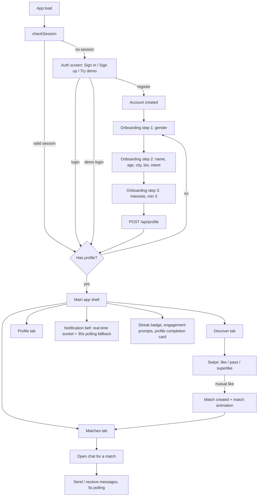
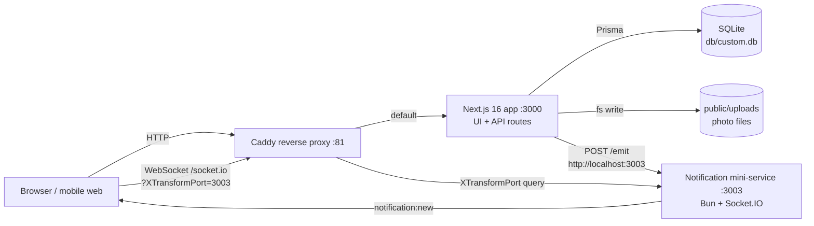
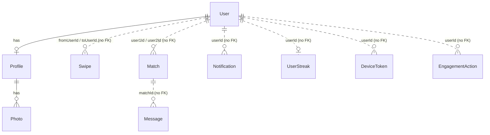
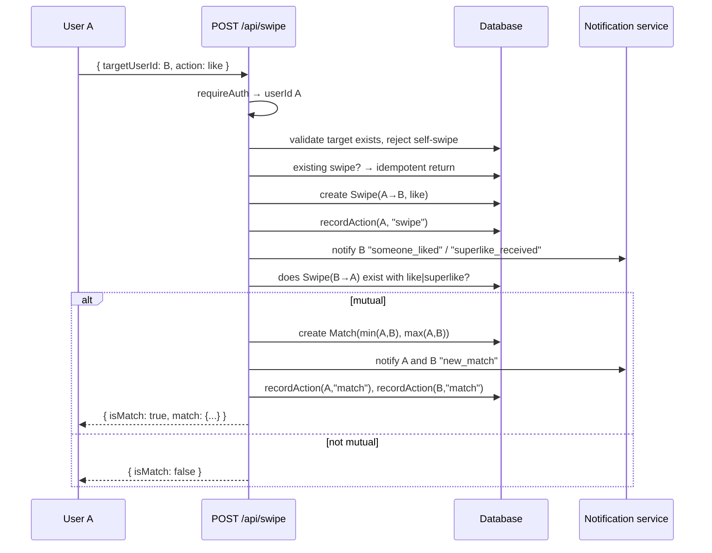
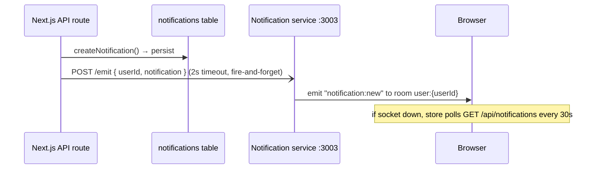

# Anera V2 — Master Specification

---

## Document Metadata

| Field | Value |
|---|---|
| **Document name** | `docs/00-MASTER-SPECIFICATION.md` |
| **Project** | Anera V2 (repository: `anera-v2`, branch `main`) |
| **Purpose** | Single entry point for understanding Anera V2: what is approved, what is built, what is undecided, and how work must proceed. |
| **Status** | **BASELINE.** Sections 1–38 are the repository audit as it stood on **2026-08-30**, when no approved product specification existed. They are preserved unchanged as the historical baseline. **[Annex A](#annex-a--post-decision-update-2026-09-01) supersedes parts of them following the approval of Decisions 16–35 on 2026-09-01.** |
| **Last updated** | 2026-09-01 (Annex A added; §1–§38 unchanged from 2026-08-30) |
| **Author** | Generated by Claude Code from repository inspection, on the instruction of the product owner. |
| **Supersedes** | Nothing. No prior master document exists. |

### Source documents reviewed

Every file below was read in full or in relevant part while producing this document.

| Source | Type | Authority under §2 |
|---|---|---|
| `docs/DECISIONS.md` | **DOES NOT EXIST** | Priority 1 — **absent** |
| Any product / PRD / vision / requirements document | **NONE FOUND IN REPOSITORY** | Priority 2 — **absent** |
| Any architecture / technical design document | **NONE FOUND IN REPOSITORY** | Priority 3 — **absent** |
| `worklog.md` | Implementation work log (2 task entries) | Priority 4 (implementation history) |
| `agent-ctx/chat-messaging-system-main.md` | Implementation record — messaging | Priority 4 |
| `agent-ctx/notification-service-implementation.md` | Implementation record — notification mini-service | Priority 4 |
| `agent-ctx/notification-engagement-frontend.md` | Implementation record — notification/engagement UI | Priority 4 |
| `download/README.md` | Placeholder file, one line, no content | None |
| `prisma/schema.prisma` | Live data model | Priority 4 |
| `prisma/migrations/20260829214701_initial_schema/migration.sql` | Live migration (untracked in git) | Priority 4 |
| `package.json`, `next.config.ts`, `tsconfig.json`, `eslint.config.mjs`, `components.json`, `tailwind.config.ts`, `postcss.config.mjs` | Build / stack configuration | Priority 4 |
| `Caddyfile`, `.env`, `.gitignore`, `start-dev.sh`, `.zscripts/*` | Runtime / environment configuration | Priority 4 |
| `src/lib/auth.ts`, `src/lib/api-client.ts`, `src/lib/db.ts`, `src/lib/notifications.ts`, `src/lib/engagement.ts` | Core implementation | Priority 4 |
| `src/proxy.ts` | CORS / request proxy | Priority 4 |
| All 24 route files under `src/app/api/**` | API surface | Priority 4 |
| `src/app/page.tsx`, `src/app/layout.tsx`, `src/app/globals.css`, `src/app/dev/page.tsx` | Application shell, theme | Priority 4 |
| `src/components/**` (feature + `ui/` component library), `src/stores/**`, `src/types/**`, `src/hooks/**` | Frontend implementation | Priority 4 |
| `mini-services/notification-service/*` | Real-time notification service | Priority 4 |
| `examples/websocket/*` | Reference example, not wired into the app | None |
| Git history (`git log`, all commits, all changed paths) | Confirms no documentation file has ever existed in this repository | Evidence |
| The V2 Handover Brief (product owner instruction, 2026-08-30, that commissioned this document) | Process/governance directives | Treated as **approved process directives** — see §2.5 |

---

> ## ⚠️ READ THIS BEFORE ACTING ON SECTIONS 1–38
>
> **Sections 1–38 are a historical audit dated 2026-08-30.** At that time the repository contained no approved decisions, and those sections correctly recorded 31 open decisions and 10 conflicts.
>
> **On 2026-09-01 the product owner approved Decisions 16–35**, recorded in [`DECISIONS.md`](DECISIONS.md), which is now the **Priority 1 authority** for this project.
>
> **Many items that §33 lists as `OPEN DECISION` are now APPROVED** — including Trust & Safety, Referral, Payments, Admin, Analytics, Privacy, Communication, Architecture, UX and Globalization.
>
> **Sections 1–38 have deliberately not been rewritten**, to preserve the audit's historical accuracy. **[Annex A](#annex-a--post-decision-update-2026-09-01) records exactly what changed.** Read Annex A before treating any statement in §1–§38 as current.
>
> **Implementation status statements in §1–§38 remain accurate** — no application code has changed since the audit.

---

## Table of Contents

1. [Document Purpose](#1-document-purpose)
2. [Source of Truth Rules](#2-source-of-truth-rules)
3. [Project Overview](#3-project-overview)
4. [Product Vision](#4-product-vision)
5. [Product Requirements](#5-product-requirements)
6. [Complete Application Scope](#6-complete-application-scope)
7. [User Roles & Permissions](#7-user-roles--permissions)
8. [Complete User Journey](#8-complete-user-journey)
9. [Feature Inventory](#9-feature-inventory)
10. [UX/UI & Design System](#10-uxui--design-system)
11. [Technology Stack](#11-technology-stack)
12. [System Architecture](#12-system-architecture)
13. [Authentication & Authorization](#13-authentication--authorization)
14. [Database & Data Model](#14-database--data-model)
15. [API Architecture](#15-api-architecture)
16. [Discovery System](#16-discovery-system)
17. [Matching Engine](#17-matching-engine)
18. [Messaging & Communication](#18-messaging--communication)
19. [Notifications](#19-notifications)
20. [AI Architecture](#20-ai-architecture)
21. [Referral System](#21-referral-system)
22. [Verification, Trust & Safety](#22-verification-trust--safety)
23. [Payments & Subscriptions](#23-payments--subscriptions)
24. [Admin Platform](#24-admin-platform)
25. [Analytics & Reporting](#25-analytics--reporting)
26. [Security](#26-security)
27. [Privacy & Data Protection](#27-privacy--data-protection)
28. [Testing Strategy](#28-testing-strategy)
29. [Implementation Strategy](#29-implementation-strategy)
30. [Current Implementation Status](#30-current-implementation-status)
31. [Development Rules for Claude Code](#31-development-rules-for-claude-code)
32. [Documentation Governance](#32-documentation-governance)
33. [Open Decisions](#33-open-decisions)
34. [Known Risks & Constraints](#34-known-risks--constraints)
35. [Implementation Roadmap](#35-implementation-roadmap)
36. [Related Documentation](#36-related-documentation)
37. [Handover Instructions](#37-handover-instructions)
38. [Final Project Rules](#38-final-project-rules)

**[Annex A — Post-Decision Update (2026-09-01)](#annex-a--post-decision-update-2026-09-01)** — *what changed after Decisions 16–35 were approved. Read this before acting on §1–§38.*

---

## 1. Document Purpose

### 1.1 What this document is

This is the **entry point** for Anera V2. Any person or AI agent starting work on this project reads this document first.

It exists to answer four questions:

1. What is Anera V2 and what has been decided about it?
2. What is actually built right now, in this repository?
3. What has *not* been decided, and therefore must not be assumed?
4. What rules govern anyone who changes the project?

### 1.2 What this document is NOT

This document is **not** a product requirements document, and it does not invent one. At the time of writing, the repository contains **no approved product specification, no vision document, no architecture document, and no decision log**. Git history confirms none has ever existed here.

Therefore this document performs a different, necessary job: it establishes an accurate, verifiable **baseline** — the built system, the implicit decisions embedded in code, and an explicit inventory of everything that is undecided. It is the foundation on which the real specification documents (`10-PRODUCT-VISION.md`, `20-ARCHITECTURE.md`, `DECISIONS.md`, …) must be written by the product owner.

### 1.3 Who should read it

| Reader | How to use it |
|---|---|
| **Product owner** | Read §33 (Open Decisions) first. Nothing product-defining can proceed until those are answered. |
| **New developer** | Read §3, §11–§15, §30. Then follow §37. |
| **A new Claude Code session** | Read this entire document, then §31 (Development Rules) is binding on you. |
| **A new ChatGPT account / external collaborator** | This document plus `docs/DECISIONS.md` (once it exists) is the complete authoritative context. Do not rely on anything remembered from an earlier session. |

### 1.4 How to read the labels

Every substantive statement in this document carries one of these labels. **The labels are the most important content in the document.**

| Label | Meaning |
|---|---|
| `APPROVED REQUIREMENT` | An explicit product requirement, approved by the product owner and traceable to a source. |
| `APPROVED ARCHITECTURAL DECISION` | An explicit architectural decision, approved and traceable to a source. |
| `CURRENT IMPLEMENTATION` | Verified fact about the code in this repository as of 2026-08-30. Describes what *is*, never what *should be*. |
| `PLANNED / NOT YET IMPLEMENTED` | Documented as intended but not built. |
| `OPEN DECISION` | No answer exists in any source. Must be decided by the product owner. Must not be assumed. |
| `RECOMMENDATION` | Suggestion from general engineering practice, offered for the product owner to accept or reject. Carries **no** authority. |
| `ASSUMPTION` | An inference made to make this document readable. Explicitly not approved. Must be confirmed or corrected. |

> **Rule:** `CURRENT IMPLEMENTATION` is never evidence of approval. Code that exists may be wrong, may be a sandbox artifact, or may be scheduled for removal. See §2.3.

---

## 2. Source of Truth Rules

### 2.1 Authority order

When two sources conflict, the higher-priority source wins. This order is binding.

| Priority | Source | Present in repo today? |
|---|---|---|
| 1 | Explicit approved decisions in `docs/DECISIONS.md` | ❌ No — file does not exist |
| 2 | Approved Anera product / specification documents | ❌ None exist |
| 3 | Approved architecture / technical documents | ❌ None exist |
| 4 | Existing implementation — **only** as evidence of *current implementation status* | ✅ Yes |
| 5 | General technical knowledge — **only** to explain something, and always labelled `RECOMMENDATION` or `ASSUMPTION` | n/a |

### 2.2 Conflict handling

If a conflict cannot be resolved from the sources:

- **Do not choose a side.**
- Record it in §33 (Open Decisions), naming the conflicting sources.
- Escalate to the product owner.

Conflicts found during this review are recorded in §33.2.

### 2.3 Code is not a requirement

The current codebase originated as an MVP built inside a hosted sandbox environment (`space-z.ai` / `/home/z/my-project`, Caddy gateway on port 81, a `XTransformPort` query-parameter routing convention). Several implementation choices exist **solely** to work around that environment and are documented as such in code comments. They are recorded here as `CURRENT IMPLEMENTATION` and are candidates for removal — but only the product owner may approve their removal.

### 2.4 The documentation gap (most important finding)

> **There is no approved specification for Anera V2 in this repository.**
>
> - `docs/` did not exist before this file was created.
> - `docs/DECISIONS.md` does not exist.
> - No PRD, vision, roadmap, architecture, referral, monetization, moderation, or analytics document exists.
> - Git history across all commits shows no such file has ever been committed.
> - The strings "V2", "phase", "roadmap", and "milestone" appear **nowhere** in the source tree or existing docs.
> - The only signals that "V2" exists at all are the repository name `anera-v2` and the commit message `495cba7 "Prepare Anera MVP for V2 development"`.
>
> Consequently, sections §4, §5, §7, §16, §17, §20, §21, §22, §23, §24, §25, §27, §35 contain **almost no approved content**. This is a faithful report, not an omission. Filling these gaps is the product owner's next task.

### 2.5 Status of the V2 Handover Brief

The instruction that commissioned this document (the "V2 Handover Brief", 2026-08-30) contains explicit **process and governance directives** from the product owner: phase-by-phase delivery, a `docs/DECISIONS.md` decision log, a set of security/authentication constraints to preserve, and development rules for Claude Code.

These are treated in this document as **approved process directives** and are reproduced in §13.4, §28, §29, §31, §32 and §38.

They are *process* directives. They are **not** product requirements, and they do not fill the gap described in §2.4.

### 2.6 Changing anything in this document

1. A change to an approved requirement or architectural decision requires a new entry in `docs/DECISIONS.md`.
2. This document is then updated to match, with the `Last updated` field revised.
3. An `OPEN DECISION` is resolved **only** by a `DECISIONS.md` entry — never by an implementation choice, and never by an agent's judgement.

---

## 3. Project Overview

`CURRENT IMPLEMENTATION` — the following describes the repository as it stands. It is a description of a system, not a statement of approved scope.

Anera is a mobile-first dating application. The repository `anera-v2` contains a working MVP web application:

- A **Next.js 16 App Router** application (React 19, TypeScript, Tailwind CSS v4, shadcn/ui) serving both the UI and the JSON API from a single deployable.
- A **Prisma + SQLite** persistence layer with ten models covering users, profiles, photos, swipes, matches, messages, notifications, device tokens, streaks and engagement actions.
- A separate **Socket.IO notification mini-service** (Bun, port 3003) for real-time notification delivery.
- A **Caddy** reverse proxy fronting both on port 81, using an `XTransformPort` query parameter to route to the mini-service. This is sandbox-environment infrastructure.

The application implements the core dating loop end-to-end: register → onboard → discover profiles → swipe → mutual like creates a match → chat within a match → receive notifications, plus a daily-streak engagement layer and a development-only admin/debug panel.

`ASSUMPTION` — "V2" refers to a rebuild/hardening effort taking this MVP toward a production product. The specific goals, scope and success criteria of V2 are **not documented anywhere**, so this remains an assumption. See §33.1 `OD-01`.

---

## 4. Product Vision

`OPEN DECISION` — **`OD-02`. No product vision document exists.**

There is no approved statement of vision, positioning, target market, differentiation, business goals, or intended user segments anywhere in the repository.

The only vision-adjacent artefacts found, all of them incidental:

| Artefact | Content | Status |
|---|---|---|
| `src/app/layout.tsx` metadata `title` | "Anera - Find Your Perfect Match" | `CURRENT IMPLEMENTATION` — marketing copy in a page tag, not an approved positioning statement. |
| `src/app/layout.tsx` metadata `description` | "A premium dating app built with love. Discover, match, and connect with amazing people." | Same. |
| Seed/demo data (`/api/seed/bulk`, `/api/dev`) | 15 demo profiles, all Indian names, all Indian cities (Mumbai, Delhi, Bangalore, Pune, Chennai, Hyderabad, Kolkata, Goa, Jaipur) | `CURRENT IMPLEMENTATION`. Suggestive of an India-first market, but demo fixtures are **not** an approved geographic strategy. See §33.1 `OD-03`. |
| `relationshipIntent` options | casual, serious, networking, friendship, not-sure | `CURRENT IMPLEMENTATION`. Includes non-dating intents (networking, friendship), which may or may not reflect an approved product positioning. See §33.1 `OD-04`. |

**Nothing in this section may be treated as approved.** The product owner must author `docs/10-PRODUCT-VISION.md`.

---

## 5. Product Requirements

`OPEN DECISION` — **`OD-05`. No approved functional or non-functional requirements exist.**

No requirements document, acceptance criteria, user stories, or success metrics were found.

What *can* be stated is the set of **behavioural rules currently enforced by the code**. These are `CURRENT IMPLEMENTATION` facts, and each one should be reviewed and either ratified or changed by the product owner.

### 5.1 Behavioural rules enforced today (`CURRENT IMPLEMENTATION`)

| # | Rule as implemented | Source |
|---|---|---|
| R-01 | Registration requires email, password (6–128 chars), and a name (≤ 50 chars). Email must match a basic format regex and is normalised to lowercase. | `api/auth/register/route.ts` |
| R-02 | Passwords are hashed with bcrypt, 10 salt rounds. | `api/auth/register/route.ts` |
| R-03 | A duplicate email returns HTTP 409. | `api/auth/register/route.ts` |
| R-04 | Accounts with no `passwordHash` (demo/seed users) cannot log in via `/api/auth/login`. | `api/auth/login/route.ts` |
| R-05 | Login failure returns a generic "Invalid email or password" for both unknown-user and bad-password cases (no user enumeration). | `api/auth/login/route.ts` |
| R-06 | A new user has no profile and is routed to onboarding (`needsOnboarding: true`). | `api/auth/register`, `api/auth/session` |
| R-07 | Onboarding is a 3-step flow: gender → details (name, age, city, bio, intent) → interests. | `src/app/page.tsx` |
| R-08 | Minimum age is 18; maximum 120. Enforced in the API and in the onboarding form. | `api/profile/route.ts`, `page.tsx` |
| R-09 | Onboarding requires selecting **at least 3** interests before completion. Client-side only. | `page.tsx` |
| R-10 | Interests are capped at **10**; bio at 500 chars; name at 50; city at 100. | `api/profile/route.ts` |
| R-11 | Gender is one of: `male`, `female`, `non-binary`, `other`. | `api/profile/route.ts`, `types/profile.ts` |
| R-12 | Relationship intent is one of: `casual`, `serious`, `networking`, `friendship`, `not-sure` (or empty). | `api/profile/route.ts`, `types/profile.ts` |
| R-13 | Max 6 photos per profile; ≤ 10 MB each; JPEG/PNG/WebP only; validated by magic bytes as well as MIME type; dimensions 200–4096 px. | `types/profile.ts`, `api/profile/photos/route.ts` |
| R-14 | Discover returns up to 20 onboarded profiles the user has not already swiped on, excluding the user themself, ordered by profile `createdAt` descending. | `api/discover/route.ts` |
| R-15 | Swipe actions are `like`, `pass`, `superlike`. A user may swipe on another user only once (unique constraint); repeat swipes are idempotent. | `api/swipe/route.ts`, `schema.prisma` |
| R-16 | A user cannot swipe on themself. | `api/swipe/route.ts` |
| R-17 | A match is created when both users have recorded `like` or `superlike` on each other. `pass` never matches. | `api/swipe/route.ts` |
| R-18 | Messaging is only possible inside a match; both read and write verify match participation, returning 403 otherwise. | `api/messages/route.ts` |
| R-19 | A message is 1–2000 characters, trimmed. | `api/messages/route.ts` |
| R-20 | Opening a conversation marks the other participant's unread messages as read. | `api/messages/route.ts` |
| R-21 | Every inbound message creates a `new_message` notification for the recipient. | `api/messages/route.ts` |
| R-22 | Daily streak: active today = no change; active yesterday = +1; older = reset to 1. Longest streak is retained. | `lib/engagement.ts` |
| R-23 | Profile completion is scored out of 100: name 10, bio 15, city 10, interests 15, ≥ 3 photos 25, intent 10, age 5, gender 10. | `lib/engagement.ts` |
| R-24 | Engagement prompts fire for: streak at risk, profile < 80 % complete, pending likes > 0. Each prompt type is created at most once per 24 h per user. | `lib/engagement.ts` |
| R-25 | Notifications of the same type from the same user within 1 hour are grouped into one entry with a count. | `lib/notifications.ts` |

### 5.2 Non-functional requirements

`OPEN DECISION` — **`OD-06`.** No performance, availability, scalability, latency, capacity, browser-support or SLA targets are documented anywhere.

---

## 6. Complete Application Scope

`CURRENT IMPLEMENTATION` + `OPEN DECISION`. The table below is the full subsystem map, built from the code. "Approved scope" is empty for every row because no scope document exists (§2.4).

| # | Subsystem | Implementation state | Approved scope |
|---|---|---|---|
| S-01 | Authentication & session | Implemented (email/password + demo login) | `OPEN DECISION` |
| S-02 | Onboarding | Implemented (3 steps) | `OPEN DECISION` |
| S-03 | Profile management | Implemented (edit, photos, ordering, primary photo) | `OPEN DECISION` |
| S-04 | Photo upload & storage | Implemented (local filesystem under `public/uploads`) | `OPEN DECISION` |
| S-05 | Discovery / swipe deck | Implemented (unfiltered, 20-profile batches) | `OPEN DECISION` |
| S-06 | Matching | Implemented (mutual-like only, no scoring) | `OPEN DECISION` |
| S-07 | Messaging | Implemented (per-match chat, 5 s polling) | `OPEN DECISION` |
| S-08 | Notifications (in-app) | Implemented (persisted + real-time socket + polling fallback) | `OPEN DECISION` |
| S-09 | Push notifications | **Partial** — `DeviceToken` model and registration endpoint exist; **no sending mechanism exists** | `OPEN DECISION` |
| S-10 | Engagement / streaks | Implemented | `OPEN DECISION` |
| S-11 | Premium / subscriptions | **Stub only** — endpoint returns hardcoded `isPremium: false` | `OPEN DECISION` |
| S-12 | Settings | **Stub only** — endpoint returns hardcoded values, `PUT` persists nothing | `OPEN DECISION` |
| S-13 | Dev/debug panel | Implemented, development-mode only | Not a product surface |
| S-14 | Seed / demo data | Implemented (`/api/seed`, `/api/seed/bulk`, `/api/dev`) | Not a product surface |
| S-15 | **Referral system** | **Does not exist** — zero code, zero schema, zero documentation | `OPEN DECISION` — see §21 |
| S-16 | **Verification / trust & safety** | **Does not exist** — `isVerified` is hardcoded `false` in the discover response; no report, block, or moderation capability | `OPEN DECISION` — see §22 |
| S-17 | **Admin platform** | **Does not exist** — no admin role, no admin UI, no admin API | `OPEN DECISION` — see §24 |
| S-18 | **Analytics & reporting** | **Minimal** — `EngagementAction` rows are written but never read or aggregated | `OPEN DECISION` — see §25 |
| S-19 | **AI functionality** | **Does not exist** — no AI code paths | `OPEN DECISION` — see §20 |
| S-20 | **Payments / billing** | **Does not exist** — no provider, no code | `OPEN DECISION` — see §23 |

---

## 7. User Roles & Permissions

### 7.1 Roles as implemented (`CURRENT IMPLEMENTATION`)

The system has **no role model**. There is no `role` field on `User`, no permission table, and no role checks anywhere in the codebase. Authorization is entirely **ownership-based and relationship-based**.

| Effective role | How it is established | Capabilities |
|---|---|---|
| **Anonymous** | No valid session | Register, log in, demo-login, seed endpoints, `GET /api/profile?userId=…` (**this is public — see §26.2 SEC-05**) |
| **Authenticated user** | Valid session token | All protected endpoints, scoped to own data |
| **Match participant** | Both users appear on the same `Match` row | Read and send messages in that match |
| **Demo user** | Created by `/api/auth/demo-login`, `passwordHash` is `null` | Same as authenticated user; cannot use password login |
| **Developer** | `NODE_ENV !== 'production'` | Full `/api/dev` powers: log in as any user, reset the entire database, seed, fabricate matches/messages/notifications. Gated **only** by `NODE_ENV`, with **no authentication of any kind**. See §26.2 SEC-04. |

### 7.2 Authorization primitives (`CURRENT IMPLEMENTATION`)

Defined in `src/lib/auth.ts`:

- `requireAuth(request)` → userId or a 401 `NextResponse`.
- `requireOwnership(request, resourceUserId)` → userId, or 401, or 403 if the caller is not the owner.
- Message endpoints implement participation checks inline (403 for non-participants).
- **The authenticated userId always comes from the session, never from the request body.** Route comments state this explicitly (`⚠️ We ignore any userId in the body`). This is a deliberate, valuable pattern.

### 7.3 Open items

`OPEN DECISION` — **`OD-07`.** Whether Anera V2 has roles at all (admin, moderator, support, verified user, premium user), what each may do, and how role assignment works. Nothing is documented.

---

## 8. Complete User Journey

### 8.1 Implemented journey (`CURRENT IMPLEMENTATION`)



### 8.2 Journey notes (`CURRENT IMPLEMENTATION`)

- The entire authenticated app is a **single client-side route** (`src/app/page.tsx`) with three tabs held in React state: `discover`, `matches`, `profile`. There is no URL-based routing for these views, and no deep linking.
- Chat renders **over** the tab content and hides the header and bottom navigation while open.
- The only other page routes are `/dev` (development panel) and the API routes.
- Render order is strictly guarded: `HydrationLoader` → `AuthScreen` → `OnboardingScreen` → main app. No protected content renders before `hasHydrated` is true.

### 8.3 Missing journey stages

`OPEN DECISION` — **`OD-08`.** The following journey stages are undefined and unbuilt: marketing/landing entry, email verification, password reset, phone verification, permission prompts (notifications/location), referral entry (invited-user flow), paywall/upgrade, profile verification, reporting/blocking, account deletion, and re-engagement/win-back.

---

## 9. Feature Inventory

Legend — **Approved**: backed by an approved requirement document (none exist today, so this column is `—` throughout). **Implemented**: verified in code. **Planned**: documented as intended but not built. **Open**: undecided.

### 9.1 Authentication

| Feature | Approved | Implemented | Notes |
|---|---|---|---|
| Email + password registration | — | ✅ | bcrypt, 10 rounds |
| Email + password login | — | ✅ | |
| Demo login (no password) | — | ✅ | `POST /api/auth/demo-login`, **not gated by `NODE_ENV`** |
| Session check | — | ✅ | `GET /api/auth/session` |
| Logout with token revocation | — | ✅ | In-memory blocklist, resets on restart |
| HTTP-only session cookie | — | ✅ | `anera_session`, 30 days, SameSite=Lax |
| localStorage token + `Authorization: Bearer` fallback | — | ✅ | **Conflicts with the stated V2 security posture — see §13.4 and `OD-09`** |
| Password reset | — | ❌ | `OPEN DECISION` |
| Email verification | — | ❌ | `OPEN DECISION` |
| Social / OAuth login | — | ❌ | `next-auth` is a declared dependency but is **never imported**. `OPEN DECISION` |
| Phone / OTP login | — | ❌ | `input-otp` is a declared dependency but is only a UI component. `OPEN DECISION` |
| Multi-factor authentication | — | ❌ | `OPEN DECISION` |
| Rate limiting on auth endpoints | — | ❌ | **None exists.** `OPEN DECISION` / security gap `SEC-03` |

### 9.2 Profile

| Feature | Approved | Implemented | Notes |
|---|---|---|---|
| Create profile (onboarding) | — | ✅ | |
| Edit profile | — | ✅ | `profile-editor.tsx`, `profile-edit-form.tsx` (zod-validated client side) |
| Photo upload | — | ✅ | Local disk, magic-byte validation |
| Photo reorder (drag & drop) | — | ✅ | `@dnd-kit` |
| Set primary photo | — | ✅ | |
| Delete photo | — | ✅ | |
| Profile completion scoring | — | ✅ | See R-23 |
| Profile verification badge | — | ⚠️ | UI renders `profile.isVerified`, but the API hardcodes `isVerified: false`. No verification system exists. |
| View another user's profile | — | ✅ | `GET /api/profile?userId=…` — **unauthenticated**, see `SEC-05` |

### 9.3 Discovery & matching

| Feature | Approved | Implemented | Notes |
|---|---|---|---|
| Swipe deck with card stack | — | ✅ | Framer Motion, drag gestures |
| Like / Pass / Superlike | — | ✅ | |
| Photo carousel on card | — | ✅ | |
| Match animation | — | ✅ | |
| Mutual-like matching | — | ✅ | |
| Reset swipes (start over) | — | ✅ | `POST /api/swipe/reset` — deletes **all** the user's swipes **and matches** |
| Matches list | — | ✅ | |
| Filters (age, distance, gender, intent) | — | ❌ | **No filtering of any kind.** `OPEN DECISION` |
| Compatibility scoring / ranking | — | ❌ | **No scoring.** `OPEN DECISION` — see §17 |
| Location / distance | — | ❌ | Only a free-text `city` string exists. No geo data. `OPEN DECISION` |
| Undo last swipe | — | ❌ | `OPEN DECISION` |
| Boost | — | ❌ | Only a `boost_expired` notification *type* string exists. No boost feature. `OPEN DECISION` |
| "Who liked me" list | — | ⚠️ | Count only (`pendingLikes`); no list surface. |

### 9.4 Messaging

| Feature | Approved | Implemented | Notes |
|---|---|---|---|
| Per-match chat | — | ✅ | |
| Cursor pagination (50/page, max 100) | — | ✅ | |
| Read receipts (`isRead`) | — | ⚠️ | Flag is set server-side; not surfaced as a per-message UI indicator |
| Auto-scroll, date separators, empty state | — | ✅ | |
| 5-second polling for new messages | — | ✅ | **Chat does not use the WebSocket service.** |
| Real-time chat over WebSocket | — | ❌ | `PLANNED / NOT YET IMPLEMENTED` — the socket service handles notifications only |
| Typing indicators, presence | — | ❌ | `OPEN DECISION` |
| Media / voice messages | — | ❌ | `OPEN DECISION` |
| Message deletion / editing | — | ❌ | `OPEN DECISION` |
| Unmatch / delete conversation | — | ❌ | `OPEN DECISION` |

### 9.5 Notifications & engagement

| Feature | Approved | Implemented | Notes |
|---|---|---|---|
| Persisted notifications (9 types) | — | ✅ | |
| Notification centre with swipe-to-dismiss | — | ✅ | |
| Unread badge, bell animation | — | ✅ | |
| Real-time delivery via Socket.IO | — | ✅ | Mini-service on port 3003 |
| 30-second polling fallback | — | ✅ | |
| Notification grouping (same type, 1 h) | — | ✅ | |
| Mark read / mark all read / delete | — | ✅ | |
| Daily streak | — | ✅ | |
| Profile completion card | — | ✅ | |
| Engagement prompt cards | — | ✅ | Dismissal is local state only; not persisted |
| Device token registration | — | ✅ | `POST /api/notifications/register-token` |
| **Actual push notification sending** | — | ❌ | **Not implemented.** Tokens are stored and never used. |
| Email notifications | — | ❌ | `OPEN DECISION` |
| Notification preferences | — | ❌ | Settings endpoint is a stub |

### 9.6 Not built at all

| Feature area | State |
|---|---|
| Referral system | ❌ Nothing. See §21 |
| Payments / subscriptions | ❌ Stub endpoint only. See §23 |
| Admin platform | ❌ Nothing. See §24 |
| Moderation / reporting / blocking | ❌ Nothing. See §22 |
| Identity or photo verification | ❌ Nothing. See §22 |
| AI features | ❌ Nothing. See §20 |
| Analytics dashboards | ❌ Nothing. See §25 |
| Internationalisation | ❌ `next-intl` declared but never imported |
| Automated tests | ❌ Zero test files. See §28 |

---

## 10. UX/UI & Design System

### 10.1 Design system in use (`CURRENT IMPLEMENTATION`)

| Aspect | Value |
|---|---|
| Component library | **shadcn/ui**, style `new-york`, base colour `neutral`, CSS variables enabled, RSC enabled (`components.json`) |
| Primitives | **Radix UI** (~25 packages) |
| Icons | **lucide-react** |
| Styling | **Tailwind CSS v4** via `@tailwindcss/postcss`; `globals.css` uses `@import "tailwindcss"` and `@theme inline` tokens |
| Animation | **Framer Motion** (used in 12 files), plus `tailwindcss-animate` and `tw-animate-css` |
| Fonts | `Geist` and `Geist Mono` via `next/font/google` |
| Toasts | Radix Toast (`ui/toast.tsx`, `ui/toaster.tsx`) and `sonner` both present |
| UI inventory | 48 components in `src/components/ui/` |

### 10.2 Theme (`CURRENT IMPLEMENTATION`)

- **Dark theme is the default and is hard-coded**: `<html lang="en" className="dark">` in `layout.tsx`. There is no theme toggle.
- Colour tokens are defined in `oklch`. Primary is a rose/pink hue (`oklch(0.65 0.22 350)`); background is a near-black plum (`oklch(0.1 0.005 300)`); radius `0.75rem`. In-code comment: *"Deep dark background like Tinder/Bumble"*, *"Rose/pink primary for dating vibe"*.
- A complete `.light` token set exists in `globals.css` but is **never activated** — no code adds the `light` class. `next-themes` is a declared dependency, imported only by `ui/sonner.tsx`.
- `themeColor` is `#1a0a1e`.
- **Two Tailwind configurations coexist**: `tailwind.config.ts` (v3-style, `hsl(var(--…))` colours, `darkMode: "class"`, content globs pointing at `./app`, `./components`, `./pages` — paths that do **not** exist, since the code is under `src/`) and the v4 `@theme inline` block in `globals.css` using `oklch`. See §33.2 `CONF-03`.

### 10.3 UX characteristics (`CURRENT IMPLEMENTATION`)

- **Mobile-first.** Viewport is locked: `maximumScale: 1`, `userScalable: false`. Layout is a fixed 56 px header + flexible main + 64 px bottom tab bar, with `safe-area-bottom` handling.
- Glassmorphism throughout: `bg-card/80 backdrop-blur-xl`, animated gradient background blobs.
- Loading states: branded `HydrationLoader`, skeletons in the notification centre, spinners on submit buttons.
- Tab transitions, card swipe physics, and the match animation are all Framer Motion.

### 10.4 Accessibility (`CURRENT IMPLEMENTATION`)

Partial and unaudited. Present: `role="tab"`, `aria-label`, `aria-selected` on the bottom navigation; `Label`/`htmlFor` pairing on forms; Escape-key and click-outside handling on the notification panel; Radix primitives supply focus management for dialogs and menus.

Absent: any accessibility standard, audit, contrast verification, screen-reader testing, or reduced-motion handling. `userScalable: false` actively blocks pinch-zoom, which is a known accessibility problem.

`OPEN DECISION` — **`OD-10`.** Accessibility target (e.g. WCAG 2.2 AA) and whether it is a release gate.

### 10.5 Open design decisions

`OPEN DECISION` — **`OD-11`.** Light-mode support, theme switching, brand identity (`public/logo.svg` exists but the favicon points at an external `z-cdn.chatglm.cn` URL — see `CONF-04`), design tokens of record, native-app plans, responsive behaviour above tablet width, and whether a Figma source of truth exists.

---

## 11. Technology Stack

### 11.1 Confirmed — in use today (`CURRENT IMPLEMENTATION`)

| Layer | Technology | Version | Evidence |
|---|---|---|---|
| Framework | Next.js (App Router, `output: "standalone"`) | ^16.1.1 | `package.json`, `next.config.ts` |
| UI runtime | React | ^19.0.0 | |
| Language | TypeScript | ^5 | `strict: true`, but `noImplicitAny: false` |
| Styling | Tailwind CSS | ^4 | |
| Components | shadcn/ui + Radix UI | — | `components.json` |
| Animation | Framer Motion | ^12.23.2 | 12 files |
| Client state | Zustand | ^5.0.6 | 5 stores |
| ORM | Prisma | ^6.11.1 | |
| Database | **SQLite** (`file:../db/custom.db`) | — | `schema.prisma`, `.env` |
| Password hashing | bcryptjs | ^3.0.3 | |
| Real-time | Socket.IO (server ^4.8.1 in mini-service, client ^4.8.3) | — | |
| Mini-service runtime | **Bun** | — | `bun --hot index.ts` |
| Reverse proxy | **Caddy** (port 81) | — | `Caddyfile` |
| Package manager | Both `bun.lock` and `package-lock.json` are committed | — | See `CONF-05` |
| Linting | ESLint 9 + `eslint-config-next` | — | Most rules disabled — see §28.4 |

### 11.2 Declared but unused (`CURRENT IMPLEMENTATION`)

These are in `package.json` but are **never imported by application code**. Their presence is not a decision to use them.

| Package | Import count | Note |
|---|---|---|
| `next-auth` ^4.24.11 | 0 | Auth is hand-rolled HMAC. Its presence may mislead. See `CONF-01` |
| `@tanstack/react-query` ^5.82.0 | 0 | Data fetching is Zustand + `apiFetch` |
| `next-intl` ^4.3.4 | 0 | No i18n implemented |
| `z-ai-web-dev-sdk` ^0.0.17 | 0 | Sandbox-vendor SDK. **The only AI-adjacent dependency in the project.** |
| `uuid`, `sharp`, `date-fns`, `react-markdown`, `react-syntax-highlighter`, `@mdxeditor/editor` | 0 | |
| `next-themes`, `recharts`, `zod` | 1 each | Only inside `ui/sonner.tsx`, `ui/chart.tsx`, and `profile-edit-form.tsx` respectively. **`zod` is not used for API validation.** |

### 11.3 Planned technologies

`PLANNED / NOT YET IMPLEMENTED` — the only technology explicitly named as future work in an existing source document is a **Redis or database-backed token blocklist**, replacing the in-memory `Set` (`src/lib/auth.ts` comment: *"For production, use Redis or a database-backed blocklist"*).

### 11.4 Recommendations (not approved)

`RECOMMENDATION` — offered for the product owner's decision, carrying no authority:

- Replace SQLite with PostgreSQL before any multi-instance deployment (SQLite cannot support concurrent writers across processes, and the current DB file lives in the repo working tree).
- Adopt `zod` (already a dependency) for server-side request validation, replacing the current hand-written per-route checks.
- Choose one package manager and remove the other lockfile.
- Introduce a test runner (none exists).

### 11.5 Do not change without approval

`APPROVED ARCHITECTURAL DECISION` (source: V2 Handover Brief §11) — **existing approved technologies must not be replaced by an agent's preference.** Any stack change requires a `DECISIONS.md` entry approved by the product owner. Since almost nothing is formally approved yet, the practical rule is: **the stack as built (§11.1) is the baseline, and changing it requires an approved decision.**

---

## 12. System Architecture

### 12.1 Runtime topology (`CURRENT IMPLEMENTATION`)



### 12.2 Layers inside the Next.js app (`CURRENT IMPLEMENTATION`)

| Layer | Location | Responsibility |
|---|---|---|
| Route handlers | `src/app/api/**/route.ts` | HTTP entry, auth check, validation, response shaping |
| Domain helpers | `src/lib/notifications.ts`, `src/lib/engagement.ts` | Notification creation/grouping; streaks, completion scoring, prompts |
| Auth | `src/lib/auth.ts` | Token creation/validation, cookie handling, `requireAuth`/`requireOwnership`, revocation blocklist |
| Data access | `src/lib/db.ts` | Prisma client |
| Proxy | `src/proxy.ts` | CORS headers and OPTIONS preflight for `/api/*` |
| Client transport | `src/lib/api-client.ts` | `apiFetch` wrapper: credentials, Bearer fallback, auth-readiness gate, global 401 handling |
| Client state | `src/stores/*.ts` | `auth`, `profile`, `discover`, `chat`, `notification` Zustand stores |
| UI | `src/components/**` | Feature components + 48-component shadcn/ui library |

### 12.3 Architectural characteristics (`CURRENT IMPLEMENTATION`)

- **Monolith + one sidecar.** Everything except real-time notification fan-out lives in the Next.js app.
- **Client-heavy.** `src/app/page.tsx` is a client component holding the entire authenticated app; there is effectively no server-side rendering of authenticated content, and no server-side route protection (no `middleware.ts` guarding pages — `src/proxy.ts` matches `/api/*` and only sets CORS headers).
- **No service layer between routes and Prisma.** Most routes call Prisma directly.
- **Notification push is fire-and-forget** with a 2-second timeout; failure is swallowed because the notification is already persisted (`lib/notifications.ts`).
- **Hard-coded service URL:** `http://localhost:3003/emit?XTransformPort=3003` in `lib/notifications.ts`. Not configurable.

### 12.4 Sandbox coupling (`CURRENT IMPLEMENTATION`, flagged)

The architecture carries artefacts of the sandbox it was built in:

- The `XTransformPort` query-parameter routing convention (Caddy).
- `allowedDevOrigins: ['.space-z.ai', '127.0.0.1', 'localhost']` in `next.config.ts`.
- `start-dev.sh` hard-codes `/home/z/my-project`.
- The favicon URL points at `https://z-cdn.chatglm.cn/z-ai/static/logo.svg`.
- The cross-origin-iframe justification for the localStorage token fallback (see §13.4).

`OPEN DECISION` — **`OD-12`.** Target deployment environment for V2 and which of these artefacts are removed.

### 12.5 Open architectural decisions

`OPEN DECISION` — **`OD-13`.** Whether V2 remains a monolith; whether the notification service stays separate; native app strategy; hosting/CI/CD; environment/secret management; background job processing (there is none — engagement prompts are computed synchronously inside `GET /api/engagement`).

---

## 13. Authentication & Authorization

> This section is security-critical. Read §13.4 before changing anything in `src/lib/auth.ts` or `src/lib/api-client.ts`.

### 13.1 Session mechanism (`CURRENT IMPLEMENTATION`)

| Property | Value |
|---|---|
| Token format | `base64url(userId) : hex(HMAC-SHA256(payload, SESSION_SECRET))` — a custom signed token, **not a JWT** |
| Secret | `process.env.SESSION_SECRET`, falling back to the literal `'anera-dev-secret-change-in-production'` |
| Signature comparison | `crypto.timingSafeEqual` (timing-attack resistant) — good |
| Cookie | `anera_session`; `httpOnly: true`; `sameSite: 'lax'`; `secure: NODE_ENV === 'production'`; `maxAge` 30 days; `path: '/'` |
| Expiry inside the token | **None.** The token payload carries only the userId. Cookie `maxAge` is the only expiry, and it does not apply to the Bearer path. |
| Revocation | In-memory `Set<string>` blocklist, capped at 10 000 entries, **cleared on every server restart** |
| Server-side session store | **None.** Sessions are stateless. |

### 13.2 Dual transport (`CURRENT IMPLEMENTATION`)

`getSessionToken()` accepts the token from **either**:

1. the `anera_session` HTTP-only cookie (primary), **or**
2. an `Authorization: Bearer <token>` header (fallback).

The client (`src/lib/api-client.ts`) **also stores the same token in `localStorage`** under the key `anera_session_token`, and attaches it as a Bearer header on every request. Login, register, demo-login and session-check responses all return the raw token in the JSON body so the client can store it.

The in-code justification (`src/lib/api-client.ts`, `src/lib/auth.ts`): the app runs inside a cross-origin iframe in the preview sandbox, where browsers drop cookies on cross-origin `fetch` and never send `Secure` cookies over HTTP.

### 13.3 Auth-readiness gate (`CURRENT IMPLEMENTATION`)

A client-side coordination mechanism added to fix an "Authentication required" bug after a logout→login cycle (`worklog.md` Task 2):

- `markAuthReady()` / `clearAuthReady()` / `isAuthReady()` / `waitForAuth(timeoutMs = 5000)` in `api-client.ts`.
- `apiFetch(url, { requireAuth: true })` awaits readiness (max 5 s) before firing; on timeout it **proceeds anyway** with a console warning.
- The auth store marks readiness only after login/register/demo-login **and** a verifying `checkSession()` round-trip.
- A 401 on any request clears the stored token, clears readiness, and fires the global unauthorized callback.
- `logout()` resets all five Zustand stores, disconnects the socket, clears the token and clears readiness.

### 13.4 The authentication conflict — **do not silently resolve**

> ## ⚠️ SUPERSEDED 2026-09-02
>
> **`OD-09` is RESOLVED by [Decision 37](DECISIONS.md).** Anera V2 authentication is **HTTP-only cookie sessions with server-side validation**, and the cookie is the single source of truth.
>
> **The binding rule below — "do not remove or extend the localStorage/Bearer path" — is LIFTED.** It is replaced by the opposite instruction: **remove the entire legacy auth path in Phase 1** (`AUTHENTICATION.md` §8, `ROADMAP.md` Phase 1).
>
> The section below is retained as the historical record of the conflict and of the as-built implementation. **It no longer governs.** The canonical architecture is [`AUTHENTICATION.md`](AUTHENTICATION.md).

`OPEN DECISION` — **`OD-09`** / `CONF-01`. *(Historical. Resolved by D37.)*

The V2 Handover Brief (§2.5) directs that these constraints be preserved:

- server-side authentication
- HTTP-only cookies
- server-side session handling
- server-side authorization
- **avoiding insecure client-side authentication state**
- **no JWT/localStorage authentication workaround unless explicitly approved**

The current implementation **partially conflicts** with that posture:

| Directive | Current implementation | Verdict |
|---|---|---|
| Server-side authentication | All auth decisions are made server-side in `requireAuth`/`requireOwnership`. | ✅ Consistent |
| HTTP-only cookies | `anera_session` is `httpOnly`, `sameSite=lax`, `secure` in production. | ✅ Consistent |
| Server-side authorization | Ownership and match-participation checks are server-side; the userId always comes from the session, never the body. | ✅ Consistent |
| No client-side auth state | The session token is **also written to `localStorage`** and sent as a Bearer header. | ❌ **Conflict** |
| No localStorage auth workaround unless approved | The workaround exists and is documented in code as a sandbox necessity. **No approval record exists** (there is no `DECISIONS.md`). | ❌ **Conflict — unapproved** |

**This conflict is recorded, not resolved.** A token in `localStorage` is readable by any script on the origin and is therefore exposed to XSS; that is precisely the risk the directive targets. Equally, removing the fallback may break the preview environment the MVP was developed against.

**Binding rule for all agents:** do **not** remove, and do **not** extend, the localStorage/Bearer path until the product owner records a decision in `docs/DECISIONS.md`. Options to put to the product owner (each a `RECOMMENDATION`, none approved):

- **(a)** Remove the Bearer/localStorage fallback entirely; rely on the HTTP-only cookie; deploy so the app is same-origin (no cross-origin iframe).
- **(b)** Keep the fallback strictly for non-production environments, gated on `NODE_ENV`.
- **(c)** Formally approve the fallback as a permanent architecture decision, accepting the XSS exposure, and document compensating controls.

### 13.5 Further authentication gaps (`CURRENT IMPLEMENTATION`)

| ID | Gap |
|---|---|
| AUTH-01 | `SESSION_SECRET` has a hard-coded development fallback. If the env var is unset in production, **every session token is forgeable by anyone who reads this repository.** The same literal is duplicated in `mini-services/notification-service/index.ts`. |
| AUTH-02 | Tokens contain no issued-at or expiry claim, so a leaked Bearer token is valid indefinitely (subject only to the volatile in-memory blocklist). |
| AUTH-03 | The revocation blocklist is per-process and in-memory: it is lost on restart and is not shared across instances. Its eviction routine also deletes the *first half* of insertion order, which can drop still-valid revocations. |
| AUTH-04 | `POST /api/auth/demo-login` creates a fully authenticated session **without any credential** and is **not** gated by `NODE_ENV`. |
| AUTH-05 | `POST /api/seed` and `POST /api/seed/bulk` also create sessions and set session cookies, and are **not** gated by `NODE_ENV`. |
| AUTH-06 | No rate limiting, lockout, or CAPTCHA on any auth endpoint. |
| AUTH-07 | No password reset, no email verification, no session listing/revocation UI. |

These are reported as findings, not as approved changes. Fixing them requires the phase discipline in §29.

---

## 14. Database & Data Model

### 14.1 Database (`CURRENT IMPLEMENTATION`)

- Provider: **SQLite**, `url = env("DATABASE_URL")`, `.env` sets `DATABASE_URL="file:../db/custom.db"`.
- One migration exists: `prisma/migrations/20260829214701_initial_schema/migration.sql`, creating all ten tables. **The `prisma/migrations/` directory is currently untracked in git** (it appears as `?? prisma/migrations/` in `git status`).
- `src/lib/db.ts` deliberately **removed the Prisma singleton pattern** ("Always create a fresh client to ensure latest schema is available") — a workaround for a stale-client bug recorded in `agent-ctx/notification-engagement-frontend.md`. It still assigns to `globalForPrisma.prisma` in non-production, but never reads it back, so a new `PrismaClient` is constructed on every module instantiation. See `RISK-04`.
- `PRAGMA foreign_keys = ON` is issued at client construction, since SQLite disables FK enforcement by default.

### 14.2 Entities (`CURRENT IMPLEMENTATION` — exactly as in `schema.prisma`)

| Model | Table | Key fields | Relations / constraints |
|---|---|---|---|
| `User` | `User` | `id` (cuid), `email` (unique), `name?`, `passwordHash?`, timestamps | 1–1 `Profile` |
| `Profile` | `profiles` | `userId` (unique), `name`, `age`, `gender`, `bio`, `interests` (**JSON string**), `city`, `relationshipIntent`, `isOnboarded` | FK → `User`, cascade delete; 1–N `Photo` |
| `Photo` | `photos` | `profileId`, `url`, `order`, `isPrimary` | FK → `Profile`, cascade delete; index on `profileId` |
| `Swipe` | `swipes` | `fromUserId`, `toUserId`, `action` (`like`/`pass`/`superlike`) | **Unique** `(fromUserId, toUserId)`; indexes on `fromUserId`, `toUserId`, `(fromUserId, action)`. **No FK to User.** |
| `Match` | `matches` | `user1Id` (lower id), `user2Id` (higher id) | **Unique** `(user1Id, user2Id)`; indexes on each. **No FK to User.** |
| `Message` | `messages` | `matchId`, `senderId`, `content`, `isRead` | Indexes `(matchId, createdAt)`, `matchId`, `senderId`. **No FK to Match or User.** |
| `Notification` | `notifications` | `userId`, `type`, `title`, `body`, `isRead`, `fromUserId?`, `entityId?`, `entityType?`, `imageUrl?`, `readAt?` | Indexes `(userId, isRead)`, `(userId, createdAt)`. Polymorphic, **no FKs.** |
| `DeviceToken` | `device_tokens` | `userId`, `token`, `platform` (`ios`/`android`/`web`), `isActive` | **Unique** `(userId, token)`; index on `userId`. **No FK.** |
| `UserStreak` | `user_streaks` | `userId` (unique), `currentStreak`, `longestStreak`, `lastActiveDate` (`YYYY-MM-DD` string) | **No FK.** |
| `EngagementAction` | `engagement_actions` | `userId`, `action` (`swipe`/`match`/`message`/`profile_view`/`login`) | Indexes `(userId, action)`, `(userId, createdAt)`. **No FK.** |



### 14.3 Data-model observations (`CURRENT IMPLEMENTATION`)

1. Only `Profile`→`User` and `Photo`→`Profile` have real foreign keys. Every other relation is an unconstrained string column, so **deleting a user leaves orphaned swipes, matches, messages, notifications, streaks, device tokens and engagement actions**. This directly affects account deletion and GDPR-style erasure (§27).
2. `Profile.interests` is a JSON string parsed with bare `JSON.parse` in many routes — unqueryable and a parse-failure risk.
3. There is **no** `Settings`, `Subscription`, `Report`, `Block`, `Verification`, `Referral`, `Role`, or `AuditLog` model.
4. `city` is free text; there are no coordinates, so distance-based discovery is impossible without a schema change.
5. `UserStreak.lastActiveDate` is a `YYYY-MM-DD` string derived from `new Date().toISOString()` — i.e. **UTC**, with no timezone handling.

### 14.4 Open data decisions

`OPEN DECISION` — **`OD-14`.** Production database engine; whether to add foreign keys and cascade rules; normalising interests; adding geo data; retention and deletion semantics; audit logging; migration strategy from the existing SQLite data.

**Do not add schema fields that are not supported by an approved requirement.** No approved requirement currently supports any new field.

---

## 15. API Architecture

### 15.1 Endpoint inventory (`CURRENT IMPLEMENTATION`)

| Endpoint | Methods | Auth | Notes |
|---|---|---|---|
| `/api` | GET | none | `{"message":"Hello, world!"}` — scaffolding leftover |
| `/api/auth/register` | POST | none | Creates user + session |
| `/api/auth/login` | POST | none | |
| `/api/auth/logout` | POST | none (uses token if present) | Revokes token, clears cookie |
| `/api/auth/session` | GET | optional | Returns `authenticated`, `userId`, `token`, `needsOnboarding` |
| `/api/auth/demo-login` | POST | none | **Creates a session with no credential; not env-gated** |
| `/api/profile` | GET | **none** | Public read by `?userId=` — see `SEC-05` |
| `/api/profile` | POST, PUT | ✅ | userId from session only |
| `/api/profile/photos` | POST, DELETE | ✅ | Upload / delete, ownership verified |
| `/api/profile/photos/primary` | PUT | ✅ | Ownership verified |
| `/api/profile/photos/reorder` | PUT | ✅ | Verifies **all** photo ownership |
| `/api/discover` | GET | ✅ | 20 unswiped onboarded profiles |
| `/api/swipe` | POST | ✅ | Records swipe, detects match, emits notifications |
| `/api/swipe/reset` | POST | ✅ | Deletes all the caller's swipes **and matches** |
| `/api/matches` | GET | ✅ | Matches + other user's profile |
| `/api/matches` | POST | ✅ | No-op; returns an explanatory message |
| `/api/messages` | GET, POST | ✅ | Participation verified (403); cursor pagination |
| `/api/notifications` | GET, PUT | ✅ | List (grouped, cursor); mark read / mark all read |
| `/api/notifications/[id]` | DELETE | ✅ | Delete a single notification (ownership verified) |
| `/api/notifications/register-token` | POST | ✅ | Device token upsert |
| `/api/engagement` | GET | ✅ | Updates streak, records `login`, returns summary + prompts |
| `/api/premium` | GET, POST | ✅ | **Stub.** `TODO: Implement` |
| `/api/settings` | GET, PUT | ✅ | **Stub.** Returns hardcoded values; `PUT` persists nothing |
| `/api/seed` | POST | none | Creates demo user + session. **Not env-gated** |
| `/api/seed/bulk` | POST | none | Creates 15 demo profiles + session. **Not env-gated** |
| `/api/dev` | GET, POST | none | **Env-gated on `NODE_ENV !== 'production'` only.** Actions: `login-as`, `reset-database`, `seed-demo-profiles`, `create-random-match`, `clear-swipes`, `generate-test-messages`, `generate-notifications` |

### 15.2 Conventions in force (`CURRENT IMPLEMENTATION`)

- REST-ish JSON over Next.js App Router route handlers. No GraphQL, no tRPC, no OpenAPI schema.
- **Auth pattern:** every protected route begins with
  ```ts
  const authResult = requireAuth(request);
  if (authResult instanceof NextResponse) return authResult;
  const userId = authResult;
  ```
- **The session userId is authoritative.** Any `userId` in a request body or form data is deliberately ignored.
- **Validation is hand-written per route** (type checks, length caps, enum whitelists). `zod` is a dependency but is used only in one client-side form. There is no shared validation layer and no consistent error schema.
- **Errors** are `{ error: string }` with status codes 400 / 401 / 403 / 404 / 409 / 500. There is no error code taxonomy.
- **Pagination** is cursor-based on `createdAt` for messages and notifications; discover is a fixed `take: 20` with no cursor.
- **CORS** is handled in `src/proxy.ts` for `/api/*`: it reflects the request `Origin` back and sets `Access-Control-Allow-Credentials: true`. This is an **origin-reflection** policy with no allowlist — see `SEC-06`.
- Side effects (notifications, engagement actions) are fired with `.catch(() => {})` and, in `/api/swipe`, raced against a 2-second timeout.

### 15.3 Open API decisions

`OPEN DECISION` — **`OD-15`.** API versioning; a shared validation layer; a standard error envelope and error codes; rate limiting; idempotency keys; pagination consistency; whether an API contract document (OpenAPI) is required; and the fate of the seed/dev endpoints in production.

---

## 16. Discovery System

### 16.1 As implemented (`CURRENT IMPLEMENTATION`)

`GET /api/discover`:

1. Loads every `toUserId` the caller has already swiped on.
2. Selects `Profile` rows where `isOnboarded = true` and `userId NOT IN [self, ...swiped]`.
3. Includes photos ordered by `order` ascending.
4. Orders by `Profile.createdAt` **descending**, `take: 20`.
5. Returns profiles with `interests` parsed, plus a hardcoded `isVerified: false`, and `hasMore: profiles.length >= 20`.

The client (`discover-store.ts`, `discover-page.tsx`, `swipe-stack.tsx`, `swipe-card.tsx`) renders a draggable card stack with a photo carousel, like/pass/superlike buttons, and a match animation. `discover-page.tsx` performs **no filtering, sorting or scoring** — the server order is used as-is. A "reset swipes" affordance calls `POST /api/swipe/reset`.

### 16.2 What discovery does **not** do

- No age filter, gender filter, distance filter, intent filter or interest filter.
- No preference model exists (there is no `Preferences` entity).
- No ranking, scoring, freshness weighting, or diversity control.
- No pagination beyond the fixed 20; `hasMore` is returned but the client does not page.
- No exclusion of blocked or reported users (no such concepts exist).

### 16.3 Open decisions

`OPEN DECISION` — **`OD-16`.** The entire discovery product definition: filters and preferences, whether gender preference gates the deck (currently **everyone sees everyone**, which is very likely wrong for a dating product but is not documented either way), distance/location, deck size and refill behaviour, ordering strategy, daily limits, and re-showing passed profiles.

---

## 17. Matching Engine

### 17.1 As implemented (`CURRENT IMPLEMENTATION`)

There is **no matching engine** in the sense of scoring or recommendation. There is a **mutual-like detector**.



Details:

- Match rows store user IDs sorted (`user1Id < user2Id`) so the unique constraint prevents duplicates.
- Match creation is wrapped in try/catch with a lookup fallback to survive the race where both users like simultaneously.
- `superlike` behaves identically to `like` for matching; its only difference is the notification type and copy.
- Notification creation is raced against a 2-second timeout so the swipe response is not blocked.

### 17.2 What does not exist

- No compatibility score, no weighting of interests, intent, age, or location.
- No ML, no ranking model, no feedback loop.
- No match expiry, no unmatch, no match limits.
- No "superlike" quota or economy.

### 17.3 Open decisions

`OPEN DECISION` — **`OD-17`.** Whether V2 requires a scoring/compatibility engine at all; if so, its inputs (interests overlap, intent alignment, age band, location, activity/recency, reciprocity likelihood), its outputs (score, ranked deck, explanations), thresholds, cold-start behaviour, fairness constraints, and how it is evaluated. **None of this is documented, so none of it may be assumed or built.**

---

## 18. Messaging & Communication

### 18.1 As implemented (`CURRENT IMPLEMENTATION`)

| Aspect | Detail |
|---|---|
| Scope | One conversation per `Match`. Messages carry `matchId`, `senderId`, `content`, `isRead`. |
| Access control | Both GET and POST load the match and return **403** unless the caller is `user1Id` or `user2Id`. |
| Read | `GET /api/messages?matchId=…&cursor=&limit=` — default 50, max 100, ascending by `createdAt`, `hasMore` + `nextCursor`. Sender name and primary photo are joined in. |
| Read receipts | GET marks all unread messages **not sent by the caller** as read. |
| Write | `POST /api/messages` — content required, trimmed, ≤ 2000 chars. Creates the message, then creates a `new_message` notification for the other participant (**awaited**, unlike other notification calls). |
| Transport | **HTTP polling every 5 seconds** from `chat-page.tsx`. The Socket.IO service is **not** used for chat. |
| UI | Full-screen chat overlay: header with back/avatar/name/age/city, date separators, left/right bubbles with timestamps, avatars on received messages, empty state, pill input, Enter-to-send, auto-scroll, Framer Motion transitions, safe-area support. |
| Store | `chat-store.ts` — `fetchMessages`, `sendMessage`, `markAsRead`, `clearMessages`, `prependOlderMessages`; all use `requireAuth: true`. |

### 18.2 Gaps

`PLANNED / NOT YET IMPLEMENTED` — real-time chat over the existing WebSocket service. The infrastructure exists (authenticated socket, per-user rooms) but carries notifications only.

Not present: typing indicators, presence/online status, delivery receipts, media/voice/video, reactions, message search, editing, deleting, unmatching, conversation archiving, message reporting, or any content moderation of message text.

`OPEN DECISION` — **`OD-18`.** Whether chat moves to WebSocket in V2; message retention; whether conversations survive an unmatch; abuse controls in chat (see §22).

---

## 19. Notifications

### 19.1 Types (`CURRENT IMPLEMENTATION`)

Nine types, defined in `src/lib/notifications.ts` and mirrored in the schema comment:

`new_match`, `new_message`, `someone_liked`, `superlike_received`, `profile_viewed`, `boost_expired`, `streak_reminder`, `profile_incomplete`, `people_waiting`.

Note: `profile_viewed` and `boost_expired` are **generated only by the dev tools** — no product feature creates them, because profile-view tracking and boosts do not exist.

### 19.2 Delivery (`CURRENT IMPLEMENTATION`)



- **Channel 1 — in-app persisted:** `GET /api/notifications` with cursor pagination, type filter, `unreadOnly`, grouping, and `unreadCount`.
- **Channel 2 — real-time WebSocket:** the mini-service authenticates the socket handshake using the **same HMAC token scheme** as the main app (token from `auth.token` or `query.token`, timing-safe comparison), joins the socket to room `user:{userId}`, handles `notification:read` and `notification:read_all`, and exposes `POST /emit` and `GET /health`. Path `/socket.io`; CORS `origin: true` (all origins) for development.
- **Channel 3 — polling fallback:** the notification store polls every 30 s whenever the socket is disconnected.
- **Channel 4 — push:** `DeviceToken` rows are stored via `POST /api/notifications/register-token` (validating `ios`/`android`/`web`). **Nothing ever sends a push.** No FCM/APNs integration exists.

### 19.3 Grouping and prompts (`CURRENT IMPLEMENTATION`)

- Consecutive notifications of the same `type` from the same `fromUserId` within **1 hour** collapse into one entry with `groupedCount`, `groupedIds`, and rewritten body copy ("3 people liked you").
- Engagement prompts (`streak_reminder`, `profile_incomplete`, `people_waiting`) are generated inside `GET /api/engagement` and deduplicated to at most one per type per user per 24 h.

### 19.4 Open decisions

`OPEN DECISION` — **`OD-19`.** Push provider and whether push is in V2 scope; email notifications; per-user notification preferences (the settings endpoint is a stub); quiet hours; digesting; notification retention/cleanup (**notifications are never deleted automatically**); and whether the notification service remains a separate process.

---

## 20. AI Architecture

`OPEN DECISION` — **`OD-20`. There is no AI functionality in Anera, and none is documented.**

Verified facts:

- No AI provider integration, no model calls, no prompts, no embeddings, no vector storage anywhere in `src/` or `mini-services/`.
- The only AI-adjacent artefact is the dependency `z-ai-web-dev-sdk@0.0.17` in `package.json`, which is **never imported**. It is a sandbox-vendor SDK, not an Anera feature.
- The favicon URL (`z-cdn.chatglm.cn`) is likewise a sandbox artefact.

**No AI functionality may be introduced on the grounds that it would be useful.** Per the V2 Handover Brief, AI features must not be invented. If the product owner wants AI in V2 (candidates a product owner might consider: profile-text assistance, conversation starters, moderation classification, photo quality checks, match explanations), each requires an explicit approved requirement covering: purpose, provider and model, data sent to the provider, retention by the provider, user consent, cost model and budget, failure/fallback behaviour, and safety constraints.

Until then this section stays empty by design.

---

## 21. Referral System

`OPEN DECISION` — **`OD-21`. The referral system does not exist and has never been specified.**

An exhaustive search of the repository (source, schema, migrations, all markdown, all configuration) for `referr*`, `invite`, `invitation`, `reward`, `redeem`, and `promo` returned **zero** application matches.

Because the V2 Handover Brief asks specifically about referrals, the following is the **decision checklist** the product owner must answer before any referral work begins. Each line is an open question, **not** a proposed rule:

| Ref | Open question |
|---|---|
| REF-01 | Does Anera V2 include a referral system at all? |
| REF-02 | **Attribution** — how is a referrer identified (code, link, deferred deep link)? What happens on multi-touch (last-touch vs first-touch)? What is the attribution window? |
| REF-03 | **Lifecycle** — what are the states (invited → signed up → qualified → rewarded → expired/void) and what transitions each? |
| REF-04 | **Tracking** — what is persisted, and what identifiers are stored (device, IP, cookie)? How does this interact with §27 privacy? |
| REF-05 | **Rewards** — what is granted, to whom (referrer, referee, or both), in what form (premium days, superlikes, boosts, credit), and when? |
| REF-06 | **Qualification** — what must the referee do to make a referral count (register? complete onboarding? verify? subscribe? remain active N days)? |
| REF-07 | **Anti-abuse / fraud** — self-referral, duplicate accounts, disposable email, device fingerprinting, velocity limits, manual review, clawback of rewards on abuse. |
| REF-08 | **Limits** — maximum referrals per user, per period, per reward tier; caps on total reward value. |
| REF-09 | **Administration** — who can view, adjust, void, or manually grant referrals, and through what surface (no admin platform exists — see §24)? |
| REF-10 | **Analytics** — which events are emitted, what funnel is measured, what are the success metrics? |
| REF-11 | **Edge cases** — referee deletes their account; referrer deletes their account; referee was already a user; reward granted then subscription refunded; referral during an outage; expired code; region restrictions. |
| REF-12 | **Data model** — what entities are required? **No schema may be added until REF-01…REF-11 are answered.** |

**Binding rule:** an agent must not design, scaffold, or "prepare" a referral system. Until a `DECISIONS.md` entry exists, the correct action is to do nothing.

---

## 22. Verification, Trust & Safety

`OPEN DECISION` — **`OD-22`. Almost nothing exists.**

### 22.1 What exists (`CURRENT IMPLEMENTATION`)

| Item | State |
|---|---|
| `isVerified` on discover profiles | **Hardcoded `false`** in `api/discover/route.ts`. The UI (`swipe-card.tsx`) renders a badge when true, so the badge can never appear. There is no verification data, process or storage. |
| Photo upload safety | Real controls: MIME allowlist, 10 MB cap, **magic-byte signature validation** to defeat MIME spoofing, extension sanitisation, per-profile photo cap. |
| Message access control | Non-participants receive 403. |
| Self-swipe prevention | Enforced. |
| Age floor | 18, enforced in API and UI. |

### 22.2 What does not exist

- **No reporting.** A user cannot report a profile, a photo, or a message.
- **No blocking.** No `Block` model, no exclusion of blocked users from discovery or chat.
- **No unmatch.**
- **No moderation.** No content review of bios, photos or messages; no moderation queue; no automated classification; no moderator role.
- **No identity or photo verification.** No selfie verification, no document verification, no phone/email verification.
- **No safety features.** No safety centre, no emergency resources, no consent/behaviour policy surface, no ban or suspension mechanism (there is no account status field at all).
- **No audit trail.**

### 22.3 Open decisions

`OPEN DECISION` — **`OD-22`.** The full trust & safety programme: verification method and badge semantics; report categories and SLA; block semantics (bidirectional invisibility? chat removal? match removal?); unmatch; moderation tooling and staffing; automated content screening; ban/suspension/appeal; underage detection; safety policy and its enforcement; and legal/regulatory obligations by market.

`RECOMMENDATION` (not approved): for a dating product, reporting, blocking and unmatch are typically treated as launch-blocking safety requirements. The product owner should decide whether they gate V2 release.

---

## 23. Payments & Subscriptions

`OPEN DECISION` — **`OD-23`. Monetization is unspecified and unbuilt.**

### 23.1 What exists (`CURRENT IMPLEMENTATION`)

`/api/premium` is a stub:

- `GET` returns `{ isPremium: false, features: [], userId, message: 'Premium endpoint - authenticated' }` with the comment `// TODO: Implement premium status check`.
- `POST` accepts a `plan` string, validates only its presence, and returns success without persisting anything (`// TODO: Implement premium subscription logic`).

There is no `Subscription` model, no entitlement checks anywhere in the codebase, no payment provider dependency (no Stripe, no in-app purchase SDK), no pricing, no plan definitions, no receipts, no webhooks. The `boost_expired` notification type exists as a string with no feature behind it.

### 23.2 Open decisions

`OPEN DECISION` — **`OD-23`.** Whether V2 monetizes; business model (subscription tiers, consumables such as superlikes/boosts, or both); pricing and currencies; payment provider(s) and platform-store requirements; entitlement model and enforcement points; trials and promotions; billing lifecycle (renewal, upgrade/downgrade, dunning, cancellation); refunds and chargebacks; tax/invoicing; regional compliance; and the interaction between subscriptions and any referral rewards (§21).

---

## 24. Admin Platform

`OPEN DECISION` — **`OD-24`. There is no admin platform.**

### 24.1 What exists (`CURRENT IMPLEMENTATION`)

A **development-only debug panel** at `/dev` (`src/app/dev/page.tsx`) backed by `/api/dev`:

- `GET /api/dev` — lists all users with profile data (password hashes masked as `------`) and aggregate counts (users, profiles, matches, messages, notifications, swipes).
- `POST /api/dev` actions: `login-as` (assume any user's identity), `reset-database` (**deletes all rows in every table**), `seed-demo-profiles`, `create-random-match`, `clear-swipes`, `generate-test-messages`, `generate-notifications`.

**This is not an admin platform.** Its only protection is `if (process.env.NODE_ENV === 'production') return 403`. There is no authentication, no authorization, no role check, and no audit logging. A `Dev` button is rendered in the app header when `NODE_ENV === 'development'`.

### 24.2 Open decisions

`OPEN DECISION` — **`OD-24`.** Whether V2 needs an admin platform; admin roles and permission granularity; capabilities (user search, suspend/ban, moderation queue, verification review, refunds, referral administration, feature flags, support impersonation); admin authentication (SSO? MFA?); mandatory audit logging; and the separation between admin surfaces and the dev panel — which must not survive into production in its current form.

---

## 25. Analytics & Reporting

### 25.1 What exists (`CURRENT IMPLEMENTATION`)

| Item | State |
|---|---|
| `EngagementAction` table | Rows written for `swipe`, `match`, `login`. Values `message` and `profile_view` appear in the schema comment but **are never written**. |
| Reads of that table | **None.** No query, no aggregation, no dashboard reads `engagement_actions`. It is write-only. |
| `UserStreak` | Read by `/api/engagement` for the streak badge — a product feature, not analytics. |
| `/api/dev` counts | Raw totals for debugging only. |
| Third-party analytics | **None.** No analytics SDK, no event pipeline, no telemetry. |
| Error monitoring | **None.** Errors go to `console.error`. |
| `recharts` | A dependency, used only by the unused `ui/chart.tsx` component. |

### 25.2 Open decisions

`OPEN DECISION` — **`OD-25`.** The analytics programme: which product events are tracked and their schema; the analytics platform; north-star and funnel metrics (registration → onboarding → first swipe → first match → first message → retention); cohort/retention reporting; dashboards and their audience; experimentation/A-B capability; consent-gating of analytics (§27); and error/performance monitoring in production.

---

## 26. Security

### 26.1 Controls that exist (`CURRENT IMPLEMENTATION`) — preserve these

| ID | Control |
|---|---|
| SEC-P1 | Passwords hashed with bcrypt (10 rounds); never returned by the API; masked even in the dev panel. |
| SEC-P2 | Session tokens are HMAC-SHA256 signed and verified with `timingSafeEqual`. |
| SEC-P3 | The session cookie is `httpOnly`, `sameSite=lax`, and `secure` in production. |
| SEC-P4 | **The authenticated userId always comes from the session, never from client input.** Enforced across every protected route. |
| SEC-P5 | Ownership checks on all photo mutations (including verifying *every* photo id in a reorder request). |
| SEC-P6 | Match-participation checks on message read and write (403). |
| SEC-P7 | Photo upload validates MIME type, size, **magic bytes**, and sanitises the extension to an allowlist. |
| SEC-P8 | Login failures do not distinguish unknown user from wrong password. |
| SEC-P9 | Token revocation on logout (within the limits of AUTH-03). |
| SEC-P10 | `/api/dev` is blocked when `NODE_ENV === 'production'`. |
| SEC-P11 | Prisma parameterises queries; the only raw SQL is a fixed `PRAGMA` with no user input. |

### 26.2 Findings (`CURRENT IMPLEMENTATION` — reported, not fixed)

| ID | Finding | Why it matters |
|---|---|---|
| SEC-01 | `SESSION_SECRET` falls back to a hard-coded literal committed to the repository, duplicated in the notification service. | If unset in production, all session tokens are forgeable. |
| SEC-02 | Session token is stored in `localStorage` and sent as a Bearer header. | XSS-readable credential; conflicts with the stated V2 posture (§13.4, `OD-09`). |
| SEC-03 | No rate limiting, lockout or CAPTCHA anywhere. | Credential stuffing, brute force, spam registration, notification flooding. |
| SEC-04 | `/api/dev` has **no authentication** — only an `NODE_ENV` check — and exposes `login-as` (impersonate any user) and `reset-database`. | Catastrophic if `NODE_ENV` is ever misconfigured. |
| SEC-05 | `GET /api/profile?userId=…` is **unauthenticated** and returns the full profile of any user. | Enumerable personal data (name, age, gender, bio, city, photos) with cuid-guessing or any leaked id. |
| SEC-06 | CORS in `src/proxy.ts` reflects any `Origin` and sets `Allow-Credentials: true`, with no allowlist. | Any origin can make credentialed cross-origin API calls. |
| SEC-07 | `POST /api/auth/demo-login`, `/api/seed`, `/api/seed/bulk` create authenticated sessions with **no credential and no environment gate**. | Anyone can obtain a valid session in any environment. |
| SEC-08 | `next.config.ts` sets `typescript: { ignoreBuildErrors: true }`. | Type errors ship to production. |
| SEC-09 | Notification-service socket CORS is `origin: true` (all origins). | Documented as "allow all for dev". |
| SEC-10 | Uploaded photos are written to the public filesystem and served directly; no virus/content scanning, no CDN, no signed URLs. | Unmoderated public content. |
| SEC-11 | No security headers (CSP, HSTS, X-Frame-Options, X-Content-Type-Options) are configured. | Standard hardening absent. |
| SEC-12 | No FKs on most tables (§14.3), so deletion leaves orphaned personal data. | Blocks reliable erasure (§27). |

### 26.3 Approved security constraints

`APPROVED ARCHITECTURAL DECISION` (source: V2 Handover Brief) — the following are binding on all future work:

1. Preserve server-side authentication and server-side authorization.
2. Preserve HTTP-only cookie session handling.
3. Do **not** introduce authentication shortcuts.
4. Do **not** introduce new client-side authentication state, and do not extend the existing localStorage/Bearer path, without an approved decision.
5. Do **not** expose secrets or credentials.
6. Preserve existing security boundaries when refactoring.

`OPEN DECISION` — **`OD-26`.** Which of the SEC-01…SEC-12 findings are in V2 scope, their priority, and whether a security review gates release.

---

## 27. Privacy & Data Protection

`OPEN DECISION` — **`OD-27`. No privacy documentation or implementation exists.**

### 27.1 Personal data currently processed (`CURRENT IMPLEMENTATION`)

| Category | Fields | Where |
|---|---|---|
| Identity | email, name, password hash | `User` |
| Profile | name, age, gender, bio, interests, city, relationship intent | `profiles` |
| Media | uploaded photos on the public filesystem | `photos`, `public/uploads` |
| Behaviour | swipes (who liked/passed whom), matches, engagement actions, streaks | `swipes`, `matches`, `engagement_actions`, `user_streaks` |
| Communications | full message content | `messages` |
| Notifications | titles, bodies, image URLs, related user ids | `notifications` |
| Device | FCM/device tokens and platform | `device_tokens` |

### 27.2 What is missing

- **No privacy policy, no terms of service, no consent capture** anywhere in the product or repository.
- **No account deletion.** No endpoint, no UI. `/api/dev reset-database` deletes everything for everyone and is a dev tool.
- **No data export.**
- **No retention policy.** Notifications, messages, swipes and engagement actions accumulate forever.
- **No cascade integrity** (§14.3), so even a manual user deletion would orphan personal data across seven tables.
- **No PII redaction in logs.** Extensive `console.log` of auth flow state exists in `api-client.ts`, `auth-store.ts` and `page.tsx`.
- **No age verification** beyond a self-declared number.
- **No regional compliance work** (GDPR, CCPA, or India's DPDP Act — relevant if the demo-data market signal in §4 is real).

### 27.3 Open decisions

`OPEN DECISION` — **`OD-27`.** Target jurisdictions and applicable regimes; lawful basis and consent UX; privacy policy and ToS; account deletion and erasure semantics (hard vs soft delete, message retention when one party deletes); data export; retention schedules per entity; log hygiene; data processor inventory; breach procedure; and DPO/records obligations.

---

## 28. Testing Strategy

### 28.1 Current state (`CURRENT IMPLEMENTATION`)

> **There are zero automated tests in this repository.**

- No test files (`*.test.ts(x)`, `*.spec.ts(x)`) exist anywhere outside `node_modules`.
- `package.json` defines **no test script**. Scripts are: `dev`, `build`, `start`, `lint`, `db:push`, `db:generate`, `db:migrate`, `db:reset`.
- No test framework is configured (`bun-types` is present, and `fast-check`/`pretty-format` appear only as transitive dependencies).
- No CI configuration exists.
- Verification recorded in `worklog.md` and `agent-ctx/*` consists of: ESLint passing, dev server returning HTTP 200, and manual observation.
- ESLint itself is weakened: `no-explicit-any`, `no-unused-vars`, `react-hooks/exhaustive-deps`, `prefer-const`, `no-undef`, `no-unreachable` and ~20 other rules are turned **off** in `eslint.config.mjs`.
- `next.config.ts` sets `typescript.ignoreBuildErrors: true`, so the build does not fail on type errors.

### 28.2 Approved testing directive

`APPROVED REQUIREMENT` (source: V2 Handover Brief §29, §31) — binding:

1. **Every phase must be tested before the next phase begins.**
2. **Regressions must be fixed before continuing.**
3. Testing must cover, where applicable: unit, integration, security, end-to-end, regression and acceptance testing.

The Brief mandates the *discipline*. It does **not** specify tooling, coverage targets, or gates.

### 28.3 Open decisions

`OPEN DECISION` — **`OD-28`.** Test runner and E2E framework; coverage expectations; whether type errors and lint errors become build-blocking again (removing `ignoreBuildErrors` and re-enabling disabled rules); CI provider and required checks; test data strategy (the seed endpoints currently double as fixtures); and who signs off acceptance per phase.

`RECOMMENDATION` (not approved): given the security surface in §26, the first tests written should cover authentication, authorization boundaries (ownership and match participation), and the swipe→match state machine, because those are the invariants most costly to break.

---

## 29. Implementation Strategy

### 29.1 Approved methodology

`APPROVED REQUIREMENT` (source: V2 Handover Brief §29) — binding on all contributors, human and AI:

> **Anera V2 must be developed phase by phase. Each phase must be implemented, tested, reviewed, stabilised and verified before the next phase begins.**
>
> **Building the entire application in one uncontrolled pass is prohibited.**

### 29.2 The phase gate

Every phase must satisfy all of the following before the next phase starts:

| Gate | Requirement |
|---|---|
| G1 | Scope of the phase is written down and approved before implementation begins. |
| G2 | Implementation is complete for that scope — no half-finished surfaces left behind. |
| G3 | Tests for that scope exist and pass (§28.2). |
| G4 | The change is reviewed. |
| G5 | Regressions in previously completed phases are fixed, not deferred. |
| G6 | Documentation is updated: `docs/DECISIONS.md` for decisions, this document's §30 for status. |
| G7 | The product owner confirms the phase is complete. |

### 29.3 Working rules within a phase

`APPROVED REQUIREMENT` (source: V2 Handover Brief §31):

- Prefer small, verifiable changes over large ones.
- Do not perform broad refactors unless justified and documented.
- Do not remove existing functionality without approval.
- Keep documentation synchronised with implementation.

### 29.4 What is not decided

`OPEN DECISION` — **`OD-29`.** The **phase list itself**. No phases, sequence, or scope boundaries are documented anywhere. See §35 — this document deliberately does **not** invent them.

---

## 30. Current Implementation Status

Verified against the repository on **2026-08-30** (branch `main`, HEAD `495cba7`).

### 30.1 Implemented and working

| Area | Detail |
|---|---|
| Auth | Register, login, logout with revocation, session check, demo login |
| Onboarding | 3-step flow, profile creation |
| Profile | View, edit, photo upload/reorder/primary/delete, completion scoring |
| Discovery | Swipe deck, card stack, photo carousel, like/pass/superlike, swipe reset |
| Matching | Mutual-like detection, match creation with race handling, match animation |
| Matches list | With the other user's profile |
| Messaging | Per-match chat, cursor pagination, read marking, 5 s polling, full chat UI |
| Notifications | Persistence, 9 types, grouping, mark read/all/delete, real-time socket, 30 s polling fallback, bell + centre UI |
| Engagement | Daily streaks, completion card, prompt cards, `EngagementAction` writes |
| Dev tooling | `/dev` panel and 7 dev actions; seed endpoints |
| Infrastructure | Next.js standalone build config, Caddy proxy, Bun notification service with health endpoint and graceful shutdown |

### 30.2 Partially implemented

| Area | What exists | What is missing |
|---|---|---|
| Push notifications | `DeviceToken` model, registration endpoint, platform validation | **No sending path at all** — no FCM/APNs integration |
| Verification | `isVerified` field in the API response and a UI badge | Hardcoded `false`; no verification system |
| Read receipts | `isRead` maintained server-side | No per-message UI indicator |
| "Who liked me" | `pendingLikes` count in the engagement summary | No list surface |
| Light theme | Complete token set in `globals.css` | Never activated; no toggle |
| Analytics | `EngagementAction` writes | Never read or aggregated |
| Settings | Endpoint shape | Returns hardcoded values; `PUT` persists nothing |
| Premium | Endpoint shape | Returns hardcoded `false`; no logic, no model, no provider |

### 30.3 Not started

Referral system · payments/billing · admin platform · moderation/reporting/blocking/unmatch · identity & photo verification · AI features · discovery filters & preferences · compatibility scoring · location/distance · password reset · email verification · account deletion · data export · notification preferences · i18n · automated tests · CI/CD · error monitoring · rate limiting.

### 30.4 Known technical issues

| ID | Issue | Source |
|---|---|---|
| TI-01 | `src/lib/db.ts` constructs a **new `PrismaClient` on every module instantiation** (singleton deliberately removed to dodge a stale-client bug). Risks connection exhaustion and memory growth, especially under hot reload. | `db.ts`, `agent-ctx/notification-engagement-frontend.md` |
| TI-02 | `/api/engagement` previously returned 500 due to a stale Prisma client missing `userStreak`; the recorded fix was the TI-01 change plus a server restart. **Not re-verified in this review.** | `agent-ctx/notification-engagement-frontend.md` |
| TI-03 | `typescript.ignoreBuildErrors: true` — type errors do not fail the build. | `next.config.ts` |
| TI-04 | ~25 ESLint rules disabled, including `react-hooks/exhaustive-deps`. | `eslint.config.mjs` |
| TI-05 | Two conflicting Tailwind configurations (v3-style `tailwind.config.ts` with non-existent content paths vs v4 `@theme` in `globals.css`). | `CONF-03` |
| TI-06 | Two lockfiles committed (`bun.lock` and `package-lock.json`) — dependency drift risk. | `CONF-05` |
| TI-07 | `prisma/migrations/` is **untracked in git**; the schema history is not version-controlled. | `git status` |
| TI-08 | `db/custom.db` (SQLite) is gitignored, so there is no reproducible database state and no seed-from-scratch guarantee beyond the seed endpoints. | `.gitignore` |
| TI-09 | Hard-coded `http://localhost:3003` for notification emit; no configuration. | `lib/notifications.ts` |
| TI-10 | Sandbox artefacts: `start-dev.sh` points at `/home/z/my-project`; `allowedDevOrigins` includes `.space-z.ai`; the favicon is an external `z-cdn.chatglm.cn` URL. | Multiple |
| TI-11 | `public/` contains a duplicated nested `public/public/` directory (`logo.svg`, `robots.txt`). | Filesystem |
| TI-12 | Extensive `console.log` of authentication state in production code paths. | `api-client.ts`, `auth-store.ts`, `page.tsx` |
| TI-13 | Streak dates use UTC (`toISOString().split('T')[0]`) with no timezone handling — streaks break for users far from UTC. | `lib/engagement.ts` |
| TI-14 | `POST /api/swipe/reset` deletes **matches** as well as swipes, destroying conversations' parent records. Message rows are left orphaned (no FK). | `api/swipe/reset/route.ts` |

### 30.5 Known blockers

| ID | Blocker |
|---|---|
| BL-01 | **No approved product specification** (§2.4). Product-defining work cannot start. |
| BL-02 | **No `docs/DECISIONS.md`**, so no decision can be formally recorded — including the authentication decision in §13.4. |
| BL-03 | **No defined phase plan** (`OD-29`), so the mandated phase-by-phase method (§29) has nothing to iterate over. |
| BL-04 | **The authentication conflict (`OD-09`)** blocks any auth or session work. |
| BL-05 | **SQLite + local-disk uploads** block any multi-instance deployment; no target environment is chosen (`OD-12`). |
| BL-06 | **No tests and no CI**, so the mandated per-phase verification (§28.2) has no mechanism yet. |

---

## 31. Development Rules for Claude Code

`APPROVED REQUIREMENT` (source: V2 Handover Brief §31). These rules are binding on every Claude Code session and every other AI agent working on Anera V2.

### 31.1 Before writing any code

1. **Read the relevant documentation first** — this document, then `docs/DECISIONS.md`, then the subsystem document for the area you are touching.
2. **Confirm the current phase and its approved scope** before starting. If you cannot identify an approved scope, stop and ask.
3. **Verify against the code, not against memory.** This document is a snapshot; the repository is the ground truth for implementation status.

### 31.2 Prohibitions

4. **Do not invent product requirements.** If a requirement is absent, it is `OPEN DECISION` — raise it, do not fill it.
5. **Do not silently change approved architecture.**
6. **Do not overwrite or reinterpret approved decisions.**
7. **Do not introduce authentication shortcuts** — no bypasses, no dev backdoors, no relaxing of `requireAuth`, no new client-side auth state (see §13.4).
8. **Do not expose secrets or credentials** — no secrets in code, logs, error messages, or commits.
9. **Do not remove existing functionality without approval.**
10. **Do not perform broad refactors** unless justified and documented in `DECISIONS.md`.
11. **Do not resolve a documented conflict on your own judgement.** Record it; escalate it.
12. **Do not build a referral system, AI feature, payment flow, admin surface, or moderation feature** on the grounds that it would be useful. All are `OPEN DECISION` (§20–§25).

### 31.3 Obligations

13. **Record every significant architectural or product change in `docs/DECISIONS.md`** — including rejected alternatives and the reason.
14. **Implement phase by phase** (§29). One phase at a time.
15. **Test every phase before moving forward** (§28.2).
16. **Fix regressions before continuing.** A regression outranks new work.
17. **Preserve security boundaries** — session-derived userId, ownership checks, participation checks, HTTP-only cookies.
18. **Prefer small, verifiable changes.**
19. **Keep documentation synchronised with implementation** — a code change that invalidates a statement in `docs/` must update `docs/` in the same change.
20. **Treat `docs/` as the project specification system**, not as notes.

### 31.4 When blocked

21. If a required decision is missing: state precisely what is missing, list the options with trade-offs, mark it `OPEN DECISION`, add it to §33, and **stop**. Do not proceed under an invented assumption.
22. If an instruction conflicts with an approved decision: say so, cite both, and ask. Do not quietly follow the newer instruction.

---

## 32. Documentation Governance

`APPROVED REQUIREMENT` (source: V2 Handover Brief §32).

### 32.1 Structure

`docs/` is the specification system. The intended layout (this document is the only file that exists today):

| File | Responsibility | Exists? |
|---|---|---|
| `docs/00-MASTER-SPECIFICATION.md` | This document. Entry point, index, status, rules. | ✅ |
| `docs/DECISIONS.md` | **Append-only decision log.** The single highest authority (§2.1). | ❌ **Must be created next** |
| `docs/10-PRODUCT-VISION.md` | Vision, positioning, market, goals, users. | ❌ |
| `docs/20-REQUIREMENTS.md` | Functional and non-functional requirements. | ❌ |
| `docs/30-ARCHITECTURE.md` | System architecture and technical design. | ❌ |
| `docs/40-*.md` | Subsystem specifications (auth, discovery, matching, messaging, notifications, referral, payments, admin, trust & safety, analytics). | ❌ |
| `docs/90-ROADMAP.md` | Approved phases and their scope. | ❌ |

`RECOMMENDATION` — the file names above are a suggested convention, not an approved decision. The product owner may choose different names; if so, update this table.

### 32.2 Decision record format

Every entry in `docs/DECISIONS.md` should carry:

```
### D-0001 — <short title>
Date:        YYYY-MM-DD
Status:      Proposed | Approved | Superseded by D-XXXX | Rejected
Decided by:  <name>
Context:     Why a decision was needed.
Decision:    What was decided, precisely.
Alternatives rejected: What else was considered, and why it lost.
Consequences: What this obliges or forbids from now on.
Affects:     Documents / code areas that must be updated.
```

### 32.3 Rules

| Situation | Required action |
|---|---|
| **New requirement** | Add to the requirements document, label `APPROVED REQUIREMENT`, cite the decision that approved it. |
| **Changed requirement** | Do not edit history silently. Record a decision superseding the old one; update the requirement; note the supersession. |
| **Architectural decision** | New `DECISIONS.md` entry **before** implementation. |
| **Rejected alternative** | Record it in the decision entry. A rejected option that is not written down gets re-proposed forever. |
| **Open decision** | List it in §33 with a stable `OD-xx` id. Remove it only when a `DECISIONS.md` entry resolves it. |
| **Implementation status change** | Update §30 in the same change that alters the code. |
| **Version / history** | `Last updated` in the metadata block must be revised on every substantive edit. Git history is the change log; commit messages must say what changed and why. |
| **Conflict discovered** | Record in §33.2 naming both sources. Never silently reconcile. |

### 32.4 Ownership

`OPEN DECISION` — **`OD-30`.** Who approves decisions, who may edit `docs/`, and what review a documentation change requires.

---

## 33. Open Decisions

The product owner must resolve these. **No agent may resolve them.** Each becomes closed only via a `docs/DECISIONS.md` entry.

### 33.1 Open decision register

| ID | Area | Question | Blocking? |
|---|---|---|---|
| **OD-01** | Project | What *is* Anera V2? Scope, goals, success criteria, and its relationship to the existing MVP (evolve in place, or rebuild?). | **Yes — BL-01** |
| **OD-02** | Vision | Product vision, positioning, differentiation, target users. No document exists. | **Yes** |
| **OD-03** | Market | Target geography. Demo data is entirely India-based; no approved market strategy exists. | Yes |
| **OD-04** | Product | Is Anera strictly dating, or also friendship/networking? `relationshipIntent` currently includes both. | Yes |
| **OD-05** | Requirements | Approved functional requirements. Which of the 25 implemented behaviours (§5.1) are ratified, and which change? | **Yes** |
| **OD-06** | Requirements | Non-functional requirements: performance, availability, scale, browser support, SLAs. | Yes |
| **OD-07** | Roles | Does V2 have roles (admin, moderator, support, premium, verified)? Permission model? | Yes |
| **OD-08** | Journey | Missing journey stages: landing, email verification, password reset, permissions, paywall, verification, reporting, account deletion, re-engagement. | Yes |
| **OD-09** | **Auth** | **Resolve the localStorage/Bearer conflict (§13.4).** Remove, environment-gate, or formally approve? | **Yes — BL-04** |
| **OD-10** | UX | Accessibility target and whether it gates release. | No |
| **OD-11** | Design | Light mode / theming, brand identity, design source of truth, responsive breakpoints above mobile. | No |
| **OD-12** | Infra | Target deployment environment; removal of sandbox coupling (Caddy `XTransformPort`, `space-z.ai`, `/home/z/my-project`, external favicon). | **Yes — BL-05** |
| **OD-13** | Architecture | Monolith vs services; fate of the notification mini-service; native apps; CI/CD; secret management; background jobs. | Yes |
| **OD-14** | Data | Production database engine; foreign keys and cascades; interests normalisation; geo data; retention; audit log; migration of existing data. | **Yes — BL-05** |
| **OD-15** | API | Versioning; shared validation layer (adopt `zod`?); standard error envelope; rate limiting; fate of seed/dev endpoints in production. | Yes |
| **OD-16** | Discovery | Filters and preferences; **whether gender preference gates the deck (today everyone sees everyone)**; distance; deck sizing; ordering; daily limits. | **Yes** |
| **OD-17** | Matching | Is a compatibility/scoring engine in scope? If so: inputs, outputs, thresholds, cold start, fairness, evaluation. | **Yes** |
| **OD-18** | Messaging | Move chat to WebSocket? Retention; unmatch semantics; typing/presence; media; in-chat abuse controls. | Yes |
| **OD-19** | Notifications | Push provider and scope; email; per-user preferences; quiet hours; retention/cleanup. | Yes |
| **OD-20** | AI | Is any AI functionality in scope? If so, purpose, provider/model, data handling, consent, cost, safety. | Yes |
| **OD-21** | **Referral** | **The entire referral system — REF-01…REF-12 in §21.** Nothing is specified. | **Yes** |
| **OD-22** | Trust & Safety | Verification, reporting, blocking, unmatch, moderation, bans/appeals, safety policy. Whether these gate V2 release. | **Yes** |
| **OD-23** | Payments | Whether V2 monetizes; model, pricing, provider, entitlements, billing lifecycle, refunds, compliance. | Yes |
| **OD-24** | Admin | Whether an admin platform exists; capabilities; admin auth; audit logging; disposition of `/api/dev`. | Yes |
| **OD-25** | Analytics | Event schema; platform; metrics; dashboards; experimentation; consent gating; error monitoring. | Yes |
| **OD-26** | Security | Which of SEC-01…SEC-12 are in scope, at what priority; whether a security review gates release. | **Yes** |
| **OD-27** | Privacy | Jurisdictions; consent; policy/ToS; account deletion and erasure; export; retention; log hygiene. | **Yes** |
| **OD-28** | Testing | Test runner, E2E framework, coverage expectations, re-enabling type/lint gates, CI, acceptance sign-off. | **Yes — BL-06** |
| **OD-29** | Roadmap | **The phase list itself** — phases, sequence, and scope per phase. | **Yes — BL-03** |
| **OD-30** | Governance | Who approves decisions and edits `docs/`. | Yes |
| **OD-31** | Docs | Whether the retained MVP implementation records (`worklog.md`, `agent-ctx/*.md`) move into `docs/`, stay, or are archived. | No |

### 33.2 Conflicts found during this review

Recorded, **not resolved**. Each needs a product-owner decision.

| ID | Conflict | Sources |
|---|---|---|
| **CONF-01** | **Authentication posture.** The V2 Handover Brief directs "no JWT/localStorage authentication workaround unless explicitly approved" and "avoid insecure client-side authentication state". The implementation stores the session token in `localStorage` and sends it as a Bearer header, justified in code as a cross-origin-sandbox necessity. No approval record exists. | V2 Handover Brief §13 vs `src/lib/api-client.ts`, `src/lib/auth.ts`, `src/stores/auth-store.ts` |
| **CONF-02** | **Auth library.** `next-auth@^4.24.11` is a declared dependency, implying an intended auth approach, but authentication is entirely hand-rolled HMAC and `next-auth` is never imported. Which is intended for V2 is undocumented. | `package.json` vs `src/lib/auth.ts` |
| **CONF-03** | **Two Tailwind configurations.** `tailwind.config.ts` uses v3 conventions, `hsl(var(--…))` colours, and content globs (`./app`, `./components`, `./pages`) that do not exist in this repo. `globals.css` uses Tailwind v4 `@theme inline` with `oklch` colours. Both are present; only the v4 path is effective. | `tailwind.config.ts` vs `src/app/globals.css` + `postcss.config.mjs` |
| **CONF-04** | **Brand assets.** `public/logo.svg` exists, but `layout.tsx` sets the favicon to an external sandbox-vendor URL (`https://z-cdn.chatglm.cn/z-ai/static/logo.svg`). The intended brand asset is unclear. | `public/logo.svg` vs `src/app/layout.tsx` |
| **CONF-05** | **Two package managers.** Both `bun.lock` and `package-lock.json` are committed; scripts and the mini-service assume Bun, while `package-lock.json` implies npm. | `bun.lock`, `package-lock.json`, `package.json`, `.zscripts/*` |
| **CONF-06** | **Verification badge.** The UI renders a verified badge from `profile.isVerified`, but the API always returns `false` and no verification system exists — a UI promise with no backing capability. | `src/components/discover/swipe-card.tsx` vs `src/app/api/discover/route.ts` |
| **CONF-07** | **Notification types without features.** `profile_viewed` and `boost_expired` are defined types produced only by dev tooling; no profile-view tracking or boost feature exists. Either the types are aspirational or the features were dropped. | `src/lib/notifications.ts`, `prisma/schema.prisma` vs the absence of any implementation |
| **CONF-08** | **Engagement action taxonomy.** The schema comment lists `message` and `profile_view` as `EngagementAction` values, but only `swipe`, `match` and `login` are ever written. | `prisma/schema.prisma` vs `src/lib/engagement.ts`, route call sites |
| **CONF-09** | **Session expiry.** The cookie expires after 30 days, but the token itself carries no expiry, so the Bearer path has effectively unlimited lifetime. The two transports disagree about session lifetime. | `src/lib/auth.ts` |
| **CONF-10** | **Package identity.** `package.json` `name` is `nextjs_tailwind_shadcn_ts` (scaffold default), version `0.2.0` — it does not identify Anera or any version scheme. | `package.json` |

---

## 34. Known Risks & Constraints

### 34.1 Documented risks

| ID | Risk | Impact | Source |
|---|---|---|---|
| **RISK-01** | **No approved specification exists.** Any build work risks producing the wrong product. | Critical | §2.4 |
| **RISK-02** | **`SESSION_SECRET` fallback is committed.** Misconfiguration in production makes every session forgeable. | Critical | `src/lib/auth.ts`, SEC-01 |
| **RISK-03** | **Unauthenticated session-granting endpoints** (`demo-login`, `seed`, `seed/bulk`) are not environment-gated. | Critical | SEC-07 |
| **RISK-04** | **Prisma client is recreated per module load.** Connection/memory growth; the singleton was removed as a workaround, not a fix. | High | TI-01 |
| **RISK-05** | **SQLite + local-disk uploads** cannot support multi-instance production; the DB file is gitignored and unreproducible. | High | §11.1, TI-08 |
| **RISK-06** | **No tests, no CI, lint largely disabled, type errors ignored.** Regression risk on every change, against a mandate requiring per-phase verification. | High | §28.1 |
| **RISK-07** | **In-memory token blocklist** loses all revocations on restart and cannot work across instances; its eviction can drop live revocations. | High | AUTH-03 |
| **RISK-08** | **No rate limiting anywhere.** Brute force, enumeration, spam. | High | SEC-03 |
| **RISK-09** | **Public unauthenticated profile endpoint.** Personal data exposure. | High | SEC-05 |
| **RISK-10** | **Origin-reflecting CORS with credentials.** Any origin can make credentialed API calls. | High | SEC-06 |
| **RISK-11** | **No trust & safety capability at all** (no report, block, unmatch, moderation) in a dating product. Legal, reputational and user-harm exposure. | High | §22 |
| **RISK-12** | **No privacy compliance**: no policy, no consent, no deletion, no retention, no export; missing FKs make erasure unreliable. | High | §27, SEC-12 |
| **RISK-13** | **Sandbox coupling** (Caddy `XTransformPort`, `space-z.ai`, `/home/z/my-project`, external favicon, hard-coded `localhost:3003`) blocks a clean deployment. | Medium | §12.4 |
| **RISK-14** | **Migrations untracked in git.** Schema history can be lost. | Medium | TI-07 |
| **RISK-15** | **Everyone sees everyone in discovery** — no gender/preference filtering. Likely a product defect, but undocumented either way. | Medium | §16.2, OD-16 |
| **RISK-16** | **`POST /api/swipe/reset` deletes matches**, orphaning message rows. Data-loss surface exposed to any authenticated user. | Medium | TI-14 |
| **RISK-17** | **UTC-only streak dates** break streaks for users far from UTC. | Low | TI-13 |
| **RISK-18** | **Auth-readiness gate proceeds anyway on timeout**, so the original race can still occur after 5 seconds. | Low | §13.3 |

### 34.2 Constraints

| Type | Constraint |
|---|---|
| Process | Phase-by-phase development is mandatory (§29). |
| Process | Approved decisions may not be changed without a `DECISIONS.md` entry (§32). |
| Security | Server-side auth, HTTP-only cookies, no auth shortcuts, no new client-side auth state (§26.3). |
| Scope | No invented requirements — referral, AI, payments, admin and moderation are all `OPEN DECISION`. |
| Technical | SQLite, single-process assumptions, local filesystem uploads, and sandbox coupling constrain deployment until `OD-12`/`OD-14` are resolved. |
| Technical | The stack in §11.1 is the baseline; replacing any part of it requires approval. |

---

## 35. Implementation Roadmap

`OPEN DECISION` — **`OD-29`. No approved roadmap or phase plan exists.**

The repository contains no roadmap, no phase definitions, no milestones, and no sequencing document. The strings "phase", "roadmap" and "milestone" do not appear anywhere in the source or documentation.

**This document deliberately does not invent phase scope.** The V2 Handover Brief mandates the phase *method* (§29) but supplies no phase *content*.

What can be stated without inventing scope: several items are **structurally prerequisite** — they block other work by dependency, not by product preference. Presented as `RECOMMENDATION` only, for the product owner to accept, reorder, or reject when authoring `docs/90-ROADMAP.md`:

| Prerequisite | Why it blocks other work |
|---|---|
| Create `docs/DECISIONS.md` | Nothing can be formally approved until the log exists (BL-02). |
| Resolve `OD-01`, `OD-02`, `OD-05` (what V2 is, vision, requirements) | Every feature phase depends on knowing the product (BL-01). |
| Resolve `OD-09` (authentication conflict) | Blocks all auth, session and deployment work (BL-04). |
| Resolve `OD-12`/`OD-14` (environment and database) | Determines whether anything can be deployed (BL-05). |
| Establish testing and CI (`OD-28`) | The mandated per-phase verification has no mechanism without it (BL-06). |
| Define the phase list (`OD-29`) | The mandated method needs phases to iterate over (BL-03). |

Once those are answered, the roadmap is written by the product owner into `docs/90-ROADMAP.md` and referenced from here.

---

## 36. Related Documentation

### 36.1 Documents in `docs/` today

| File | Responsibility |
|---|---|
| `docs/00-MASTER-SPECIFICATION.md` | **This document.** Entry point: source-of-truth rules, current state, open decisions, development rules, governance, handover. |

Nothing else. See §32.1 for the documents that must be created.

### 36.2 Other documentation in the repository

These are **implementation records**, not specifications. They are Priority 4 sources (§2.1) and describe what was built, sometimes in an older sandbox path layout (`/home/z/my-project/...`).

| File | What it is responsible for | Caveats |
|---|---|---|
| `worklog.md` | Two task records: the homepage/auth rebuild with hydration safety, and the "Authentication required" root-cause fix (auth-readiness system). Best available explanation of *why* the auth-readiness gate exists. | Task log, not a specification. |
| `agent-ctx/chat-messaging-system-main.md` | How the messaging system was built: `Message` model, `/api/messages`, chat store, chat UI, navigation wiring. | Paths and status reflect the build session, not today. |
| `agent-ctx/notification-service-implementation.md` | The Socket.IO mini-service: HMAC handshake auth, `/socket.io` path choice, `XTransformPort` URL-parsing workaround, `/emit` and `/health`, graceful shutdown, and the sandbox process-management note. | Contains the shared `SESSION_SECRET` literal. Paths are sandbox paths. |
| `agent-ctx/notification-engagement-frontend.md` | Notification store, notification centre/bell, streak badge, completion card, engagement prompts; records the `db.ts` singleton removal and the `/api/engagement` 500. | Records a pre-existing issue whose fix has not been re-verified here. |
| `download/README.md` | One line ("Here are all the generated files."). No content. | Ignore. |
| `examples/websocket/frontend.tsx`, `examples/websocket/server.ts` | Reference examples for the socket pattern; excluded from linting; **not wired into the app**. | Not production code. |
| `.agents/skills/**` | Tooling skills for AI agents (shadcn, magic-ui, Radix→Base migration). Not Anera documentation. | Ignore for product purposes. |

### 36.3 Key code locations

| Concern | Location |
|---|---|
| Authentication core | [src/lib/auth.ts](src/lib/auth.ts) |
| Client transport & auth readiness | [src/lib/api-client.ts](src/lib/api-client.ts) |
| Data model | [prisma/schema.prisma](prisma/schema.prisma) |
| App shell, onboarding, navigation | [src/app/page.tsx](src/app/page.tsx) |
| API surface | [src/app/api/](src/app/api/) |
| Notification domain logic | [src/lib/notifications.ts](src/lib/notifications.ts) |
| Engagement domain logic | [src/lib/engagement.ts](src/lib/engagement.ts) |
| Real-time service | [mini-services/notification-service/index.ts](mini-services/notification-service/index.ts) |
| Design tokens | [src/app/globals.css](src/app/globals.css) |
| Dev panel | [src/app/dev/page.tsx](src/app/dev/page.tsx), [src/app/api/dev/route.ts](src/app/api/dev/route.ts) |

---

## 37. Handover Instructions

### 37.1 Starting sequence — follow in order

1. **Read `docs/00-MASTER-SPECIFICATION.md`** (this document) in full. Pay particular attention to §2 (source of truth), §13.4 (the authentication conflict), §31 (development rules) and §33 (open decisions).
2. **Read `docs/DECISIONS.md`.** If it does not exist, that is itself the first blocker (BL-02) — no decision has been formally recorded, so treat every `OPEN DECISION` in §33 as genuinely open.
3. **Read the relevant subsystem documents.** None exist yet; until they do, use §36.2 (implementation records) and the code, and treat both as *implementation evidence*, never as approved requirements.
4. **Inspect the current implementation** for the area you are touching. Verify this document's claims against the code — this document is a snapshot dated 2026-08-30.
5. **Confirm the current phase and status.** Ask the product owner which phase is active and what its approved scope is. If no phase is defined (`OD-29`), **stop and escalate** — the mandated method (§29) cannot be followed without one.
6. **Make only approved changes.** If a change requires an answer that does not exist in `DECISIONS.md`, do not assume it: raise it as an `OPEN DECISION` and wait.
7. **Test and document the result.** Tests for the change (§28.2), then update `docs/DECISIONS.md` for any decision and §30 of this document for any status change, in the same change.

### 37.2 For a new Claude Code session

- §31 is binding on you.
- Do not rely on memory of Anera from any prior session. Read the documents.
- Do not begin a large implementation pass. One phase, scoped and approved, at a time.
- If you find this document contradicts the code, the **code wins for implementation status** and this document must be corrected; but the code **never** wins on requirements or approved decisions.

### 37.3 For a new ChatGPT account or external collaborator

- This document plus `docs/DECISIONS.md` is the complete authoritative context. Nothing else is authoritative.
- The most useful contribution right now is **answering §33**, not writing code.

### 37.4 For the product owner

The project's critical path is documentation, not implementation. In order:

1. Create `docs/DECISIONS.md`.
2. Answer `OD-01`, `OD-02`, `OD-05` — what Anera V2 is, its vision, and its requirements.
3. Answer `OD-09` — the authentication conflict.
4. Answer `OD-29` — the phase plan.

Until at least these four are resolved, any further build work is speculative.

---

## 38. Final Project Rules

Non-negotiable. They apply to every contributor, human or AI.

1. **`docs/` is the specification system.** If it is not written down there, it is not approved.
2. **`docs/DECISIONS.md` is the highest authority.** Approved decisions outrank everything, including this document.
3. **Never invent a requirement.** Absent documentation means `OPEN DECISION`, not licence to decide.
4. **Never silently resolve a conflict.** Record it, name the conflicting sources, escalate.
5. **Never change an approved architectural decision without a new decision record.**
6. **Code is evidence of what exists, never proof of what was approved.**
7. **Develop phase by phase.** Implement, test, review, stabilise, verify — then move on.
8. **Test every phase. Fix regressions before continuing.**
9. **Preserve security boundaries:** server-side authentication and authorization, HTTP-only cookies, session-derived user identity, ownership and participation checks.
10. **No authentication shortcuts. No new client-side authentication state without explicit approval.**
11. **Never expose secrets or credentials** — not in code, logs, errors, or commits.
12. **Do not remove existing functionality without approval.**
13. **No broad refactors** unless justified and recorded.
14. **Prefer small, verifiable changes.**
15. **Documentation and implementation move together.** A change that makes a document wrong must fix the document in the same change.
16. **Preserve Anera terminology exactly** — `discover`, `swipe`, `like`/`pass`/`superlike`, `match`, `relationshipIntent`, `streak`, `engagement prompt`, `profile completion`.
17. **When blocked, stop and ask.** A blocked task correctly escalated is a better outcome than a completed task built on an invented assumption.

---

# Annex A — Post-Decision Update (2026-09-01)

| Field | Value |
|---|---|
| **Added** | 2026-09-01 |
| **Reason** | The product owner approved **Decisions 16–35** on 2026-09-01, recorded in [`DECISIONS.md`](DECISIONS.md). Sections 1–38 above predate them. |
| **Scope** | This annex records what changed. **It does not rewrite §1–§38**, which remain the historical audit of 2026-08-30. |
| **Authority** | Where this annex and §1–§38 disagree, **this annex wins**. Where this annex and `DECISIONS.md` disagree, **`DECISIONS.md` wins**. |

---

## A.1 What changed

On 2026-09-01, twenty decisions were approved. This is the first decision record in the project's history, and it resolves a large part of the documentation gap that §2.4 identified as the project's most important finding.

**§2.4 is now historically accurate but operationally out of date.** It said "There is no approved specification for Anera V2 in this repository." That was true on 2026-08-30. It is no longer true.

### A.1.1 The source-of-truth table (§2.1) is now populated

| Priority | Source | Status on 2026-08-30 | Status on 2026-09-01 |
|---|---|---|---|
| 1 | `docs/DECISIONS.md` | ❌ did not exist | ✅ **exists — 20 approved decisions** |
| 2 | Approved product / specification documents | ❌ none | ✅ subsystem specifications exist (see A.5) |
| 3 | Approved architecture / technical documents | ❌ none | ✅ `ARCHITECTURE-GOVERNANCE.md` (principles; **no technology approved**) |
| 4 | Existing implementation, as status evidence only | ✅ | ✅ unchanged |
| 5 | General technical knowledge, labelled | n/a | n/a |

### A.1.2 Blockers

| Blocker | Status |
|---|---|
| `BL-01` No approved product specification | ✅ **Resolved.** Decisions 16–35 approved the capability set; **D42** supplied principles for D16, D17, D18, D20, D22, D23. Residue: **D19 and D21 remain `SCOPE ONLY`** (`OQ-B01`). |
| `BL-02` No `docs/DECISIONS.md` | ✅ **Resolved.** |
| `BL-03` No defined phase plan | ✅ **RESOLVED by Decision 39** (2026-09-02) — thirteen phases, 0–12. See [`ROADMAP.md`](ROADMAP.md). |
| `BL-04` The authentication conflict | ✅ **RESOLVED by Decision 37** (2026-09-02) — HTTP-only cookie sessions, server-validated. See [`AUTHENTICATION.md`](AUTHENTICATION.md). |
| `BL-05` SQLite + local-disk uploads; no target environment | **Partly resolved by Decision 36** — PostgreSQL and the stack are locked; SQLite is `DEPRECATED`. **Hosting remains open** (`OQ-B04`). |
| `BL-06` No tests, no CI | ✅ **RESOLVED by Decision 43** (2026-09-02) — Vitest · Playwright · GitHub Actions. See [`TESTING-STRATEGY.md`](TESTING-STRATEGY.md). |

> **As of 2026-09-02 all six original blockers are resolved or substantially resolved. Phase 0 is ❄️ FROZEN and Phase 1 may begin.**

---

## A.2 Open decisions that are now APPROVED

The following entries in **§33.1** are superseded. They must **not** be treated as open.

| §33.1 ID | Was | Now |
|---|---|---|
| `OD-20` AI | `OPEN DECISION` | **APPROVED as scope** — D18 (`APPROVED — SCOPE ONLY`); D30 approves a **central AI Gateway**. Providers, models and features remain undecided. |
| `OD-21` Referral | `OPEN DECISION` | **APPROVED** — D27. Six referrer types, qualification-based rewards, referral ledger, fraud prevention, country-specific rules; **no pyramid or unlimited multi-level structure**. Amounts and thresholds remain undecided. |
| `OD-22` Trust & Safety | `OPEN DECISION` | **APPROVED** — D34 (and D24). A core platform capability with progressive verification, blocking, reporting, moderation, risk-based enforcement and appeals. |
| `OD-23` Payments | `OPEN DECISION` | **APPROVED** — D26 (model + eight prohibitions), **superseded in part by D38**: five tiers (Free, Premium, Gold, Platinum, Elite) plus one-time extras; **all five tiers may purchase eligible extras**. Prices and entitlements remain undecided. |
| `OD-24` Admin platform | `OPEN DECISION` | **APPROVED** — D32. A dedicated Admin platform, fourteen roles/functions, RBAC, least privilege, audit logs, MFA, separation of duties. The permission matrix remains undecided. |
| `OD-25` Analytics | `OPEN DECISION` | **APPROVED** — D29. Twenty-one analytics domains, with the core principle: optimize for safe, meaningful connections and sustainable user value, **not vanity engagement alone**. No formula is approved. |
| `OD-27` Privacy | `OPEN DECISION` | **APPROVED** — D28. Privacy by design, data minimization, classification, user and AI controls, deletion, export, retention, regional configuration. Legal detail remains undecided. |
| `OD-13` Architecture | `OPEN DECISION` | **APPROVED (principles)** — D30. Modular monolith, domain orientation, central auth/AI/T&S architecture, ledgers, observability, testing, feature flags, security gates, TDRs. **No technology is approved.** |
| `OD-07` Roles | `OPEN DECISION` | **APPROVED (roles)** — D32 names fourteen admin roles/functions. Their permissions remain undecided. |
| `OD-11` Design | `OPEN DECISION` | **APPROVED (principles)** — D31. Simple on the surface, powerful underneath; mobile-first, accessible, localization- and RTL-ready; **shadcn foundational, Magic UI selective**. Tokens remain undecided. |
| `OD-18` Messaging | `OPEN DECISION` | **APPROVED** — D33. Messaging, reactions, media, voice notes, voice, video, translation, AI assistance, gifts, group and Concierge communication, blocking, reporting, anti-spam. Parameters remain undecided. |
| `OD-19` Notifications | `OPEN DECISION` | **APPROVED in part** — D33 notification controls; D30 notification architecture. Push provider remains undecided. |
| `OD-03` Market | `OPEN DECISION` | **APPROVED in part** — D35: a **global platform with local-first discovery**. Launch markets remain undecided. |
| `OD-16` Discovery | `OPEN DECISION` | **APPROVED in part** — D35: local discovery first, expansion ladder **Nearby → City → Region → Country → Global**, user-controlled. Filters and preferences remain undecided. |
| `OD-02` Vision | `OPEN DECISION` | **Substantially addressed** — Anera V2 is a global dating platform whose capability set is defined by Decisions 16–35. |
| `OD-26` Security scope | `OPEN DECISION` | **APPROVED in principle** — D30 security gates; D34; the standing security posture. Which findings are in scope per phase depends on the phase plan (`OD-29`, still open). |

---

## A.3 Open decisions that REMAIN OPEN

These §33.1 entries are **unchanged** by Decisions 16–35.

| §33.1 ID | Item | Note |
|---|---|---|
| **`OD-09`** | **The localStorage / Bearer authentication conflict** | **No decision addresses it.** D30 approves central authentication governance but does not resolve the specific conflict. **Still blocking** (`BL-04`, gap `IG-01`). §13.4 remains fully in force, including its binding rule that the path must not be removed or extended. |
| **`OD-29`** | **The phase list** | **No decision defines phases.** Still blocking (`BL-03`). |
| `OD-05` | Ratification of the 25 existing behaviours (`R-01`…`R-25`) | No decision ratifies them. |
| `OD-06` | Non-functional requirements | Not addressed. |
| `OD-12` | Deployment environment; sandbox coupling removal | D30 names no environment. |
| `OD-14` | Production database, foreign keys, geo data model | D30 names no technology. |
| `OD-17` | **Matching logic** | D30 approves that a *dedicated matching architecture* exists and that discovery, matching and ranking are **separate responsibilities**. **It does not say what the matching engine does.** |
| ~~`OD-28`~~ | ~~Testing tooling, coverage, CI~~ | ✅ **RESOLVED by Decision 43** (2026-09-02) — Vitest · Playwright · GitHub Actions · `tsc` · ESLint · Next.js production build. Coverage: critical-path + ratchet. |
| `OD-30` | Documentation ownership | Partially touched by D32; not stated. |
| `OD-04` | Dating vs friendship/networking positioning | Undecided. |
| `OD-31` | Disposition of `worklog.md` and `agent-ctx/*` | Undecided. |
| `OD-10` | Accessibility conformance target | D31 approves "accessible"; the level is undecided. |
| `OD-15` | API versioning, validation layer, error envelope | Not addressed. |
| `OD-01` | What V2 *is* | Substantially answered by the capability set, but scope boundaries and success criteria remain undecided. |

The full current register is [`OPEN-QUESTIONS.md`](OPEN-QUESTIONS.md) — **153 open items, 9 of them blocking.**

---

## A.4 Conflicts (§33.2) after the decisions

**No conflict in §33.2 has been resolved by code**, because no application code has changed. Their *status* has changed: several are now conflicts **against an approved decision** rather than against an unstated posture.

| §33.2 ID | Status now | Gap ID |
|---|---|---|
| `CONF-01` Authentication posture | **Still unresolved and blocking.** Now the single `UNRESOLVED` entry in the gap register. | `IG-01` |
| `CONF-02` `next-auth` declared vs hand-rolled auth | Now a conflict against **D30 central authentication governance**. | `IG-02` |
| `CONF-03` Two Tailwind configurations | Now a conflict against **D31 consistent design system**. | `IG-03` |
| `CONF-04` Brand asset / favicon | Now a conflict against **D31 trustworthy / consistent design system**. | `IG-04` |
| `CONF-05` Two package managers | Now technical debt against **D30 migration governance**. | `IG-62` |
| `CONF-06` Verification badge | Now a conflict against **D34 progressive verification and profile authenticity**. Treated as: approved requirement · implementation gap · future remediation. | `IG-06` |
| `CONF-07` Notification types without features | Now a conflict against **D17** (Boosts are an approved extra). | `IG-07` |
| `CONF-08` Engagement action taxonomy | Now a conflict against **D29**. | `IG-08` |
| `CONF-09` Session expiry disagreement | Unchanged; depends on `OD-09`. | `IG-63` |
| `CONF-10` Package identity | Technical debt. | `IG-64` |

**New conflicts created by the decisions** — these did not exist as conflicts before 2026-09-01, because there was nothing to conflict with:

| Gap | Conflict |
|---|---|
| `IG-16` | Discovery is globally unfiltered — the inverse of **D35 local-first discovery**. |
| `IG-19` | The streak and engagement system was built before, and has never been reviewed against, **D29's anti-vanity-engagement core principle**. |
| `IG-26` | `/api/dev` fails **all seven of D32's absolute admin controls** simultaneously. |
| `IG-42` | The free, unmetered `superlike` swipe action is **not** the approved Super Like extra (**D26**). |
| `IG-13` | UTC-only streak dates conflict with **D35 timezone awareness**. |
| `IG-23` | The locked viewport conflicts with **D31 accessible**. |

The complete register, with all nine required fields per gap, is [`IMPLEMENTATION-GAPS.md`](IMPLEMENTATION-GAPS.md) — **76 gaps**.

---

## A.5 The documentation system now

§32.1 proposed a naming convention (`10-PRODUCT-VISION.md`, `20-ARCHITECTURE.md`, …) as a `RECOMMENDATION`. The product owner subsequently directed a different set of documents. **The actual structure is the one below**, indexed in [`README.md`](README.md).

| Document | Status | Authority |
|---|---|---|
| `DECISIONS.md` | APPROVED | **Priority 1** |
| `00-MASTER-SPECIFICATION.md` (this document) | BASELINE | Historical audit + this annex |
| `README.md` | REFERENCE | Documentation index |
| `TRUST-AND-SAFETY.md` | APPROVED | D34, D24 |
| `PRIVACY-GUIDELINES.md` | APPROVED | D28 |
| `SUBSCRIPTION-MONETIZATION.md` | APPROVED | D26 |
| `REFERRAL-ECONOMY.md` | APPROVED | D27 |
| `COMMUNICATION.md` | APPROVED | D33 |
| `ANALYTICS.md` | APPROVED | D29 |
| `ARCHITECTURE-GOVERNANCE.md` | APPROVED | D30 |
| `UX-DESIGN-GUIDELINES.md` | APPROVED | D31 |
| `ADMIN-OPERATIONS.md` | APPROVED | D32 |
| `GLOBAL-OPERATING-MODEL.md` | APPROVED | D35, D25 |
| `FEATURE-INVENTORY.md` | REFERENCE | Status register |
| `IMPLEMENTATION-GAPS.md` | REFERENCE | Gap register |
| `ROADMAP.md` | DRAFT / BLOCKED | Nothing approved |
| `OPEN-QUESTIONS.md` | OPEN | Unresolved items |
| `DOCUMENTATION-AUDIT.md` | REFERENCE | Cross-document consistency audit |
| `CHANGELOG.md` | REFERENCE | Documentation history |

§9 of this document (Feature Inventory) is superseded by `FEATURE-INVENTORY.md`, which carries approval status per feature. §9 remains accurate as an *implementation* snapshot.

---

## A.6 What has NOT changed

| Item | Status |
|---|---|
| **All implementation status statements in §1–§38** | **Accurate.** No application code has changed since 2026-08-30. §30 remains a correct snapshot. |
| §13.4 — the authentication conflict and its binding rule | **Fully in force.** Do not remove or extend the localStorage/Bearer path. |
| §26.1 — the eleven security controls to preserve | **Fully in force**, and reinforced by D30 and D34. |
| §26.2 — the twelve security findings | **All still present in the code.** |
| §29 — the phase-by-phase method and the seven phase gates | **Fully in force**, and reinforced by D30. |
| §31 — the twenty-two development rules for Claude Code | **Fully in force**, and reinforced by D30's stop-and-surface rule. |
| §38 — the seventeen final project rules | **Fully in force.** |
| §2.2 — never silently reconcile a conflict | **Fully in force**, and now an explicit approved rule (D30). |

---

## A.7 Reading order after this annex

1. [`README.md`](README.md) — the documentation index and authority hierarchy.
2. [`DECISIONS.md`](DECISIONS.md) — the approved decisions. **Priority 1.**
3. This document, §1–§38 — the implementation baseline, read through this annex.
4. The subsystem document for your area (A.5).
5. [`FEATURE-INVENTORY.md`](FEATURE-INVENTORY.md) — is it approved, is it built?
6. [`IMPLEMENTATION-GAPS.md`](IMPLEMENTATION-GAPS.md) — what is broken and why it is not being fixed yet.
7. [`OPEN-QUESTIONS.md`](OPEN-QUESTIONS.md) — what is undecided.
8. [`ROADMAP.md`](ROADMAP.md) — **confirms that no phase is approved and no implementation may begin.**

---

*End of Annex A. End of `docs/00-MASTER-SPECIFICATION.md`.*
