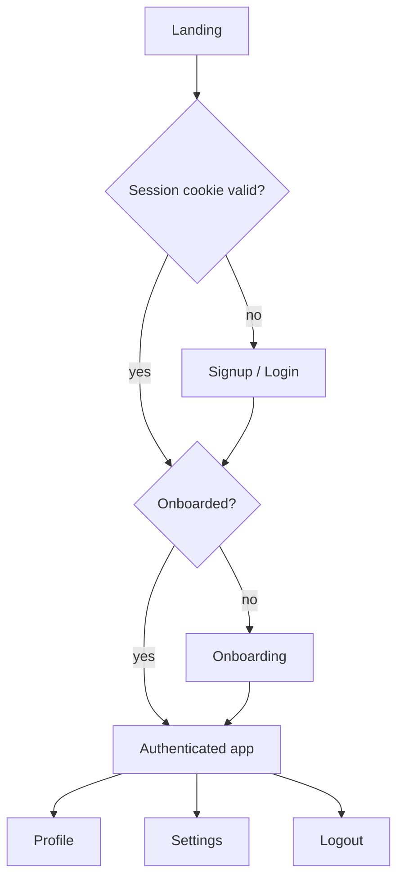

# Anera V2 — Application Flows

| Field | Value |
|---|---|
| **Purpose** | End-to-end user journeys, marked by phase. |
| **Status** | **SELECTED** for Phase 1 flows; **`FUTURE`/`OPEN`** beyond |
| **Owner** | Product owner |
| **Authority** | **Canonical for flow intent.** Derived from D37, D39, D42. |
| **Dependencies** | D37 (auth) · D39 (phasing) · D34 (safety) · D42 (principles) |
| **Related documents** | [`AUTHENTICATION.md`](AUTHENTICATION.md) · [`DATING-CORE.md`](DATING-CORE.md) · [`API-SPECIFICATION.md`](API-SPECIFICATION.md) · [`UX-DESIGN-GUIDELINES.md`](UX-DESIGN-GUIDELINES.md) |
| **Last updated** | 2026-09-02 |
| **Change history** | 2026-09-02 — created. |

---

## 1. Flow notation

Each flow: **entry → steps → validation → server → success → failure → authorization → edge cases**.

Phase markers: **P1** Phase 1 · **P2** Phase 2 · **P3** Phase 3 · **P4** Phase 4 · **P6+** later.

---

## 2. Phase 1 flows

`LOCKED (D37)` — **the session check is a server concern.** With Server Components the server resolves the session before render. There is no client-side "am I authenticated yet?" state.

### 2.1 Landing — **P1**
Entry: unauthenticated visit. Server checks the cookie; authenticated users are routed onward. Public marketing content is `OPEN`.

### 2.2 Signup — **P1**
Steps: email → password → account created. Validation: email format and uniqueness; password policy (`OPEN`). Server: bcrypt hash, create user, create session, set cookie. Success: onboarding. Failure: 400 validation, 409 email exists. Edge: duplicate submit, email casing, signup while authenticated.

### 2.3 Login — **P1**
Server: verify with bcrypt, create session, set cookie. **Failure: 401 with a generic message** — never distinguish unknown user from wrong password. Edge: rate limiting, suspended account, already authenticated.

### 2.4 Logout — **P1**
Server: **delete the session row**, clear the cookie. Idempotent. Edge: "sign out everywhere" deletes all sessions.

### 2.5 Session restoration — **P1**
Cookie sent → server validates → content rendered. **No hydration gate, no readiness flag, no waiting.** Must survive refresh, new tab, and **server restart** (`TESTING-STRATEGY.md` §4 #11).

### 2.6 Onboarding — **P1**
Steps: basics → preferences → photos. Age floor 18 enforced server-side. Completion sets `isOnboarded`. Edge: abandonment mid-flow must resume; **progressive disclosure** (D31). Exact steps and required fields: `OPEN`.

### 2.7 Profile create / edit — **P1**
Server-side validation authoritative. **userId from session only.** Ownership verified on every mutation.

### 2.8 Photo upload — **P1**
Validation: MIME allowlist, size cap, **magic bytes**, extension sanitised. Stored in object storage, served via signed URL. Ownership verified on delete and reorder.

### 2.9 Preferences — **P1**
Age range, gender preference, distance. **New in V2** — the MVP has no preference model, which is why everyone currently sees everyone (`IG-16`).

### 2.10 Password reset — **P1**
Request → email → token → set new password. **All sessions revoked on reset.** No user enumeration in the request response. Token mechanics `OPEN`.

### 2.11 Account settings — **P1 partial**
Phase 1: password change, sessions. Later: notification preferences (P3), privacy controls (P4), deletion (P4).

---

## 3. Phase 2 flows — dating core

| Flow | Notes |
|---|---|
| **Discover** | Candidate set respects **preferences and blocks**. Local-first from P10 |
| **Filters** | Age, distance, gender, intent. Server-side allowlists |
| **Swipe** | Like / Nope / Super Like. Idempotent per pair |
| **Match** | Mutual like creates a match; both notified |
| **Unmatch** | Ends the match. Conversation survivorship `OPEN` (`OQ-TS06`) |
| **Block** | **Immediate** (D34). Removes from discovery, matching and messaging both ways |

## 4. Phase 3 flows — communication

Conversation list · chat · realtime delivery · read receipts · notifications · notification preferences. Authorization: **match participation required**; blocked users cannot reach each other.

## 5. Phase 4 flows — safety & verification

| Flow | Notes |
|---|---|
| **Report** | From profile, photo, message. Categories `OPEN` |
| **Moderation** | Queue → review → action. AI-assisted, human review where appropriate |
| **Appeal** | Required (D34). Process `OPEN` |
| **Email / phone verification** | Progressive levels |
| **Trusted contacts** | "Where supported" (D34) |
| **Account deletion** | Required by D28. Hard vs soft `OPEN` (`OQ-PR06`) |
| **Data export** | Required "where applicable" (D28) |

## 6. Later flows

**P5** AI assistance (with disclosure — no silent impersonation) · **P6** paywall, upgrade, purchase extras, billing management · **P7** referral entry as an invited user, redemption, rewards · **P8** social · **P9** event discovery, ticketing, attendance · **P10** discovery expansion control, Travel/Relocation Mode · **P11** Elite application and concierge.

---

## 7. Universal rules

`LOCKED` — apply to every flow:

1. **Authorization is server-side.** Client checks are UX only.
2. **userId comes from the session.** Never from client input.
3. **Every screen has a clear primary action** (D31).
4. **Loading, empty and error states are meaningful** (D31).
5. **Blocked users never see each other** anywhere (D34).
6. **Errors never leak** account existence or internals.
7. **Mobile-first** (D31).
8. **Progressive disclosure** — depth on demand, not upfront.

## 8. Open items

| Item | Tracked as |
|---|---|
| Landing / marketing content | `OQ-P05` |
| Onboarding step composition and required fields | `OQ-P05` |
| Password policy | `OQ-AUTH-02` |
| Filter set and defaults | `OQ-D01` |
| Unmatch conversation survivorship | `OQ-TS06` |
| Account deletion semantics | `OQ-PR06` |
| Paywall placement and frequency | `OQ-UX09` |

---

*Canonical flow intent. Phase 1 flows are implementation-ready; later flows are directional.*
