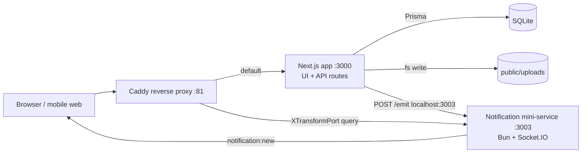

# Anera V2 — Platform Architecture & Technical Governance

| Field | Value |
|---|---|
| **Document name** | `docs/ARCHITECTURE-GOVERNANCE.md` |
| **Status** | **APPROVED** — architectural principles and governance rules. **No technology is approved by this decision.** |
| **Authority** | Derived from [`DECISIONS.md`](DECISIONS.md) — **Decision 30**. Where this document and `DECISIONS.md` disagree, `DECISIONS.md` wins. |
| **Purpose** | The approved architectural principles and technical governance rules for Anera V2. |
| **Last updated** | 2026-09-01 |

> **This document approves no technology.** Decision 30 approves architectural *principles* and *governance*, not a stack. The technologies currently in the repository are `CURRENT IMPLEMENTATION` and their future status is `OPEN / UNDECIDED`. Do not read this document as ratifying them, and do not read it as rejecting them.

---

## 1. The governing rule

`APPROVED (D30)`:

> ## **Claude Code must STOP and surface conflicts or missing requirements rather than inventing or silently reconciling them.**

This is the single most important rule in Anera's technical governance. It applies to every contributor, human or AI, and it applies at every stage.

Its practical form:

| Situation | Required action |
|---|---|
| A requirement is missing | Stop. Record it as `OPEN / UNDECIDED`. Escalate. **Do not fill it in.** |
| Two sources conflict | Stop. Record the conflict, naming both sources. Escalate. **Do not pick a side.** |
| Code contradicts an approved decision | The decision stands. Log the code as an implementation gap for a future remediation phase. **Do not silently change either.** |
| A default seems obvious | An obvious default is still a decision. It requires approval. |

---

## 2. Architectural principles

### 2.1 Structure

| Principle | Status | Meaning |
|---|---|---|
| **Modular / domain-oriented architecture** | `APPROVED` | The system is organised around domains with real boundaries. |
| **Modular monolith initially where practical** | `APPROVED` | The starting shape is a *modular* monolith. "Where practical" is a qualifier, not a licence to abandon modularity. |
| **Extract services only when justified** | `APPROVED` | **Premature service extraction is prohibited.** Extraction requires justification and evidence. |
| **Evidence-based architecture evolution** | `APPROVED` | Architecture changes on evidence, not preference or fashion. |
| **Backward compatibility** | `APPROVED` | Changes preserve compatibility. |
| **Migration governance** | `APPROVED` | Migrations are governed, versioned and reviewed. |

> **Being a monolith is not the same as being a *modular* monolith.** The current codebase is a single deployable with **no domain module boundaries**, no service layer, and route handlers that call the ORM directly. It satisfies "monolith" and fails "modular".

`OPEN / UNDECIDED`: the domain module boundaries themselves and their names.

### 2.2 Cross-cutting platform capabilities

`APPROVED (D30)` — each of the following is required as a **first-class architectural concern**, not as scattered per-feature code:

| Capability | Approved requirement | Related decision |
|---|---|---|
| **Central authentication / authorization governance** | Auth is centrally governed, not reimplemented per feature. | D32, D34 |
| **Commerce / entitlement architecture** | Entitlements are modelled explicitly. | D26, D17, D20 |
| **Auditable ledgers** | Value movement is ledger-recorded and auditable. | D17, D20, D26, D27, D32 |
| **Dedicated matching architecture** | Matching has its own architecture. | — |
| **Separate discovery / matching / ranking responsibilities** | These are three distinct responsibilities, not one. | D35 |
| **Central AI Gateway** | All AI access flows through one gateway. | D18, D28, D29 |
| **Event-driven architecture where appropriate** | Conditional — "where appropriate". | — |
| **Background jobs / queues** | Asynchronous work has infrastructure. | — |
| **Real-time architecture** | Real-time capability is architected. | D33 |
| **Media architecture** | Media handling is architected. | D33 |
| **Notification architecture** | Notifications are architected. | D33 |
| **Central Trust & Safety architecture** | Safety is central, not per-feature. | D34 |
| **Observability** | The system is observable. | D29 |

#### On "separate discovery / matching / ranking"

This is an explicit approved separation with three distinct responsibilities:

- **Discovery** — determining the candidate set (bounded by D35's local-first expansion ladder).
- **Matching** — determining mutual interest and its consequences.
- **Ranking** — ordering candidates.

`CURRENT IMPLEMENTATION` collapses all three into one endpoint (`GET /api/discover`) that returns an unfiltered, unranked set ordered by profile creation date. There is no ranking at all.

**The matching logic itself is `OPEN / UNDECIDED`.** Decision 30 approves that a dedicated matching architecture must exist; **it does not say what the matching engine does.** No decision supplies matching inputs, scoring, weighting or thresholds. See `OD-17`.

### 2.3 Delivery and quality

| Principle | Status | Meaning |
|---|---|---|
| **Multi-layer testing** | `APPROVED` | Testing at multiple layers is required. Tools, layers and thresholds are `OPEN`. |
| **Feature flags** | `APPROVED` | Also approved by D29. Enables controlled rollout. |
| **Security gates** | `APPROVED` | Security review is part of the delivery pipeline, not optional. |
| **Documentation-driven development** | `APPROVED` | Documentation precedes implementation. |
| **Technical Decision Records** | `APPROVED` | Technical decisions are recorded. |
| **Cost governance** | `APPROVED` | Costs are governed — notably AI cost (D29). |

---

## 3. Documentation-driven development

`APPROVED (D30)` — **documentation-driven development** and **Technical Decision Records**.

### 3.1 The pipeline

Combined with the governance directives already in force, the approved pipeline is:

```
APPROVED DECISION
      ↓
DOCUMENTED REQUIREMENT
      ↓
TECHNICAL DESIGN
      ↓
IMPLEMENTATION PLAN
      ↓
CODE
      ↓
TEST
      ↓
SECURITY REVIEW
      ↓
ACCEPTANCE
      ↓
RELEASE
```

**No step may be skipped. Nothing goes from conversation directly to code.**

### 3.2 Technical Decision Records (TDRs)

`APPROVED (D30)` — TDRs are required.

TDRs are **distinct from** `docs/DECISIONS.md`:

| Artefact | Records | Approved by |
|---|---|---|
| `docs/DECISIONS.md` | **Product and platform decisions.** What Anera is and must do. | Product owner |
| **Technical Decision Records** | **Technical decisions.** How an approved requirement is implemented — technology choices, patterns, trade-offs. | `OPEN / UNDECIDED` — the approval process for TDRs is not defined |

`OPEN / UNDECIDED`: where TDRs live, their template, their numbering, and who approves them.

A TDR **cannot approve a product requirement**, and it cannot override `docs/DECISIONS.md`.

---

## 4. What Decision 30 does NOT approve

This section exists because architectural principles are frequently misread as technology mandates.

**No technology is approved.** Specifically `OPEN / UNDECIDED`:

| Category | Status |
|---|---|
| Application framework | `OPEN / UNDECIDED` |
| Database engine | `OPEN / UNDECIDED` |
| ORM | `OPEN / UNDECIDED` |
| Queue / job system | `OPEN / UNDECIDED` |
| Cache | `OPEN / UNDECIDED` |
| Real-time transport | `OPEN / UNDECIDED` |
| Media storage / CDN | `OPEN / UNDECIDED` |
| AI provider and models | `OPEN / UNDECIDED` — see D18 |
| Analytics platform | `OPEN / UNDECIDED` — see D29 |
| Observability / error monitoring tooling | `OPEN / UNDECIDED` |
| Feature flag system | `OPEN / UNDECIDED` |
| ~~Testing tools, coverage thresholds~~ | ✅ **RESOLVED by Decision 43** — Vitest + Playwright; coverage is critical-path + ratchet |
| ~~CI provider and required checks~~ | ✅ **RESOLVED by Decision 43** — GitHub Actions; `tsc`, ESLint, production build and the full test suite on every push and PR |
| Hosting, deployment target, environment topology | `OPEN / UNDECIDED` |
| Secret management | `OPEN / UNDECIDED` |
| Payment provider | `OPEN / UNDECIDED` — see D26 |
| Verification provider | `OPEN / UNDECIDED` — see D34 |
| Cost governance thresholds and budgets | `OPEN / UNDECIDED` |
| Which services, if any, are extracted | `OPEN / UNDECIDED` |

**Also not approved:** the matching algorithm (`OD-17`), the domain module boundaries, the API contract style, and the location data model needed for D35's local-first discovery (`OD-14`).

---

## 5. Current implementation state

`CURRENT IMPLEMENTATION` — verified against the repository. **This is a description, not an approval.**

### 5.1 The existing stack

| Layer | Technology |
|---|---|
| Framework | Next.js ^16.1.1, App Router, `output: "standalone"` |
| UI runtime | React ^19 |
| Language | TypeScript ^5 (`strict: true`, `noImplicitAny: false`) |
| Styling | Tailwind CSS ^4 |
| Components | shadcn/ui + Radix UI |
| Client state | Zustand ^5 |
| ORM | Prisma ^6.11.1 |
| Database | **SQLite** (`file:../db/custom.db`) |
| Password hashing | bcryptjs |
| Real-time | Socket.IO — a separate Bun mini-service on port 3003, notifications only |
| Reverse proxy | Caddy on port 81, `XTransformPort` query routing |
| Linting | ESLint 9 with ~25 rules disabled |

**Declared but never imported:** `next-auth`, `@tanstack/react-query`, `next-intl`, `z-ai-web-dev-sdk`, `uuid`, `sharp`, `date-fns`, `react-markdown`, `react-syntax-highlighter`, `@mdxeditor/editor`.

### 5.2 Existing topology



`CURRENT IMPLEMENTATION` — this topology, including the Caddy `XTransformPort` convention, originated in a hosted sandbox environment and carries artefacts of it (see `IG-53`).

### 5.3 Gaps against approved principles

**None is to be fixed now.**

| Gap | Description | Approved principle violated |
|---|---|---|
| `IG-01` | **The authentication conflict.** Session token stored in `localStorage` and sent as a Bearer header. **Not resolved by Decisions 16–35 — still `OPEN / UNDECIDED` and still blocking.** | Central authentication governance; security posture |
| `IG-02` | `next-auth` declared but never imported; auth is hand-rolled HMAC. The intended approach is ambiguous. | Central authentication governance |
| `IG-09` | **No domain module boundaries, no service layer.** Route handlers call Prisma directly. | Modular / domain-oriented architecture |
| `IG-54` | **Discovery, matching and ranking are collapsed into one endpoint**, and ranking does not exist. | Separate discovery / matching / ranking responsibilities |
| `IG-55` | **No AI Gateway** — and no AI at all. | Central AI Gateway |
| `IG-43` | **No commerce or entitlement architecture, and no ledger.** | Commerce/entitlement architecture; auditable ledgers |
| `IG-56` | **No central Trust & Safety architecture** — no blocking, reporting, moderation or enforcement. | Central Trust & Safety architecture |
| `IG-10` | **No observability, no error monitoring, no queues, no background jobs, no feature flags.** Engagement prompts are computed synchronously inside a request. | Observability; background jobs/queues; feature flags |
| `IG-21` | **Zero automated tests, no CI**, `typescript.ignoreBuildErrors: true`, ~25 ESLint rules disabled. | Multi-layer testing; security gates |
| `IG-22` | **`prisma/migrations/` is untracked in git.** | Migration governance |
| `IG-57` | **No Technical Decision Records** exist and no TDR process is defined. | Technical Decision Records |
| `IG-53` | **Sandbox coupling:** Caddy `XTransformPort` routing, `allowedDevOrigins: ['.space-z.ai']`, `start-dev.sh` hard-coding `/home/z/my-project`, hard-coded `http://localhost:3003` for notification emit, external `z-cdn.chatglm.cn` favicon. | Evidence-based architecture; deployability |
| `IG-58` | **SQLite plus local-disk uploads** cannot support a multi-instance deployment; the database file is gitignored and not reproducible. | Evidence-based architecture evolution |
| `IG-59` | **No cost governance** of any kind. | Cost governance |
| `IG-60` | **Prisma client is constructed on every module instantiation** (the singleton was deliberately removed as a workaround for a stale-client bug). | Observability; evidence-based evolution |

---

## 6. Governance rules in force

`APPROVED` — consolidated from Decision 30 and the standing project governance:

1. **Stop and surface** conflicts or missing requirements. Never invent; never silently reconcile.
2. **Documentation precedes implementation.** No step of the pipeline (§3.1) may be skipped.
3. **Record technical decisions as TDRs**; record product decisions in `docs/DECISIONS.md`.
4. **Extract services only when justified** by evidence.
5. **Preserve backward compatibility**; govern migrations.
6. **Security gates are part of delivery**, not a follow-up.
7. **Multi-layer testing** is required.
8. **Cost governance** applies to variable-cost systems.
9. **Do not select a technology** that has not been approved.
10. **Do not treat existing technology as approved architecture.**

---

## 7. Rules for anyone implementing in this area

1. **Do not choose a technology.** None is approved by Decision 30.
2. **Do not migrate the database, framework, or any stack component** on your own initiative.
3. **Do not extract a service.** Extraction requires justification and evidence.
4. **Do not build the matching engine.** Its architecture is approved; its logic is undecided.
5. **Do not resolve the authentication conflict (`IG-01`).** Decisions 16–35 do not address it; it remains open and blocking.
6. **Do not treat the existing stack as either approved or rejected.** It is `CURRENT IMPLEMENTATION`, and its future is undecided.
7. **When in doubt, stop.** This is the approved governing rule, not a fallback.

---

*Derived from `docs/DECISIONS.md` Decision 30. Items marked `OPEN / UNDECIDED` are tracked in `docs/OPEN-QUESTIONS.md`. Gaps are tracked in `docs/IMPLEMENTATION-GAPS.md`.*
