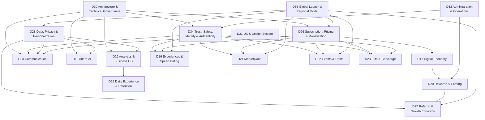

# Anera V2 — Decision Register

| Field | Value |
|---|---|
| **Document name** | `docs/DECISIONS.md` |
| **Project** | Anera V2 |
| **Status** | **APPROVED** |
| **Authority** | **Priority 1 — the highest authority in the Anera V2 documentation system.** Every other document, and all code, is subordinate to this register. |
| **Purpose** | The authoritative, append-only record of approved Anera V2 decisions. |
| **Last updated** | 2026-09-01 |
| **Decisions recorded** | 16–35 (20 decisions) |

---

## Table of Contents

- [1. Document Purpose](#1-document-purpose)
- [2. Decision Governance Rules](#2-decision-governance-rules)
- [3. Decision Status Definitions](#3-decision-status-definitions)
- [4. Decision Numbering](#4-decision-numbering)
- [5. Decision History](#5-decision-history)
- [6. Decision Index](#6-decision-index)
- [7. Decisions](#7-decisions)
  - [Decision 16 — Experiences & Speed Dating](#decision-16--experiences--speed-dating)
  - [Decision 17 — Enhanced Interactions & Digital Economy](#decision-17--enhanced-interactions--digital-economy)
  - [Decision 18 — Anera AI Intelligence](#decision-18--anera-ai-intelligence)
  - [Decision 19 — Daily Experience, Retention & Engagement](#decision-19--daily-experience-retention--engagement)
  - [Decision 20 — User Value, Rewards & Earning](#decision-20--user-value-rewards--earning)
  - [Decision 21 — Marketplace & Services](#decision-21--marketplace--services)
  - [Decision 22 — Events, Hosts & Community Economy](#decision-22--events-hosts--community-economy)
  - [Decision 23 — Anera Elite & Concierge](#decision-23--anera-elite--concierge)
  - [Decision 24 — Trust, Safety, Identity & Authenticity](#decision-24--trust-safety-identity--authenticity)
  - [Decision 25 — Globalization & Local-First Discovery](#decision-25--globalization--local-first-discovery)
  - [Decision 26 — Subscription, Pricing & Monetization](#decision-26--subscription-pricing--monetization)
  - [Decision 27 — Referral & Growth Economy](#decision-27--referral--growth-economy)
  - [Decision 28 — Data, Privacy & Personalization](#decision-28--data-privacy--personalization)
  - [Decision 29 — Analytics, Intelligence & Business Operating System](#decision-29--analytics-intelligence--business-operating-system)
  - [Decision 30 — Platform Architecture & Technical Governance](#decision-30--platform-architecture--technical-governance)
  - [Decision 31 — UX, UI & Design System](#decision-31--ux-ui--design-system)
  - [Decision 32 — Administration, Operations & Internal Control System](#decision-32--administration-operations--internal-control-system)
  - [Decision 33 — Communication & Social Interaction System](#decision-33--communication--social-interaction-system)
  - [Decision 34 — Trust, Safety, Identity & Authenticity](#decision-34--trust-safety-identity--authenticity)
  - [Decision 35 — Global Launch, Localization & Regional Operating Model](#decision-35--global-launch-localization--regional-operating-model)
- [8. Cross-Decision Dependency Map](#8-cross-decision-dependency-map)
- [9. Platform-Wide Non-Negotiable Rules](#9-platform-wide-non-negotiable-rules)
- [10. Conflicts Requiring Implementation Remediation](#10-conflicts-requiring-implementation-remediation)
- [11. Remaining Unresolved Decisions](#11-remaining-unresolved-decisions)

---

## 1. Document Purpose

This register records decisions that the Anera V2 product owner has **explicitly approved**. It is the single source of truth for what Anera V2 must be.

It answers one question: *has this been decided, and if so, exactly what was decided?*

It does **not** contain technical designs, implementation plans, or invented detail. Where an approved decision names a capability but does not define its rules, this register says so and marks the rules `OPEN / UNDECIDED`. Filling such a gap is a new decision, not an act of interpretation.

**Anyone — human or AI — who needs to know whether something is allowed reads this document first.**

---

## 2. Decision Governance Rules

1. **This register outranks everything.** Where this document and any other document, comment, or line of code disagree, this document wins.
2. **Approved decisions are not editable.** A decision is changed only by recording a *new* decision that supersedes it. The superseded entry stays, marked `SUPERSEDED BY Decision NN`.
3. **Only the product owner approves decisions.** No agent, contributor, or automated process may create, alter, or resolve a decision.
4. **An `OPEN / UNDECIDED` item is closed only by a new approved decision.** It is never closed by an implementation choice, a default, or an agent's judgement.
5. **Approved scope is not approved detail.** Where a decision approves that a capability exists but does not state its rules, only the existence is approved. Building the capability requires the rules to be decided first.
6. **Conflicts are recorded, never silently reconciled.** If code contradicts an approved decision, the code is marked for remediation (§10) and the decision stands unchanged. If two decisions contradict each other, the conflict is escalated to the product owner.
7. **Stop rather than invent.** Per Decision 30, when a requirement is missing or two sources conflict, work stops and the gap is surfaced. Proceeding on an assumption is prohibited.
8. **The pipeline is fixed.** Approved decision → documented requirement → technical design → implementation plan → code → test → security review → acceptance → release. No step may be skipped, and in particular nothing may go from conversation directly to code.

---

## 3. Decision Status Definitions

| Status | Meaning |
|---|---|
| `APPROVED` | The product owner has approved this decision. It is binding. |
| `APPROVED — SCOPE ONLY` | The product owner has approved that this capability/area exists and is in scope for Anera V2, but the approval text supplied no detailed principles. Existence is binding; rules are `OPEN / UNDECIDED`. |
| `PROPOSED` | Drafted, not yet approved. Not binding. No such entries exist today. |
| `SUPERSEDED BY Decision NN` | Replaced by a later decision. Retained for history. |
| `REJECTED` | Considered and declined. Retained so it is not re-proposed. No such entries exist today. |
| `OPEN / UNDECIDED` | Applied to individual items within a decision where no answer has been approved. |

### 3.1 Item-level status vocabulary

Used **inside** documents for individual technologies, features and options. These are not decision statuses.

| Status | Meaning |
|---|---|
| `LOCKED` | Fixed by an approved decision. Changing it requires a new decision. |
| `SELECTED` | Chosen, and expected to hold, but not yet locked by a decision. |
| `RECOMMENDED` | Proposed by engineering judgement. **Carries no authority.** |
| `OPTION` | A viable candidate under consideration. Not chosen. |
| `OPEN` | No answer exists. Must not be assumed. |
| `DEPRECATED` | Was in use or was approved; now superseded. Must not be extended. |
| `PROTOTYPE ONLY` | Exists for experimentation. Must never reach production or be cited as a requirement. |

---

## 4. Decision Numbering

- Decisions are numbered sequentially and permanently. A number is never reused.
- This register currently holds **Decisions 16 through 35**.
- **Decisions 1–15 are not present in this repository.** They were not supplied with the approval record that created this register. They may exist in an external conversation record held by the product owner. Their absence is recorded as governance item `OQ-G01` in `OPEN-QUESTIONS.md`. Until they are supplied, no statement may be attributed to them.
- Two decisions in this register share a title (24 and 34, both *Trust, Safety, Identity & Authenticity*), and two cover closely related ground (25 and 35, globalization). This is recorded as governance item `OQ-G02`. It has **not** been resolved by renumbering, merging, or deleting either entry.

---

## 5. Decision History

| Date | Event |
|---|---|
| 2026-08-30 | `docs/00-MASTER-SPECIFICATION.md` created from a full repository audit. At that time **no approved product decisions existed** in the repository; the audit recorded 31 open decisions (`OD-01`…`OD-31`) and 10 conflicts (`CONF-01`…`CONF-10`). |
| 2026-09-01 | Decisions 16–35 approved by the product owner and recorded in this register. This is the first decision record in the project's history. |
| 2026-09-01 | Documentation consolidation performed: subsystem specifications created for the approved decision areas; implementation gap register created; master specification annotated with a Post-Decision Update. No application code changed. |
| 2026-09-02 | Documentation taxonomy review. Two renames; three creations rejected as duplicates; flat structure retained. Recorded in `DOCUMENTATION-AUDIT.md` §8. |
| 2026-09-02 | **Decision 43 approved.** Vitest, Playwright, GitHub Actions, `tsc`, ESLint and the Next.js production build are locked as the verification stack; coverage is defined as critical-path plus a no-regression ratchet rather than an arbitrary percentage. **`OQ-B06` / `OD-28` / `BL-06` resolved — the last Phase 0 blocker. Phase 0 is FROZEN.** No application code changed. |
| 2026-09-02 | **Decisions 36–42 approved.** The V2 technology stack and authentication architecture are locked; the five-tier subscription ladder supersedes D26's tier names; the thirteen-phase implementation plan is approved; legacy code policy and documentation taxonomy are formalised; principles are supplied for most of D16–D23. **`OD-09`/`OQ-B02` (authentication) and `OD-29`/`OQ-B03` (phase list) — blocking since the project began — are resolved.** No application code changed. |

---

## 6. Decision Index

| # | Decision | Status | Principles supplied? | Primary document |
|---|---|---|---|---|
| 16 | Experiences & Speed Dating | `APPROVED — SCOPE ONLY` | ❌ | *deferred* — see §11 |
| 17 | Enhanced Interactions & Digital Economy | `APPROVED — SCOPE ONLY` | ❌ | `SUBSCRIPTION-MONETIZATION.md` (extras) |
| 18 | Anera AI Intelligence | `APPROVED — SCOPE ONLY` | ❌ | *deferred* — see §11 |
| 19 | Daily Experience, Retention & Engagement | `APPROVED — SCOPE ONLY` | ❌ | *deferred* — see §11 |
| 20 | User Value, Rewards & Earning | `APPROVED — SCOPE ONLY` | ❌ | *deferred* — see §11 |
| 21 | Marketplace & Services | `APPROVED — SCOPE ONLY` | ❌ | *deferred* — see §11 |
| 22 | Events, Hosts & Community Economy | `APPROVED — SCOPE ONLY` | ❌ | *deferred* — see §11 |
| 23 | Anera Elite & Concierge | `APPROVED — SCOPE ONLY` | ❌ | *deferred* — see §11 |
| 24 | Trust, Safety, Identity & Authenticity | `APPROVED — SCOPE ONLY` | ❌ | `TRUST-AND-SAFETY.md` (detail carried by Decision 34) |
| 25 | Globalization & Local-First Discovery | `APPROVED — SCOPE ONLY` | ❌ | `GLOBAL-OPERATING-MODEL.md` (detail carried by Decision 35) |
| 26 | Subscription, Pricing & Monetization | `APPROVED` | Clarification only | `SUBSCRIPTION-MONETIZATION.md` |
| 27 | Referral & Growth Economy | `APPROVED` | ✅ | `REFERRAL-ECONOMY.md` |
| 28 | Data, Privacy & Personalization | `APPROVED` | ✅ | `PRIVACY-GUIDELINES.md` |
| 29 | Analytics, Intelligence & Business Operating System | `APPROVED` | ✅ | `ANALYTICS.md` |
| 30 | Platform Architecture & Technical Governance | `APPROVED` | ✅ | `ARCHITECTURE-GOVERNANCE.md` |
| 31 | UX, UI & Design System | `APPROVED` | ✅ | `UX-DESIGN-GUIDELINES.md` |
| 32 | Administration, Operations & Internal Control System | `APPROVED` | ✅ | `ADMIN-OPERATIONS.md` |
| 33 | Communication & Social Interaction System | `APPROVED` | ✅ | `COMMUNICATION.md` |
| 34 | Trust, Safety, Identity & Authenticity | `APPROVED` | ✅ | `TRUST-AND-SAFETY.md` |
| 35 | Global Launch, Localization & Regional Operating Model | `APPROVED` | ✅ | `GLOBAL-OPERATING-MODEL.md` |
| **36** | **V2 Technology Stack** | `APPROVED` | ✅ | `TECH-STACK.md` |
| **37** | **V2 Authentication Architecture** | `APPROVED` | ✅ | `AUTHENTICATION.md` |
| **38** | **Subscription Tier Structure** — supersedes D26 tier names | `APPROVED` | ✅ | `SUBSCRIPTION-MONETIZATION.md` |
| **39** | **Phased Implementation Plan** | `APPROVED` | ✅ | `ROADMAP.md` |
| **40** | **Legacy Code Policy** | `APPROVED` | ✅ | this register + `IMPLEMENTATION-GAPS.md` |
| **41** | **Documentation Taxonomy** | `APPROVED` | ✅ | `README.md`, `DOCUMENTATION-AUDIT.md` §8 |
| **42** | **Principles Supplied for Decisions 16–23** | `APPROVED` | ✅ | `DATING-CORE.md`, `AI-ARCHITECTURE.md`, `EVENTS.md`, `ELITE.md`, `SOCIAL.md` |
| **43** | **Testing Stack, CI and the Phase 1 Verification Gate** | `APPROVED` | ✅ | `TESTING-STRATEGY.md`, `TECH-STACK.md` |
| **44** | **Package Manager and Lockfile** — npm + `package-lock.json` | `APPROVED` | ✅ | `TECH-STACK.md` |

> **Reading note.** Decisions 16–25 were approved with a title and subject area but **no detailed principles**. This is faithfully recorded. Several of the capabilities they own — Speed Dating, Experiences, Gifts, Boosts, Spotlight, Super Likes, Marketplace, Events, Hosts, Elite, Concierge, Relationship Memory, Travel Mode, Relocation Mode, Anera Credits, user earning, City Health Score, AI Gateway — are **named inside the approved principle lists of Decisions 26–35**. Their *existence* is therefore approved by attestation. Their *rules* are not.

---

## 7. Decisions

---

### Decision 16 — Experiences & Speed Dating

**Status: `APPROVED — SCOPE ONLY`**

#### Decision

Anera V2 includes **Experiences** and **Speed Dating** as product capabilities. Both are approved as in-scope areas of the platform.

#### Approved Principles

**NOT SUPPLIED.** The approval record names this decision and its subject area but contains no detailed principles. Every rule governing Experiences and Speed Dating — formats, scheduling, participation, capacity, matching within a session, pricing, cancellation, no-shows, hosting — is `OPEN / UNDECIDED`.

#### Corroborating attestations from other approved decisions

These confirm that the capabilities exist and that they carry obligations, without defining their rules:

| Attestation | Source |
|---|---|
| Speed Dating requires dedicated safety handling | Decision 34 — "Speed Dating safety" |
| Speed Dating requires dedicated analytics | Decision 29 — "Speed Dating analytics" |
| Experiences are purchasable as eligible individual extras by all subscription tiers | Decision 26 — approved clarification |
| Events and group communication capability is approved | Decision 33 — "Event/group communication" |

#### Non-Negotiable Rules

- No Speed Dating or Experiences feature may bypass blocking, consent, safety, or hard eligibility controls (Decision 26, Decision 33, Decision 34).
- Speed Dating safety is a mandatory design input, not an optional add-on (Decision 34).
- Safety in these features cannot be pay-to-win (Decision 34).

#### Dependencies

Decision 22 (Events, Hosts & Community Economy) · Decision 26 (purchasable as extras) · Decision 29 (analytics) · Decision 33 (event/group communication) · Decision 34 (safety) · Decision 35 (local events, timezone awareness).

#### Implementation Implications

Nothing may be built. The capability is approved; its behaviour is not defined. Before any implementation, the product owner must supply the principles that turn `APPROVED — SCOPE ONLY` into `APPROVED`. When those exist, the feature must be designed against approved safety (D34), analytics (D29), commerce (D26) and communication (D33) obligations from the outset rather than retrofitted.

#### Existing Repository Conflicts

None. No Experiences or Speed Dating code, schema, or configuration exists in the repository.

---

### Decision 17 — Enhanced Interactions & Digital Economy

**Status: `APPROVED — SCOPE ONLY`**

#### Decision

Anera V2 includes **enhanced interactions** and a **digital economy** as product capabilities.

#### Approved Principles

**NOT SUPPLIED.** No detailed principles accompany this decision. The mechanics of the digital economy — currency, balances, expiry, gifting rules, consumption, refunds, accounting — are `OPEN / UNDECIDED`.

#### Corroborating attestations from other approved decisions

| Attestation | Source |
|---|---|
| Super Likes, Gifts, Boosts and Spotlight exist and are eligible individual extras purchasable by all tiers | Decision 26 — approved clarification |
| Gifts are part of the communication system | Decision 33 — "Gifts" |
| Anera Credits / non-cash rewards exist | Decision 27 |
| Digital economy analytics are required | Decision 29 — "Digital economy analytics" |
| Commerce, entitlement architecture and **auditable ledgers** are required | Decision 30 |
| Financial adjustments are ledger-based | Decision 32 |

#### Non-Negotiable Rules

- No paid feature may guarantee a match, romantic interest, a response, or a date (Decision 26, Decision 33).
- No paid feature may bypass blocking, consent, safety, or hard eligibility controls (Decision 26, Decision 33, Decision 34).
- Value movements must be recorded in auditable ledgers (Decision 30, Decision 32).

#### Dependencies

Decision 20 (User Value, Rewards & Earning) · Decision 26 (extras) · Decision 27 (Credits) · Decision 29 (analytics) · Decision 30 (commerce, entitlements, ledgers) · Decision 32 (ledger-based financial adjustments) · Decision 33 (gifts).

#### Implementation Implications

Nothing may be built. The names of several economy features are approved by attestation, but their rules, costs, balances and lifecycle are undefined. Any future implementation inherits the ledger and auditability obligations of Decisions 30 and 32.

#### Existing Repository Conflicts

- `IG-07` — the notification type `boost_expired` exists in `src/lib/notifications.ts` and `prisma/schema.prisma` with **no boost feature behind it**. It is produced only by development tooling. Recorded in the master specification as `CONF-07`. This is an implementation artefact, not evidence of an approved boost design.

---

### Decision 18 — Anera AI Intelligence

**Status: `APPROVED — SCOPE ONLY`**

#### Decision

Anera V2 includes **Anera AI Intelligence** as a product capability.

#### Approved Principles

**NOT SUPPLIED.** No detailed principles accompany this decision. AI providers, models, features, prompts, cost limits, evaluation, and fallback behaviour are all `OPEN / UNDECIDED`.

#### Corroborating attestations from other approved decisions

| Attestation | Source |
|---|---|
| A **central AI Gateway** is required | Decision 30 |
| AI personalization controls, AI inference privacy, and third-party AI/data-processing controls are required | Decision 28 |
| AI quality, cost and safety analytics are required | Decision 29 |
| AI-assisted moderation with human review where appropriate | Decision 34 |
| AI conversation assistance and conversation starters exist | Decision 33 |
| Local-context AI | Decision 35 |
| An **AI Operations** admin function exists | Decision 32 |
| Cost governance applies | Decision 30 |

#### Non-Negotiable Rules

- **AI must not silently impersonate users** (Decision 33).
- AI personalization must not be manipulative and must not exploit user vulnerability (Decision 28).
- AI-assisted moderation does not replace human review where human review is appropriate (Decision 34).
- All AI access must go through the central AI Gateway rather than ad-hoc provider calls (Decision 30).
- AI features must not be invented. Each requires an approved requirement before implementation.

#### Dependencies

Decision 28 (AI privacy, inference, third-party processing) · Decision 29 (AI quality/cost/safety analytics) · Decision 30 (AI Gateway, cost governance) · Decision 32 (AI Operations) · Decision 33 (AI conversation assistance) · Decision 34 (AI-assisted moderation) · Decision 35 (local-context AI).

#### Implementation Implications

Nothing may be built. The *architecture requirement* (a central AI Gateway) is approved by Decision 30; the *features* that would use it are not defined. Selecting providers or models now would be an invention — it is `OPEN / UNDECIDED` and recorded in `OPEN-QUESTIONS.md`.

#### Existing Repository Conflicts

- `IG-15` — `z-ai-web-dev-sdk@0.0.17` is declared in `package.json` and **never imported**. It is a sandbox-vendor artefact, not an approved AI provider choice, and must not be treated as one.
- No AI code paths exist anywhere in `src/` or `mini-services/`.

---

### Decision 19 — Daily Experience, Retention & Engagement

**Status: `APPROVED — SCOPE ONLY`**

#### Decision

Anera V2 includes a **daily experience, retention and engagement** system as a product capability.

#### Approved Principles

**NOT SUPPLIED.** No detailed principles accompany this decision. Daily mechanics, streak rules, rewards for returning, prompt cadence, and re-engagement policy are `OPEN / UNDECIDED`.

#### Corroborating attestations from other approved decisions

| Attestation | Source |
|---|---|
| Retention and user satisfaction are tracked | Decision 29 |
| Notification controls are user-configurable | Decision 33 |
| The platform optimizes for safe, meaningful connections and sustainable user value, **not vanity engagement alone** | Decision 29 — core principle |
| Personalization must not be manipulative or exploit user vulnerability | Decision 28 |

#### Non-Negotiable Rules

- **Engagement must not be optimized as an end in itself.** Decision 29's core principle binds this decision: optimize for safe, meaningful connections and sustainable user value, not vanity engagement.
- No manipulative personalization; no exploitation of user vulnerability (Decision 28).

#### Dependencies

Decision 28 (no manipulative personalization) · Decision 29 (retention, satisfaction, meaningful-connection funnel) · Decision 33 (notification controls) · Decision 20 (rewards).

#### Implementation Implications

The existing streak and engagement-prompt implementation predates this decision and was **not** built against it. It must be reviewed against the approved anti-vanity-engagement principle before being extended. Extending it now would be implementation without an approved requirement.

#### Existing Repository Conflicts

- `IG-19` — a daily streak system, profile-completion scoring, and engagement prompts exist in `src/lib/engagement.ts`. These are `CURRENT IMPLEMENTATION` built before any approved requirement. They are not ratified by this decision and require review against Decision 29's core principle.
- `IG-13` — streak dates are computed in UTC with no timezone handling, which conflicts with Decision 35's approved **timezone awareness** principle.

---

### Decision 20 — User Value, Rewards & Earning

**Status: `APPROVED — SCOPE ONLY`**

#### Decision

Anera V2 includes **user value, rewards and earning** as a product capability — users can receive value from, and earn through, the platform.

#### Approved Principles

**NOT SUPPLIED.** No detailed principles accompany this decision. What users can earn, how, at what rate, with what payout mechanism, tax treatment, and eligibility, are all `OPEN / UNDECIDED`.

#### Corroborating attestations from other approved decisions

| Attestation | Source |
|---|---|
| **User earning analytics** are required | Decision 29 |
| Anera Credits / non-cash rewards, and eligible monetary rewards, exist within the referral economy | Decision 27 |
| Auditable ledgers are architecturally required | Decision 30 |
| A **Finance** admin function and ledger-based financial adjustments exist | Decision 32 |
| Hosts, experts/providers and creators are recognised participant types | Decision 27, Decision 32 |

#### Non-Negotiable Rules

- Earning and reward mechanisms must be recorded in auditable ledgers (Decision 30, Decision 32).
- No pyramid or passive-income structure, and no unlimited multi-level recruitment (Decision 27).
- Financial adjustments occur through ledger entries, never through direct data manipulation (Decision 32).

#### Dependencies

Decision 17 (digital economy) · Decision 21 (Marketplace) · Decision 22 (Hosts) · Decision 26 (monetization) · Decision 27 (referral rewards, Credits) · Decision 29 (earning analytics) · Decision 30 (ledgers) · Decision 32 (Finance operations) · Decision 35 (currency, regional payments, tax-aware commerce).

#### Implementation Implications

Nothing may be built. Earning mechanics touch money, tax and regional regulation; Decision 35 approves that commerce must be tax-aware and support regional payment methods, but the specifics are undecided and require legal review.

#### Existing Repository Conflicts

None. No rewards, credits, earning, or ledger code exists in the repository.

---

### Decision 21 — Marketplace & Services

**Status: `APPROVED — SCOPE ONLY`**

#### Decision

Anera V2 includes a **Marketplace** offering **services**.

#### Approved Principles

**NOT SUPPLIED.** No detailed principles accompany this decision. Provider onboarding, service categories, listing rules, pricing, commission, fulfilment, disputes and refunds are `OPEN / UNDECIDED`.

#### Corroborating attestations from other approved decisions

| Attestation | Source |
|---|---|
| Marketplace services are purchasable as eligible individual extras by all tiers | Decision 26 — approved clarification |
| **Marketplace safety** is required | Decision 34 |
| **Marketplace/Event data boundaries** are a privacy requirement | Decision 28 |
| Marketplace analytics are required | Decision 29 |
| A **Marketplace Operations** admin function exists | Decision 32 |
| Local Marketplace per region | Decision 35 |
| Expert/provider referrals exist | Decision 27 |

#### Non-Negotiable Rules

- Marketplace safety is mandatory (Decision 34).
- Marketplace data is subject to explicit data boundaries — it does not flow freely into the dating product (Decision 28).
- No paid marketplace feature may bypass blocking, consent, safety, or hard eligibility controls (Decision 26).

#### Dependencies

Decision 20 (earning) · Decision 26 (extras) · Decision 27 (provider referrals) · Decision 28 (data boundaries) · Decision 29 (analytics) · Decision 30 (commerce, ledgers) · Decision 32 (Marketplace Operations) · Decision 34 (safety) · Decision 35 (local marketplace).

#### Implementation Implications

Nothing may be built. Note that Decision 28's "Marketplace/Event data boundaries" is a **binding architectural constraint** on any future design: marketplace participation data must be separable from dating profile data.

#### Existing Repository Conflicts

None. No marketplace code or schema exists.

---

### Decision 22 — Events, Hosts & Community Economy

**Status: `APPROVED — SCOPE ONLY`**

#### Decision

Anera V2 includes **Events**, **Hosts**, and a **community economy**.

#### Approved Principles

**NOT SUPPLIED.** No detailed principles accompany this decision. Host eligibility, event creation, ticketing, capacity, cancellation, payouts and community roles are `OPEN / UNDECIDED`.

#### Corroborating attestations from other approved decisions

| Attestation | Source |
|---|---|
| Events are purchasable as eligible individual extras by all tiers | Decision 26 — approved clarification |
| **Event safety** is required | Decision 34 |
| Event/group communication is part of the communication system | Decision 33 |
| **Marketplace/Event data boundaries** are a privacy requirement | Decision 28 |
| Event analytics are required | Decision 29 |
| **Events Operations** and **Host Management** admin functions exist | Decision 32 |
| Host referrals exist; ambassadors/community growth exist | Decision 27 |
| Local events per region; local ambassadors/community | Decision 35 |

#### Non-Negotiable Rules

- Event safety is mandatory (Decision 34).
- Event data is subject to explicit data boundaries (Decision 28).
- No paid event feature may bypass blocking, consent, safety, or hard eligibility controls (Decision 26).

#### Dependencies

Decision 16 (Experiences & Speed Dating) · Decision 20 (earning) · Decision 26 (extras) · Decision 27 (host referrals, ambassadors) · Decision 28 (data boundaries) · Decision 29 (event analytics) · Decision 32 (Events Operations, Host Management) · Decision 33 (event/group communication) · Decision 34 (event safety) · Decision 35 (local events).

#### Implementation Implications

Nothing may be built. Hosts introduce a **participant type that is not a plain user**, which has direct consequences for the role model (Decision 32) and for the trust and verification model (Decision 34). Those consequences must be designed deliberately, not discovered during implementation.

#### Existing Repository Conflicts

None. No events, hosts, or community code exists.

---

### Decision 23 — Anera Elite & Concierge

**Status: `APPROVED — SCOPE ONLY`**

#### Decision

Anera V2 includes **Anera Elite** and a **Concierge** capability.

#### Approved Principles

**NOT SUPPLIED.** No detailed principles accompany this decision. Elite eligibility, admission, entitlements, concierge scope, staffing and service levels are `OPEN / UNDECIDED`.

#### Corroborating attestations from other approved decisions

| Attestation | Source |
|---|---|
| Elite is one of four subscription tiers (Free, Plus, Premium, Elite) | Decision 26 — approved clarification |
| **Elite privacy** is a distinct privacy requirement | Decision 28 |
| Elite/Concierge analytics are required | Decision 29 |
| Concierge communication is part of the communication system | Decision 33 |
| **Concierge safety** is required | Decision 34 |
| A **Concierge Operations** admin function exists | Decision 32 |
| Elite UX is a design consideration | Decision 31 (premium where appropriate) |

#### Non-Negotiable Rules

- **Elite cannot bypass safety** (Decision 34). This is explicit and absolute.
- No Elite or Concierge feature may guarantee a match, romantic interest, a response, or a date (Decision 26).
- Elite may not bypass blocking, consent, or hard eligibility controls (Decision 26, Decision 33, Decision 34).
- Elite privacy is a heightened requirement, not a reduced one (Decision 28).

#### Dependencies

Decision 26 (tier structure) · Decision 28 (Elite privacy) · Decision 29 (Elite/Concierge analytics) · Decision 31 (premium UX) · Decision 32 (Concierge Operations) · Decision 33 (Concierge communication) · Decision 34 (Concierge safety).

#### Implementation Implications

Nothing may be built. The critical inherited constraint is that Elite is a *premium experience*, never a *reduced-safety or reduced-consent experience*. Any future Elite design that grants reach, visibility or contact rights must be checked against Decision 34's rules first.

#### Existing Repository Conflicts

- `IG-11` — `/api/premium` is a stub returning hardcoded `isPremium: false` with `TODO` comments, and no subscription model exists. There is no tier concept in the codebase at all. This is an implementation gap against Decisions 23 and 26, not an approved design.

---

### Decision 24 — Trust, Safety, Identity & Authenticity

**Status: `APPROVED — SCOPE ONLY`**

> **Detail for this subject area is carried by [Decision 34](#decision-34--trust-safety-identity--authenticity)**, which bears the same title and supplies the full approved principle set. Both entries are retained exactly as approved; neither has been merged or renumbered. See governance item `OQ-G02`.

#### Decision

Trust, Safety, Identity and Authenticity are approved as a core Anera V2 subject area.

**This closes the master specification's `OD-22`, which had recorded Trust & Safety as an unresolved product decision.** Trust & Safety is now an approved product area. What remains open is *parameter detail*, not *whether it exists*.

#### Approved Principles

**NOT SUPPLIED IN THIS ENTRY.** See Decision 34 for the approved principle set governing this subject area.

#### Non-Negotiable Rules

As Decision 34:

- Safety cannot be pay-to-win.
- Elite cannot bypass safety.
- Paid features cannot bypass blocking or consent.
- Verified does not mean automatically safe.
- Unverified does not automatically mean unsafe.

#### Dependencies

Decision 34 (full principle set) · and all dependencies listed there.

#### Implementation Implications

See Decision 34.

#### Existing Repository Conflicts

See Decision 34. The principal item is `IG-06`: the UI renders a verified badge while the API hardcodes `isVerified: false` and no verification system exists.

---

### Decision 25 — Globalization & Local-First Discovery

**Status: `APPROVED — SCOPE ONLY`**

> **Detail for this subject area is carried by [Decision 35](#decision-35--global-launch-localization--regional-operating-model)**, which supplies the full approved principle set for globalization, localization and the regional operating model. Both entries are retained as approved. See governance item `OQ-G02`.

#### Decision

Anera V2 is a **globalized platform with local-first discovery**. Globalization and local-first discovery are approved as a core subject area.

#### Approved Principles

**NOT SUPPLIED IN THIS ENTRY.** See Decision 35.

#### Non-Negotiable Rules

As Decision 35: **Start local. Expand intelligently. Let the user choose.**

#### Dependencies

Decision 35 (full principle set) · and all dependencies listed there.

#### Implementation Implications

See Decision 35. The immediately binding consequence for the existing codebase is that today's discovery has **no locality model at all** — `city` is free text and there are no coordinates — so local-first discovery cannot be implemented on the current data model without an approved data decision.

#### Existing Repository Conflicts

- `IG-16` — discovery is global-by-accident: `GET /api/discover` returns every onboarded profile the user has not swiped on, with no locality, no filtering, and no expansion model. This is the opposite of local-first and is an implementation gap against Decisions 25 and 35.

---

### Decision 26 — Subscription, Pricing & Monetization

**Status: `APPROVED`**

#### Decision

Anera V2 monetizes through **subscription tiers** and **individual one-time extras**. Four subscription tiers are approved by name: **Free**, **Plus**, **Premium**, **Elite**.

Subscriptions provide **bundled value**. Extras provide **flexibility**. The two are complementary, not substitutes.

#### Approved Principles

**Approved clarification (verbatim in substance):**

> Free, Plus, Premium and Elite users can all purchase eligible individual extras.
>
> Subscriptions provide bundled value. Extras provide flexibility.

**Eligible extras may include, subject to feature rules:**

- Super Likes
- Gifts
- Boosts
- Spotlight
- Other approved digital features
- Events
- Experiences
- Marketplace services

#### Non-Negotiable Rules

**No paid feature may:**

1. guarantee a match
2. guarantee romantic interest
3. guarantee a response
4. guarantee a date
5. bypass blocking
6. bypass consent
7. bypass safety
8. bypass hard eligibility controls

Additionally binding:

- **A Free user must be able to purchase eligible individual extras.** Extras must not be gated behind a subscription upgrade.
- Purchase of an extra is subject to that feature's own rules ("subject to feature rules") — eligibility for the extra is not the same as unconditional access to the underlying feature.
- Safety cannot be pay-to-win (Decision 34).

#### Dependencies

Decision 17 (digital economy — Super Likes, Gifts, Boosts, Spotlight) · Decision 16 (Experiences) · Decision 21 (Marketplace services) · Decision 22 (Events) · Decision 23 (Elite tier) · Decision 27 (referral rewards may interact with entitlements) · Decision 29 (subscription and digital-economy analytics) · Decision 30 (commerce and entitlement architecture, auditable ledgers) · Decision 32 (Finance operations, promotions) · Decision 34 (no paid safety bypass) · Decision 35 (local currency, regional payment methods, localized pricing, tax-aware commerce).

#### Implementation Implications

- An **entitlement model** is required that distinguishes subscription-derived entitlements from purchased one-time extras. Decision 30 makes commerce/entitlement architecture and auditable ledgers an approved architectural requirement.
- Because all four tiers may buy extras, entitlement checks cannot be a simple tier comparison. The design must evaluate *entitlement*, not *tier*.
- Every paid feature requires an explicit check that it does not violate any of the eight prohibitions above. This should be an explicit design-review gate.

**`OPEN / UNDECIDED` for this decision:**

| Item | Status |
|---|---|
| Prices for any tier or extra | `OPEN / UNDECIDED` |
| Currencies and regional price points | `OPEN / UNDECIDED` |
| Entitlements bundled into Free / Plus / Premium / Elite | `OPEN / UNDECIDED` |
| Allowances and quotas (e.g. how many Super Likes, if any, per tier) | `OPEN / UNDECIDED` |
| Which extras are "eligible" for which users, and the feature rules that qualify eligibility | `OPEN / UNDECIDED` |
| Payment providers and platform-store handling | `OPEN / UNDECIDED` |
| Trials, promotions, discounting | `OPEN / UNDECIDED` |
| Billing lifecycle: renewal, upgrade, downgrade, dunning, cancellation | `OPEN / UNDECIDED` |
| Refunds and chargebacks | `OPEN / UNDECIDED` |
| Tax treatment | `OPEN / UNDECIDED` — requires legal review |

#### Existing Repository Conflicts

- `IG-11` — `/api/premium` is a stub. `GET` returns hardcoded `{ isPremium: false, features: [] }`; `POST` accepts a `plan` string and persists nothing. There is no `Subscription` model, no entitlement checks, no payment provider, and no tier concept anywhere in the codebase.
- `IG-07` — the `boost_expired` notification type exists without any boost feature.

---

### Decision 27 — Referral & Growth Economy

**Status: `APPROVED`**

#### Decision

Anera V2 includes a **referral and growth economy** spanning multiple participant types, with qualification-based rewards, a referral ledger, and fraud prevention.

**This closes the master specification's `OD-21`, which had recorded the referral system as entirely unspecified.** The *principles* are now approved. The *parameters* — reward amounts, qualification thresholds, limits — remain `OPEN / UNDECIDED`.

#### Approved Principles

- User referrals
- Host referrals
- Expert/provider referrals
- Creator/community referrals
- Partner referrals
- Ambassador/community growth
- Two-sided rewards where appropriate
- Anera Credits / non-cash rewards
- Eligible monetary rewards
- Referral links / codes / QR
- Qualification-based rewards
- Referral ledger
- Fraud prevention
- Country-specific rules

#### Non-Negotiable Rules

- **No unlimited multi-level recruitment.**
- **No pyramid or passive-income referral structure.**
- Rewards are **qualification-based** — a referral does not pay out merely for existing.
- All referral value movements are recorded in the **referral ledger**.
- Fraud prevention is a required component, not an optional enhancement.
- Referral rules are **country-specific** and must be regionally configurable (Decision 35).

#### Dependencies

Decision 20 (rewards and earning) · Decision 17 (Anera Credits, digital economy) · Decision 22 (host referrals, ambassadors) · Decision 21 (expert/provider referrals) · Decision 26 (rewards may confer entitlements) · Decision 28 (referral tracking is personal data) · Decision 29 (referral analytics) · Decision 30 (auditable ledgers) · Decision 32 (referral administration, Finance) · Decision 35 (country-specific rules, regional configuration).

#### Implementation Implications

- A **referral ledger** is an approved architectural requirement, consistent with Decision 30's auditable-ledger principle.
- Multiple referrer types (user, host, expert/provider, creator/community, partner, ambassador) mean the model cannot assume "referrer = user".
- "Two-sided rewards **where appropriate**" means two-sidedness is conditional, not universal — the conditions are `OPEN / UNDECIDED`.
- Fraud prevention must be designed in from the start, and interacts with Decision 34 (identity, authenticity) and Decision 29 (fraud analytics).
- Referral tracking creates personal data and is therefore bound by Decision 28 (data minimization, retention, deletion).

**`OPEN / UNDECIDED` for this decision:**

| Item | Status |
|---|---|
| Reward amounts and reward values | `OPEN / UNDECIDED` |
| What constitutes qualification for each referrer type | `OPEN / UNDECIDED` |
| Which rewards are Credits vs eligible monetary rewards, and in which countries | `OPEN / UNDECIDED` |
| Limits and caps (per user, per period, per tier) | `OPEN / UNDECIDED` |
| Attribution model (first-touch / last-touch, attribution window, multi-touch) | `OPEN / UNDECIDED` |
| Referral lifecycle states and transitions | `OPEN / UNDECIDED` |
| Specific fraud controls and thresholds | `OPEN / UNDECIDED` |
| Country eligibility lists and per-country rules | `OPEN / UNDECIDED` — requires legal review |
| Edge-case handling (account deletion, refund clawback, pre-existing users) | `OPEN / UNDECIDED` |

#### Existing Repository Conflicts

None. The master specification's audit confirmed **zero** referral code, schema, or configuration in the repository. This is a pure greenfield gap (`IG-20`), not a conflict.

---

### Decision 28 — Data, Privacy & Personalization

**Status: `APPROVED`**

#### Decision

Anera V2 operates under **privacy by design**, with data minimization, data classification, explicit user privacy controls, controlled AI personalization and inference, auditability, and regional privacy configuration.

**This closes the master specification's `OD-27`, which had recorded privacy as entirely undocumented.** Principles are approved; jurisdiction-specific legal requirements and concrete retention periods remain `OPEN / UNDECIDED` pending legal review.

#### Approved Principles

- Privacy by design
- Data minimization
- Data classification
- User privacy controls
- AI personalization controls
- AI inference privacy
- Conversation privacy
- Relationship Memory controls
- Location privacy
- Elite privacy
- Marketplace / Event data boundaries
- Least-privilege internal access
- Auditability
- Data deletion
- Data export where applicable
- Retention controls
- Regional privacy configuration
- Third-party AI / data-processing controls

#### Non-Negotiable Rules

- **No manipulative personalization.**
- **No exploitation of user vulnerability.**
- Internal access is least-privilege (reinforced by Decision 32: no unrestricted raw database access, no shared admin accounts).
- Data deletion is a required capability, not optional.
- Marketplace and Event data have boundaries — they do not merge freely into the dating product.
- AI inference about a user is subject to privacy controls in the same way as user-provided data.

#### Dependencies

Decision 18 (AI intelligence) · Decision 21 (Marketplace data boundaries) · Decision 22 (Event data boundaries) · Decision 23 (Elite privacy) · Decision 27 (referral tracking data) · Decision 29 (privacy-conscious analytics) · Decision 30 (observability, auditability) · Decision 32 (least privilege, audit logs, controlled exports) · Decision 33 (conversation privacy, notification controls) · Decision 34 (restricted safety/identity data) · Decision 35 (regional privacy configuration).

#### Implementation Implications

- **Data classification is a prerequisite**, not a later refinement: several other approved principles (retention, export, least-privilege access, regional configuration) depend on knowing what class each field belongs to.
- "Relationship Memory" is named as an approved concept requiring user controls. Its definition and mechanics are `OPEN / UNDECIDED` and belong to Decision 18's scope.
- Data deletion is architecturally constrained today: the existing schema has almost no foreign keys, so deletion cannot currently be made reliable (see `IG-12`).
- Auditability applies to internal data access, not only to financial ledgers.

**`OPEN / UNDECIDED` for this decision:**

| Item | Status |
|---|---|
| Target jurisdictions and applicable legal regimes | `OPEN / UNDECIDED` — requires legal review |
| Concrete retention periods per data class | `OPEN / UNDECIDED` |
| The data classification scheme itself (class names and criteria) | `OPEN / UNDECIDED` |
| Consent model and consent UX | `OPEN / UNDECIDED` |
| Hard vs soft deletion semantics; what survives when one party to a conversation deletes | `OPEN / UNDECIDED` |
| Export format and scope ("where applicable" is not yet defined) | `OPEN / UNDECIDED` |
| Third-party AI and data processors (identity of processors) | `OPEN / UNDECIDED` |
| Breach notification process | `OPEN / UNDECIDED` — requires legal review |

#### Existing Repository Conflicts

- `IG-12` — no account deletion capability exists; no data export; no retention policy; and missing foreign keys mean deletion would orphan personal data across seven tables. Directly conflicts with the approved "data deletion" and "retention controls" principles.
- `IG-05` — `GET /api/profile?userId=…` is unauthenticated and returns any user's full profile. Conflicts with privacy by design and data minimization.
- `IG-17` — extensive `console.log` of authentication state in production code paths conflicts with privacy-by-design log hygiene.
- `IG-18` — uploaded photos are written to a public filesystem path and served directly with no access control, conflicting with data classification and location/media privacy expectations.

---

### Decision 29 — Analytics, Intelligence & Business Operating System

**Status: `APPROVED`**

#### Decision

Anera V2 operates a comprehensive analytics and business-intelligence capability spanning product, safety, financial and operational domains, **optimized for safe, meaningful connections and sustainable user value — not vanity engagement alone.**

**This closes the master specification's `OD-25`.** Principles are approved; metric formulas, platform choice and event schema remain `OPEN / UNDECIDED`.

#### Approved Principles

- Product analytics
- Meaningful connection funnel
- Matching analytics
- Speed Dating analytics
- Event analytics
- Marketplace analytics
- Referral analytics
- Subscription analytics
- Digital economy analytics
- User earning analytics
- Elite / Concierge analytics
- AI quality / cost / safety analytics
- Retention
- User satisfaction
- Safety analytics
- Fraud analytics
- Geographic / city health
- Experimentation
- Feature flags
- Executive / business dashboards
- Privacy-conscious analytics

#### Non-Negotiable Rules

- **Core principle: optimize for safe, meaningful connections and sustainable user value, NOT vanity engagement alone.** This binds product decisions across the platform, including Decision 19.
- Analytics must be **privacy-conscious** and are subordinate to Decision 28.
- Safety and fraud analytics are first-class requirements, not by-products of product analytics.

#### Dependencies

Every product decision produces analytics obligations. Specifically: Decision 16 (Speed Dating) · Decision 17 (digital economy) · Decision 18 (AI quality/cost/safety) · Decision 19 (retention) · Decision 20 (user earning) · Decision 21 (Marketplace) · Decision 22 (Events) · Decision 23 (Elite/Concierge) · Decision 26 (subscription) · Decision 27 (referral, fraud) · Decision 28 (privacy-conscious analytics) · Decision 30 (feature flags, observability) · Decision 32 (Analytics admin function, executive dashboards) · Decision 34 (safety analytics) · Decision 35 (City Health Score, geographic health).

#### Implementation Implications

- **Feature flags and experimentation are approved capabilities** here and in Decision 30. They are infrastructure, and are prerequisites for controlled rollout.
- "Meaningful connection funnel" is approved as a concept; **its definition is `OPEN / UNDECIDED`** — what counts as a meaningful connection has not been decided and must not be assumed.
- The existing `EngagementAction` table is write-only and unread; it is not an analytics system and does not satisfy any part of this decision.

**`OPEN / UNDECIDED` for this decision:**

| Item | Status |
|---|---|
| Definition of "meaningful connection" and the funnel stages | `OPEN / UNDECIDED` |
| Any metric formula (LTV, CAC, satisfaction, City Health Score) | `OPEN / UNDECIDED` — no formula is approved |
| Analytics platform / vendor | `OPEN / UNDECIDED` |
| Event taxonomy and schema | `OPEN / UNDECIDED` |
| Dashboard inventory and audiences | `OPEN / UNDECIDED` |
| Experimentation framework and statistical standards | `OPEN / UNDECIDED` |
| Consent gating of analytics collection | `OPEN / UNDECIDED` — depends on Decision 28 |

#### Existing Repository Conflicts

- `IG-14` — `EngagementAction` rows are written for `swipe`, `match` and `login` but **never read or aggregated**. No analytics platform, event pipeline, telemetry or error monitoring exists.
- `IG-08` — the schema comment lists `message` and `profile_view` as engagement action values that are never written, so even the existing write-only data is inconsistent with its own documentation.

---

### Decision 30 — Platform Architecture & Technical Governance

**Status: `APPROVED`**

#### Decision

Anera V2 is built as a **modular, domain-oriented platform**, beginning as a **modular monolith where practical**, with services extracted only when justified, governed by documentation-driven development, technical decision records, and evidence-based evolution.

#### Approved Principles

- Modular / domain-oriented architecture
- Modular monolith initially where practical
- Extract services only when justified
- Central authentication / authorization governance
- Commerce / entitlement architecture
- Auditable ledgers
- Dedicated matching architecture
- Separate discovery / matching / ranking responsibilities
- Central AI Gateway
- Event-driven architecture where appropriate
- Background jobs / queues
- Real-time architecture
- Media architecture
- Notification architecture
- Central Trust & Safety architecture
- Observability
- Multi-layer testing
- Feature flags
- Security gates
- Documentation-driven development
- Technical Decision Records
- Cost governance
- Migration governance
- Backward compatibility
- Evidence-based architecture evolution

#### Non-Negotiable Rules

- **Critical governance rule: Claude Code must STOP and surface conflicts or missing requirements rather than inventing or silently reconciling them.**
- Services are extracted **only when justified** — premature service extraction is prohibited.
- Authentication and authorization are **centrally governed**, not implemented per-feature.
- All AI access flows through the **central AI Gateway**.
- Architecture evolves on **evidence**, not preference.
- Backward compatibility and migration governance apply to changes.
- Security gates are part of the delivery pipeline.

#### Dependencies

This decision governs every other decision's implementation. Direct couplings: Decision 17/20/26/27 (commerce, entitlements, ledgers) · Decision 18 (AI Gateway) · Decision 29 (feature flags, observability, analytics) · Decision 33 (real-time, notification architecture) · Decision 34 (central Trust & Safety architecture) · Decision 32 (audit logs, separation of duties).

#### Implementation Implications

- The approved direction is a **modular monolith**, which is compatible in principle with the current single Next.js deployable — but the current codebase has **no domain module boundaries**, no service layer, and routes that call the ORM directly. Being a monolith is not the same as being a *modular* monolith.
- "Separate discovery / matching / ranking responsibilities" is an explicit approved separation. The current implementation collapses all three into one endpoint with no ranking at all.
- "Dedicated matching architecture" is approved as a requirement. The **matching logic itself** — inputs, scoring, ranking — is `OPEN / UNDECIDED` (it belongs to a decision that has not been supplied).
- **Technical Decision Records (TDRs)** are an approved governance artefact, distinct from this product decision register. Where they live and their format is `OPEN / UNDECIDED`.
- Multi-layer testing and security gates are approved; the repository currently has **zero tests and no CI**.

**`OPEN / UNDECIDED` for this decision:**

| Item | Status |
|---|---|
| Specific technologies (database engine, queue, cache, hosting, CDN, real-time transport) | `OPEN / UNDECIDED` — no technology is approved by this decision |
| Domain module boundaries and their names | `OPEN / UNDECIDED` |
| Where TDRs live and their template | `OPEN / UNDECIDED` |
| Which services, if any, are extracted and on what evidence | `OPEN / UNDECIDED` |
| ~~Testing tools, coverage thresholds and CI provider~~ | ✅ **RESOLVED by Decision 43** — Vitest, Playwright, GitHub Actions; coverage is critical-path + ratchet |
| Cost governance thresholds and budgets | `OPEN / UNDECIDED` |
| Deployment target and environment topology | `OPEN / UNDECIDED` |

> **Note on the existing stack.** The technologies currently in the repository (Next.js 16, React 19, TypeScript, Tailwind v4, shadcn/ui, Prisma, SQLite, Zustand, Socket.IO, Bun, Caddy) are `CURRENT IMPLEMENTATION`. This decision does **not** approve them as the future architecture, and does not reject them.
>
> **⚠️ Superseded in part 2026-09-02.** [Decision 36](#decision-36--v2-technology-stack) **locks** Next.js 16, TypeScript, Tailwind, shadcn/ui, Prisma, PostgreSQL, cookies, bcrypt and minimal Zustand, and **deprecates SQLite**. Peripheral technologies (queue, cache, media/CDN, AI, payments, email, SMS, push, observability, hosting) remain `OPEN / UNDECIDED` under this decision. D30's architectural *principles* are unchanged.

#### Existing Repository Conflicts

- `IG-01` — **the authentication conflict.** The session token is stored in `localStorage` and sent as a Bearer header, contradicting the approved security posture. Central authentication governance (this decision) cannot be established while this is unresolved. **Still `OPEN / UNDECIDED` — Decisions 16–35 do not resolve it.**
- `IG-02` — `next-auth` is declared but never imported; auth is hand-rolled HMAC. Conflicts with "central authentication/authorization governance" by leaving the intended approach ambiguous.
- `IG-09` — no domain module structure, no service layer; route handlers call Prisma directly.
- `IG-10` — no observability, no error monitoring, no queues, no background jobs, no feature flags.
- `IG-21` — zero automated tests, no CI, `typescript.ignoreBuildErrors: true`, ~25 ESLint rules disabled. Conflicts with "multi-layer testing" and "security gates".
- `IG-22` — `prisma/migrations/` is untracked in git, conflicting with "migration governance".

---

### Decision 31 — UX, UI & Design System

**Status: `APPROVED`**

#### Decision

Anera V2's experience is **simple on the surface and powerful underneath** — human, warm, intelligent, premium where appropriate, and trustworthy — delivered through a consistent, accessible, mobile-first, localization-ready design system.

#### Approved Principles

- Simple on the surface
- Powerful underneath
- Human / warm
- Intelligent
- Premium where appropriate
- Trustworthy
- Mobile-first
- Responsive
- Accessible
- Localization-ready
- RTL-ready
- Progressive disclosure
- Clear primary action
- Meaningful loading / empty / error states
- Purposeful motion
- Consistent design system

**Approved tooling direction:**

- **shadcn** for foundational UI
- **Magic UI** selectively, for premium / high-impact visual interactions
- Do not overuse animation
- Reuse established components and patterns before creating new ones

#### Non-Negotiable Rules

- Animation must be **purposeful** and must not be overused.
- Existing components and patterns are reused before new ones are created.
- Accessibility, localization-readiness and RTL-readiness are requirements, not enhancements.
- Every screen has a **clear primary action**.
- Loading, empty and error states are **meaningful**, not placeholders.

#### Dependencies

Decision 23 (Elite UX — "premium where appropriate") · Decision 26 (monetization UX must not be coercive) · Decision 33 (communication UX) · Decision 34 (safety UX must be reachable and clear) · Decision 35 (localization, RTL, local currency display).

#### Implementation Implications

- **shadcn is approved as the foundational UI layer.** The repository already uses shadcn/ui with 48 components, so this direction is consistent with `CURRENT IMPLEMENTATION`.
- **Magic UI is approved for selective use only** — for premium and high-impact interactions. It is **not** currently a dependency in the repository; adding it would be an implementation change requiring an approved phase.
- "Localization-ready" and "RTL-ready" are approved. The repository declares `next-intl` but never imports it, and has no RTL handling. This is an implementation gap.
- Accessibility is approved as a principle. The **standard and conformance level are `OPEN / UNDECIDED`** — "accessible" has not been quantified.

**`OPEN / UNDECIDED` for this decision:**

| Item | Status |
|---|---|
| Final colours, typography, spacing scale and visual tokens | `OPEN / UNDECIDED` — no visual token set is approved |
| Accessibility conformance target (e.g. a specific WCAG level) and whether it gates release | `OPEN / UNDECIDED` |
| Light mode / theme switching | `OPEN / UNDECIDED` |
| Brand identity and logo of record | `OPEN / UNDECIDED` |
| Responsive breakpoints beyond "mobile-first" | `OPEN / UNDECIDED` |
| Whether a design source of truth (e.g. a design file) exists and where | `OPEN / UNDECIDED` |
| Motion specification — durations, easing, reduced-motion handling | `OPEN / UNDECIDED` |

#### Existing Repository Conflicts

- `IG-03` — two conflicting Tailwind configurations coexist (v3-style `tailwind.config.ts` with content globs pointing at non-existent directories, versus the effective v4 `@theme` block in `globals.css`). Conflicts with "consistent design system".
- `IG-04` — `public/logo.svg` exists but the favicon points at an external sandbox-vendor URL (`z-cdn.chatglm.cn`). Conflicts with "trustworthy" and with brand consistency.
- `IG-23` — the viewport is locked with `userScalable: false` and `maximumScale: 1`, which blocks pinch-zoom. This conflicts with the approved **accessible** principle.
- `IG-24` — dark theme is hard-coded (`<html className="dark">`); a complete light token set exists but is never activated. Not a conflict with an approved decision (theming is `OPEN`), but recorded as technical debt.
- `IG-25` — no localization or RTL support exists; `next-intl` is declared and unused. Conflicts with "localization-ready" and "RTL-ready".

---

### Decision 32 — Administration, Operations & Internal Control System

**Status: `APPROVED`**

#### Decision

Anera V2 has a **dedicated Admin platform** with role-based access control, least privilege, approval workflows, audit logging, ledger-based financial adjustments, emergency controls and separation of duties.

**This closes the master specification's `OD-24`.** The admin platform is now an approved product area.

#### Approved Principles

**Approved admin functions / roles:**

- Super Admin
- Admin
- Trust & Safety
- Customer Support
- Finance
- Events Operations
- Host Management
- Marketplace Operations
- Concierge Operations
- AI Operations
- Analytics
- CMS / content
- Promotions
- Country / city configuration

**Approved control principles:**

- Dedicated Admin platform
- RBAC
- Least privilege
- Approval workflows
- Audit logs
- Ledger-based financial adjustments
- Emergency controls
- Kill switches
- MFA / step-up authentication
- Separation of duties
- Controlled exports

#### Non-Negotiable Rules

- **No shared admin accounts.**
- **No unrestricted raw database access.**
- Least privilege applies to every admin role — including Super Admin, which is not a licence to bypass audit.
- Financial adjustments are made through **ledger entries**, never direct data edits.
- Audit logs are mandatory.
- MFA / step-up authentication is required.
- Separation of duties is required — the same person may not both request and approve a sensitive action.
- Exports are **controlled**, not free-form.

#### Dependencies

Decision 20/26/27 (Finance, ledgers, promotions) · Decision 21 (Marketplace Operations) · Decision 22 (Events Operations, Host Management) · Decision 23 (Concierge Operations) · Decision 18 (AI Operations) · Decision 28 (least-privilege internal access, controlled exports, auditability) · Decision 29 (Analytics, executive dashboards) · Decision 30 (security gates, observability) · Decision 34 (Trust & Safety operations, enforcement, appeals) · Decision 35 (country/city configuration).

#### Implementation Implications

- The approved role list is an **inventory of functions**, not a permission matrix. **Which permissions attach to which role is `OPEN / UNDECIDED`** and must not be assumed. In particular, do not assume any role has unrestricted access.
- **Emergency controls and kill switches are approved capabilities.** They interact with Decision 30's feature flags but are not the same thing — a kill switch is a safety control.
- The existing `/dev` panel is **not** an admin platform and cannot become one by extension: it has no authentication, no roles, no audit logging, and exposes user impersonation and full database deletion. It must be treated as a development tool to be removed or replaced, not as a foundation.

**`OPEN / UNDECIDED` for this decision:**

| Item | Status |
|---|---|
| The permission matrix — which role may do what | `OPEN / UNDECIDED` |
| Which actions require approval workflows, and by whom | `OPEN / UNDECIDED` |
| Admin authentication method (SSO provider, MFA mechanism) | `OPEN / UNDECIDED` |
| Audit log schema, retention and access | `OPEN / UNDECIDED` |
| Which controls are kill switches and what they disable | `OPEN / UNDECIDED` |
| Admin platform delivery (same application, separate application, separate deployment) | `OPEN / UNDECIDED` |
| Disposition of the existing `/dev` panel | `OPEN / UNDECIDED` |

#### Existing Repository Conflicts

- `IG-26` — the `/api/dev` endpoint has **no authentication whatsoever**; it is gated only by `NODE_ENV !== 'production'` and exposes `login-as` (impersonate any user) and `reset-database` (delete all data). This conflicts with RBAC, least privilege, MFA, audit logging and separation of duties simultaneously.
- `IG-27` — no role model exists anywhere: no `role` field, no permission table, no role checks, no audit log table.

---

### Decision 33 — Communication & Social Interaction System

**Status: `APPROVED`**

#### Decision

Anera V2 provides a full communication and social interaction system — messaging, rich media, voice and video, translation, AI assistance, gifts and group/event communication — governed by consent, privacy, anti-spam and safety controls.

**This closes part of the master specification's `OD-18`.**

#### Approved Principles

- 1-to-1 messaging
- Message requests where appropriate
- Reactions
- Media
- Voice notes
- Voice
- Video
- Translation
- Conversation starters
- AI conversation assistance
- Gifts
- Event / group communication
- Concierge communication
- Blocking
- Reporting
- Anti-spam
- Risk-based rate limiting
- Communication privacy
- Notification controls
- Meaningful conversation analytics

#### Non-Negotiable Rules

- **Basic human communication must remain fundamentally accessible.** Core communication is not to be paywalled out of reach.
- **AI must not silently impersonate users.**
- **Paid features cannot bypass blocking, consent, safety or eligibility.**
- **No paid feature guarantees a response, a date, or a romantic outcome.**
- Blocking and reporting are core capabilities of the communication system, not adjacent features.
- Rate limiting is **risk-based** — proportionate to assessed risk, not a blunt universal limit.

#### Dependencies

Decision 17 (gifts as digital economy items) · Decision 18 (AI conversation assistance, translation) · Decision 22 (event/group communication) · Decision 23 (Concierge communication) · Decision 26 (paid features cannot bypass; extras include gifts) · Decision 28 (conversation privacy) · Decision 29 (meaningful conversation analytics) · Decision 30 (real-time architecture, notification architecture, media architecture) · Decision 31 (communication UX) · Decision 34 (blocking, reporting, harassment protection, scam prevention) · Decision 35 (translation, localization).

#### Implementation Implications

- **"Basic human communication must remain fundamentally accessible"** is a direct constraint on Decision 26's monetization design. Messaging cannot be turned into a pure paywall.
- **Blocking and reporting do not exist in the codebase at all.** They are approved requirements here and in Decision 34, and are the largest single gap in the communication domain.
- "Message requests **where appropriate**" is conditional — when a message request flow applies is `OPEN / UNDECIDED`.
- Voice and video are approved capabilities and imply real-time media infrastructure (Decision 30's media and real-time architecture principles). No such infrastructure exists.
- "Meaningful conversation analytics" inherits Decision 29's anti-vanity-engagement core principle.

**`OPEN / UNDECIDED` for this decision:**

| Item | Status |
|---|---|
| When message requests apply, and their acceptance/decline semantics | `OPEN / UNDECIDED` |
| Media types, size limits and moderation of media in conversation | `OPEN / UNDECIDED` |
| Voice/video provider, quality targets and recording policy | `OPEN / UNDECIDED` |
| Translation provider and whether translation is automatic or opt-in | `OPEN / UNDECIDED` |
| Scope and disclosure model for AI conversation assistance | `OPEN / UNDECIDED` (bounded by the no-silent-impersonation rule) |
| Rate-limit thresholds and the risk model that drives them | `OPEN / UNDECIDED` |
| Block semantics — visibility, existing matches, existing conversations | `OPEN / UNDECIDED` |
| Unmatch semantics and whether conversations survive | `OPEN / UNDECIDED` |
| Message retention | `OPEN / UNDECIDED` — depends on Decision 28 |

#### Existing Repository Conflicts

- `IG-28` — **no blocking capability exists.** No `Block` model, no exclusion from discovery or chat. Conflicts directly with an approved principle.
- `IG-29` — **no reporting capability exists.** Users cannot report a profile, photo, or message.
- `IG-30` — **no anti-spam and no rate limiting of any kind** exists anywhere in the application.
- `IG-31` — chat uses 5-second HTTP polling rather than the real-time infrastructure that already exists for notifications. Conflicts with Decision 30's real-time architecture principle.
- Not implemented and approved: reactions, media, voice notes, voice, video, translation, conversation starters, AI assistance, gifts, group/event communication, Concierge communication, notification controls.

---

### Decision 34 — Trust, Safety, Identity & Authenticity

**Status: `APPROVED`**

#### Decision

Trust and Safety is a **core platform capability** of Anera V2 — not a feature, not a moderation add-on. It spans progressive verification, authenticity, scam and harassment protection, consent architecture, enforcement, appeals, and safety across every product surface including dates, Speed Dating, Events, Marketplace and Concierge.

**This closes the master specification's `OD-22`, which had recorded Trust & Safety as an unresolved product decision. Trust & Safety is now APPROVED.**

#### Approved Principles

- Trust / Safety as a core platform capability
- Progressive verification
- Identity verification
- Profile authenticity
- Photo authenticity
- Scam prevention
- Catfishing protection
- Financial scam protection
- Harassment protection
- Consent architecture
- Immediate blocking
- Reporting
- AI-assisted moderation
- Human review where appropriate
- Appeals
- False-positive protection
- Risk-based enforcement
- Date safety
- Trusted contacts where supported
- Speed Dating safety
- Event safety
- Marketplace safety
- Concierge safety
- Restricted safety / identity data
- Global / regional safety configuration
- Age / eligibility protection

#### Non-Negotiable Rules

1. **Safety cannot be pay-to-win.**
2. **Elite cannot bypass safety.**
3. **Paid features cannot bypass blocking or consent.**
4. **Verified does not mean automatically safe.**
5. **Unverified does not automatically mean unsafe.**

Additionally binding:

- Blocking is **immediate**.
- Enforcement is **risk-based**, with **false-positive protection** and an **appeals** path.
- AI-assisted moderation does not remove the requirement for **human review where appropriate**.
- Safety and identity data is **restricted** — it is not general-purpose profile data (interacts with Decision 28's least-privilege principle).

#### Dependencies

Decision 16 (Speed Dating safety) · Decision 21 (Marketplace safety) · Decision 22 (Event safety) · Decision 23 (Concierge safety, Elite cannot bypass) · Decision 18 (AI-assisted moderation) · Decision 26 (no paid safety bypass) · Decision 27 (referral fraud prevention) · Decision 28 (restricted data, least privilege) · Decision 29 (safety and fraud analytics) · Decision 30 (central Trust & Safety architecture) · Decision 31 (safety UX) · Decision 32 (Trust & Safety admin function, enforcement tooling, emergency controls) · Decision 33 (blocking, reporting, harassment protection) · Decision 35 (global/regional safety configuration).

#### Implementation Implications

- **Trust & Safety is architecturally central** (Decision 30: "Central Trust & Safety architecture"). It cannot be implemented as scattered checks inside feature code.
- **Progressive verification** means verification is a spectrum with levels, not a binary flag. The existing single boolean `isVerified` is structurally inadequate for this and cannot simply be turned on.
- Rules 4 and 5 have a direct product consequence: **a verification badge must not be presented as a safety guarantee.** Any future badge UX must be designed against this.
- Consent architecture, immediate blocking and reporting are prerequisites for safe operation of every social surface — including surfaces that do not yet exist (Speed Dating, Events, Marketplace, Concierge).
- Age / eligibility protection currently rests on a self-declared integer with no verification.

**`OPEN / UNDECIDED` for this decision:**

| Item | Status |
|---|---|
| Verification providers and methods | `OPEN / UNDECIDED` — no provider is approved |
| Verification levels and what each unlocks | `OPEN / UNDECIDED` |
| Report categories, triage SLAs and enforcement ladder | `OPEN / UNDECIDED` |
| Block semantics (visibility, matches, conversations, mutual effects) | `OPEN / UNDECIDED` |
| Appeals process, timelines and who adjudicates | `OPEN / UNDECIDED` |
| The risk model behind risk-based enforcement | `OPEN / UNDECIDED` |
| Trusted-contact mechanics and "where supported" scope | `OPEN / UNDECIDED` |
| Regional safety configuration specifics | `OPEN / UNDECIDED` — requires legal review |
| Legal and regulatory obligations by jurisdiction | `OPEN / UNDECIDED` — requires legal review |
| Age-verification method beyond self-declaration | `OPEN / UNDECIDED` |

#### Existing Repository Conflicts

These are **implementation gaps against an approved requirement**, recorded for future remediation. **None is to be fixed now.**

- `IG-06` — **the verification badge conflict.** `src/components/discover/swipe-card.tsx` renders a verified badge from `profile.isVerified`, while `src/app/api/discover/route.ts` hardcodes `isVerified: false`, and **no verification system, data, or process exists**. Status: approved product requirement (this decision) · existing implementation gap · future remediation item.
- `IG-28` — no blocking exists. Conflicts with the approved "immediate blocking" principle.
- `IG-29` — no reporting exists.
- `IG-32` — no moderation capability of any kind: no queue, no review workflow, no classification, no moderator role, no enforcement actions, no account status field, no ban or suspension mechanism, no appeals.
- `IG-33` — no identity, photo, phone or email verification exists.
- `IG-34` — no unmatch capability exists.
- `IG-35` — age is self-declared only; no age or eligibility verification.
- Existing controls that **do** support this decision and must be preserved: photo magic-byte validation, match-participation checks on messaging, self-swipe prevention, the 18+ floor, and session-derived user identity.

---

### Decision 35 — Global Launch, Localization & Regional Operating Model

**Status: `APPROVED`**

#### Decision

Anera V2 is a **global platform with a local-first user experience**. Discovery starts local and expands intelligently under user control. Localization, regional commerce, regional safety and regional privacy are first-class capabilities.

**This closes the master specification's `OD-03` in part** — Anera V2 is global, not single-market. Launch sequence and country list remain `OPEN / UNDECIDED`.

#### Approved Principles

- Global platform
- Local-first user experience
- Local discovery first
- Intelligent expansion when the local pool is insufficient
- Expansion ladder: **Nearby → City → Region → Country → Global**
- User-controlled discovery expansion
- International discovery
- Travel Mode
- Relocation Mode
- Language localization
- RTL
- Local currency
- Regional payment methods
- Localized pricing
- Tax-aware commerce
- Regional verification
- Regional safety
- Regional privacy
- Local events
- Local Marketplace
- Local-context AI
- Timezone awareness
- City Health Score
- Data-driven expansion
- Local ambassadors / community
- Global account portability

#### Non-Negotiable Rules

- **Critical principle: START LOCAL. EXPAND INTELLIGENTLY. LET THE USER CHOOSE.**
- Expansion beyond the local pool is **user-controlled** — it is not imposed silently.
- The expansion ladder order is approved: Nearby → City → Region → Country → Global.
- Expansion is **data-driven**, not arbitrary.
- Accounts are **portable globally** — a user moving between regions retains their account.

#### Dependencies

Decision 25 (globalization scope) · Decision 16/22 (local events, Experiences) · Decision 21 (local Marketplace) · Decision 18 (local-context AI) · Decision 26 (local currency, regional payment methods, localized pricing, tax-aware commerce) · Decision 27 (country-specific referral rules) · Decision 28 (regional privacy configuration) · Decision 29 (City Health Score, geographic health, data-driven expansion) · Decision 31 (localization-ready, RTL-ready) · Decision 32 (country/city configuration admin function) · Decision 34 (regional verification, regional safety configuration).

#### Implementation Implications

- **Local-first discovery is impossible on the current data model.** `Profile.city` is free text and there are no coordinates. Implementing "Nearby → City → Region → Country → Global" requires a data decision that has not been made (`OPEN / UNDECIDED`, see Decision 30 and the master specification's `OD-14`).
- **Country/city configuration is an approved admin capability** (Decision 32), meaning regional behaviour must be configurable rather than hard-coded.
- **Timezone awareness is approved.** The existing streak implementation computes dates in UTC only, which conflicts with this.
- Travel Mode and Relocation Mode are approved as named capabilities; their **rules are `OPEN / UNDECIDED`**.
- "City Health Score" is approved as a named metric; **its formula is `OPEN / UNDECIDED`** and must not be invented.

**`OPEN / UNDECIDED` for this decision:**

| Item | Status |
|---|---|
| Launch countries and launch sequence | `OPEN / UNDECIDED` |
| Supported languages at launch | `OPEN / UNDECIDED` |
| City Health Score formula and thresholds | `OPEN / UNDECIDED` |
| Distance definitions for "Nearby" and "Region" | `OPEN / UNDECIDED` |
| Location data model (coordinates, precision, obfuscation) | `OPEN / UNDECIDED` — interacts with Decision 28 location privacy |
| Travel Mode and Relocation Mode rules, duration and effects | `OPEN / UNDECIDED` |
| Regional payment methods and providers per country | `OPEN / UNDECIDED` |
| Country-specific legal, tax, privacy and safety requirements | `OPEN / UNDECIDED` — requires legal review |

#### Existing Repository Conflicts

- `IG-16` — discovery has **no locality model whatsoever** and returns a globally unfiltered set. This is the direct inverse of local-first and is the most significant gap against this decision.
- `IG-13` — streak dates computed in UTC conflict with approved timezone awareness.
- `IG-25` — no localization, no RTL, no currency handling; `next-intl` declared and unused.
- `IG-36` — no country or city configuration capability exists.

---

### Decision 36 — V2 Technology Stack

**Status: `APPROVED` — 2026-09-02**
**Supersedes:** Decision 30's technology question in part. D30's *principles* stand unchanged; its `OPEN / UNDECIDED` technology list is now partially closed by this decision.

#### Decision

The Anera V2 technology stack is **LOCKED** as follows.

| Layer | Technology | Status |
|---|---|---|
| Framework | **Next.js 16.x, App Router** | `LOCKED` |
| Language | **TypeScript** | `LOCKED` |
| Rendering default | **React Server Components** | `LOCKED` |
| Styling | **Tailwind CSS** | `LOCKED` |
| ORM | **Prisma** | `LOCKED` |
| Database | **PostgreSQL** | `LOCKED` |
| Session transport | **HTTP-only cookies** | `LOCKED` — see Decision 37 |
| Password hashing | **bcrypt** | `LOCKED` |
| Client state | **Zustand, minimal use only** | `LOCKED` |

**Version note.** The V2 brief specified "Next.js 15". The repository has `next: ^16.1.1` installed. The product owner confirmed on 2026-09-02 that **Next.js 16.x is the target** and "15" was an error. No downgrade is required.

#### Approved Principles

- **Minimal architecture.** Do not add technologies that are not required by the current phase.
- **Server Components by default.** Client components are the exception, justified case by case.
- **Zustand is for UI state only.** It is never an authentication or authorization source of truth.
- Technologies not listed above remain `OPEN / UNDECIDED` (queue, cache, media/CDN, AI provider, payments, email, SMS, push, observability, hosting) — see `TECH-STACK.md`.

#### Non-Negotiable Rules

- **NextAuth / Auth.js must not be introduced.** Authentication is the hand-rolled cookie-session architecture of Decision 37.
- **SQLite is DEPRECATED** for V2. It remains the as-built MVP database and must be migrated.
- No technology may be added, replaced or upgraded without a new decision.

#### Dependencies

D30 (architecture governance — principles unchanged) · D37 (authentication) · D28 (privacy: PostgreSQL enables the foreign keys erasure requires).

#### Implementation Implications

- Closes `OQ-A01` in part and `OQ-B05` in part. The **PostgreSQL migration from SQLite** becomes a Phase 1 requirement.
- The missing foreign keys recorded as `IG-12` can now be fixed, unblocking D28 data deletion.
- `next-auth` is a declared-but-unused dependency (`IG-02`) and is now formally **DEPRECATED** — removal is a Phase 1 cleanup item.

#### Existing Repository Conflicts

`IG-58` (SQLite + local-disk uploads) · `IG-02` (`next-auth` declared, never imported) · `IG-53` (sandbox coupling) · `IG-62` (two lockfiles).

---

### Decision 37 — V2 Authentication Architecture

**Status: `APPROVED` — 2026-09-02**
**Resolves:** `OQ-B02` / `OD-09` / `IG-01` — **the project's longest-standing blocker.**

#### Decision

Anera V2 authentication is **HTTP-only cookie sessions with server-side validation**. The cookie is the **single source of truth** for authentication.

#### Approved Principles

- The HTTP-only cookie is the **only** authentication/session transport.
- The server validates authentication on every protected request.
- Authorization is enforced **server-side**, always.
- Passwords are hashed with **bcrypt**.
- Sessions are server-validated, expirable and revocable.

#### Non-Negotiable Rules — the seven prohibitions

| # | Prohibition |
|---|---|
| 1 | **No localStorage authentication tokens.** |
| 2 | **No parallel Bearer-token authentication architecture.** |
| 3 | **No `authReady` architecture.** |
| 4 | **No `waitForAuth` architecture.** |
| 5 | **No hydration state (`hasHydrated`) used as authentication truth.** |
| 6 | **No client-side authorization as the enforcement point.** |
| 7 | **No NextAuth / Auth.js** unless a future decision approves it. |

#### Dependencies

D30 (central authentication governance) · D36 (stack) · D32 (admin MFA/step-up) · D34 (safety and identity) · D28 (privacy).

#### Implementation Implications

**This decision makes the entire existing auth implementation legacy.** The following are now `DEPRECATED / LEGACY` and must be replaced, not extended:

| Legacy artefact | Location | Disposition |
|---|---|---|
| HMAC session tokens | `src/lib/auth.ts` | Replace with server-validated sessions |
| `localStorage` token storage | `src/lib/api-client.ts` | **Remove** |
| `Authorization: Bearer` fallback | `src/lib/auth.ts`, `api-client.ts` | **Remove** |
| `markAuthReady` / `clearAuthReady` / `isAuthReady` / `waitForAuth` | `src/lib/api-client.ts` | **Remove** |
| `hasHydrated` as auth gate | `src/stores/auth-store.ts`, `src/app/page.tsx` | **Remove** as auth truth |
| In-memory token blocklist | `src/lib/auth.ts` | Replace with database-backed session revocation |
| `SESSION_SECRET` hard-coded fallback | `src/lib/auth.ts`, notification service | **Remove** — fail closed |
| Unauthenticated session-granting endpoints | `demo-login`, `seed`, `seed/bulk` | Environment-gate or remove |

The binding rule in `00-MASTER-SPECIFICATION.md` §13.4 — *do not remove or extend the localStorage/Bearer path* — is **now lifted**, replaced by this decision's direction to remove it during Phase 1.

#### Existing Repository Conflicts

`IG-01` (now resolved by decision; remediation is Phase 1) · `IG-02` · `IG-63` · `IG-65` · `IG-67` · `IG-70` · `IG-71` · `IG-74`.

---

### Decision 38 — Subscription Tier Structure

**Status: `APPROVED` — 2026-09-02**
**SUPERSEDES Decision 26's tier names.** D26's monetization *model* (subscriptions + one-time extras) and its **eight prohibitions** remain fully in force and are **not** superseded.

#### Decision

Anera V2 has **five subscription tiers**:

> **Free · Premium · Gold · Platinum · Elite**

#### What changed from Decision 26

| Item | D26 (2026-09-01) | D38 (2026-09-02) |
|---|---|---|
| Tier count | Four | **Five** |
| Tier names | Free, **Plus**, Premium, Elite | Free, Premium, **Gold**, **Platinum**, Elite |
| **Plus** | Approved tier | **DEPRECATED** — removed from the ladder |
| Extras rule | All tiers may buy eligible extras | **Unchanged** — now reads across five tiers |
| Eight prohibitions | In force | **Unchanged, in force** |

#### Non-Negotiable Rules

- **NR-09 as revised:** *Free, Premium, Gold, Platinum and Elite users can all purchase eligible individual extras.* Extras are never gated behind a subscription upgrade.
- Entitlement checks evaluate **entitlements, not tier rank** (unchanged from D26).
- The **eight prohibitions** of D26 apply to all five tiers without exception.
- **Elite cannot bypass safety** (D34) — unchanged.

#### Dependencies

D26 (model and prohibitions retained) · D23 (Elite) · D17 (extras) · D29 (subscription analytics) · D30/D36 (commerce architecture) · D35 (regional pricing).

#### Implementation Implications

- Every document enumerating tiers must be updated: `SUBSCRIPTION-MONETIZATION.md`, `FEATURE-INVENTORY.md`, `README.md`, and §9 NR-09 of this register.
- **"Plus" must not appear** in any forward-looking specification. Where it appears in a dated historical record, it stays.
- Pricing, entitlements and allowances for all five tiers remain **`OPEN / UNDECIDED`**.

#### Alternatives rejected

Retaining D26's four-tier Free/Plus/Premium/Elite ladder. Rejected by the product owner on 2026-09-02 in favour of the five-tier structure.

---

### Decision 39 — Phased Implementation Plan

**Status: `APPROVED` — 2026-09-02**
**Resolves:** `OQ-B03` / `OD-29` / `BL-03` — **the phase list, absent since the project began.**

#### Decision

Anera V2 is delivered in **thirteen phases, 0 through 12**, in order.

| Phase | Goal |
|---|---|
| **0** | Documentation & governance |
| **1** | V2 foundation — auth, profile, PostgreSQL |
| **2** | Dating core — discover, swipe, match |
| **3** | Realtime communication |
| **4** | Trust, safety & verification |
| **5** | AI |
| **6** | Premium & monetization |
| **7** | Referral & growth |
| **8** | Social |
| **9** | Events & live |
| **10** | Globalization |
| **11** | Elite |
| **12** | Advanced ecosystem |

Full scope, dependencies and exit criteria per phase are in [`ROADMAP.md`](ROADMAP.md).

#### Non-Negotiable Rules — the phase gate

**No phase may begin until its predecessor has passed every gate:**

```
DOCUMENTATION → DECISION → IMPLEMENTATION → UNIT TESTS →
INTEGRATION TESTS → E2E TESTS → SECURITY REVIEW →
REGRESSION TEST → PHASE FREEZE → NEXT PHASE
```

- **No gate may be skipped**, by any contributor, human or AI.
- Regressions are fixed before new work continues.
- The product owner confirms each phase freeze.

#### Dependencies

D30 (documentation-driven development, multi-layer testing, security gates) · every product decision supplies content to a phase.

#### Implementation Implications

- Unblocks `BL-03`. The approved phase-by-phase method now has phases to iterate over.
- Phase 1 cannot pass its gate until a test framework and CI exist (`IG-21`). ✅ **Tooling resolved by Decision 43** — Vitest, Playwright and GitHub Actions must be stood up during Phase 1.
- `ROADMAP.md` status changes from `DRAFT / BLOCKED` to `APPROVED`.

---

### Decision 40 — Legacy Code Policy

**Status: `APPROVED` — 2026-09-02**

#### Decision

Existing MVP implementation is **LEGACY and is not automatically V2-approved.** Working code is not a reason to keep an architecture.

#### Non-Negotiable Rules — the five-step gate

Before reusing any legacy code:

1. **Compare** it against the canonical V2 architecture.
2. **Classify** it: compatible · refactorable · incompatible.
3. **Refactor** if compatible.
4. **Replace** if incompatible.
5. **Never preserve an architecture merely because it already works.**

#### Classified as `DEPRECATED / LEGACY` by this decision

HMAC session tokens · Bearer-token transport · localStorage authentication · dual authentication transport · `authReady` · `hasHydrated` as auth truth · `waitForAuth` · in-memory token blocklist · in-memory database fallbacks · SQLite as the V2 database · sandbox coupling (Caddy `XTransformPort`, `space-z.ai`, `/home/z/my-project`, hard-coded `localhost:3003`) · the unauthenticated `/api/dev` panel · unauthenticated session-granting seed endpoints.

> **Firebase and Firestore** are named in the V2 brief's legacy list. Neither appears anywhere in this repository — verified. They are recorded as prohibited-by-default, not as present legacy.

#### Non-legacy — preserve these

The controls listed in `IMPLEMENTATION-GAPS.md` §8 remain valid and must survive any rewrite: session-derived user identity, ownership checks, match-participation checks, photo magic-byte validation, bcrypt hashing, generic login failure messages, and the 18+ age floor.

#### Implementation Implications

Documentation of migration requirements is complete. **No application code is rewritten during Phase 0.**

---

### Decision 41 — Documentation Taxonomy

**Status: `APPROVED` — 2026-09-02**
**Reaffirms** the 2026-09-02 taxonomy review recorded in `DOCUMENTATION-AUDIT.md` §8.

#### Decision

`docs/` remains a **flat directory**. New canonical documents are created at `docs/` root using existing naming conventions.

#### Non-Negotiable Rules

- **`00-MASTER-SPECIFICATION.md` is not split.** The §8.3 revisit criteria stand: split only when a section is fully `APPROVED` **and** genuinely hard to navigate.
- **No duplicate source-of-truth documents.** Where a proposed document duplicates an existing one, the existing one is updated instead.
- Every approved decision must have a carrier document — see `README.md` §3.2.1.

#### Applied to the V2 brief's proposed structure

| Proposed | Disposition |
|---|---|
| `docs/architecture/`, `docs/product/`, `docs/safety/`, `docs/operations/` | **Not created** — flat structure retained |
| `03-FEATURE-SPECIFICATION.md` | **Not created** — `FEATURE-INVENTORY.md` is the feature registry |
| `product/REFERRAL-ENGINE.md` | **Not created** — `REFERRAL-ECONOMY.md` updated instead (D27 framing preserved) |
| `product/PREMIUM-MONETIZATION.md` | **Not created** — `SUBSCRIPTION-MONETIZATION.md` updated instead |
| `safety/PRIVACY.md` | **Not created** — `PRIVACY-GUIDELINES.md` is the carrier |
| `operations/ADMIN-RBAC.md` | **Not created** — `ADMIN-OPERATIONS.md` is broader and is the carrier |
| `operations/GLOBALIZATION.md` | **Not created** — `GLOBAL-OPERATING-MODEL.md` is the carrier |
| `operations/ANALYTICS.md`, `safety/TRUST-AND-SAFETY.md`, `04-ROADMAP.md`, `05-DECISIONS.md` | Existing root files retained under current names |
| Architecture split of the master specification | **Not performed.** New `SYSTEM-ARCHITECTURE.md`, `TECH-STACK.md`, `BACKEND-SCHEMA.md`, `API-SPECIFICATION.md`, `AUTHENTICATION.md` describe **V2 target state**; `00-MASTER-SPECIFICATION.md` remains the **as-built baseline**. Both coexist and cross-reference. |

---

### Decision 42 — Principles Supplied for Decisions 16–23

**Status: `APPROVED` — 2026-09-02**
**Resolves:** `OQ-B01` in substantial part.

#### Decision

The V2 brief of 2026-09-02 supplies **detailed principles** for capability areas that were previously `APPROVED — SCOPE ONLY`. Those decisions are upgraded.

| Decision | Was | Now | Carrier document |
|---|---|---|---|
| D16 Experiences & Speed Dating | `SCOPE ONLY` | **`APPROVED`** | `EVENTS.md` |
| D17 Enhanced Interactions & Digital Economy | `SCOPE ONLY` | **`APPROVED`** | `DATING-CORE.md`, `SUBSCRIPTION-MONETIZATION.md` |
| D18 Anera AI Intelligence | `SCOPE ONLY` | **`APPROVED`** | `AI-ARCHITECTURE.md` |
| D19 Daily Experience, Retention & Engagement | `SCOPE ONLY` | `SCOPE ONLY` — **still open** | — |
| D20 User Value, Rewards & Earning | `SCOPE ONLY` | **`APPROVED`** in part | `REFERRAL-ECONOMY.md` |
| D21 Marketplace & Services | `SCOPE ONLY` | `SCOPE ONLY` — **still open** | — |
| D22 Events, Hosts & Community Economy | `SCOPE ONLY` | **`APPROVED`** | `EVENTS.md` |
| D23 Anera Elite & Concierge | `SCOPE ONLY` | **`APPROVED`** | `ELITE.md` |

Additionally, **Social** (stories, posts, reels, feeds, interest groups) is **new approved scope** not previously covered by any decision. Carrier: `SOCIAL.md`.

#### Still `SCOPE ONLY` — principles not supplied

- **D19** Daily Experience, Retention & Engagement — no mechanics supplied. The existing streak/prompt system remains unratified (`IG-19`).
- **D21** Marketplace & Services — no provider onboarding, categories, commission, fulfilment or dispute rules supplied.

These remain in `OQ-B01`.

#### Non-Negotiable Rules

- Parameters remain `OPEN / UNDECIDED` even where principles are now approved: no prices, no reward amounts, no AI provider, no verification provider, no metric formulas, no legal determinations.
- D29's core principle binds all of these: optimize for safe, meaningful connections and sustainable user value, **not vanity engagement alone**.

---

### Decision 43 — Testing Stack, CI and the Phase 1 Verification Gate

**Status: `APPROVED` — 2026-09-02**
**Resolves:** `OQ-B06` / `OD-28` / `BL-06` — the last blocker on Phase 0.
**Supersedes:** D30's `OPEN / UNDECIDED` entry for "Testing tools, coverage thresholds and CI provider". D30's *multi-layer testing* and *security gates* principles are unchanged.

#### Decision

The Anera V2 verification stack is **LOCKED**:

| Concern | Technology | Status |
|---|---|---|
| Unit / integration test runner | **Vitest** | `LOCKED` |
| E2E / browser framework | **Playwright** | `LOCKED` — was `RECOMMENDED` |
| CI provider | **GitHub Actions** | `LOCKED` |
| Type checking | **TypeScript compiler** (`tsc`) | `LOCKED` |
| Lint | **Project ESLint configuration** | `LOCKED` |
| Production build verification | **Next.js production build** | `LOCKED` |
| Coverage | **Critical-path baseline + no-regression ratchet** — see §Coverage | `LOCKED` |

#### Repository evidence considered

Verified 2026-09-02 before approving. **No incompatibility exists:**

| Check | Finding |
|---|---|
| Existing test framework | **None.** No test dependency, no test script, no `vitest`/`jest`/`playwright` config |
| Existing CI | **None.** No `.github/` directory |
| Conflicting runner | `bun-types` is a devDependency and `start` runs under Bun. Bun's built-in test runner is an **alternative, not a conflict** — Vitest is chosen deliberately over it |
| Framework compatibility | Vitest and Playwright both support Next.js 16 + TypeScript (D36) |

Playwright was already documented `RECOMMENDED` in `TECH-STACK.md` and `TESTING-STRATEGY.md`. **That recommendation is preserved and promoted to `LOCKED`.**

#### Coverage

`LOCKED` — **no arbitrary percentage target is set.** A number chosen for its own sake measures nothing.

Coverage is defined by **what must be covered**, not by a global ratio:

1. **Critical-path coverage is mandatory.** Every item in the Phase 1 gate (§below) must have an automated test. This is pass/fail, not a percentage.
2. **Domain services and authorization logic must be unit-tested.** These hold the invariants that are most costly to break.
3. **Coverage is reported on every CI run**, so the number is visible.
4. **No-regression ratchet:** once Phase 1 freezes, its measured coverage becomes the floor. A change that lowers it fails CI.
5. A numeric threshold may be introduced by a later decision **once a real baseline exists**. Setting one before any test is written would be invention.

#### Non-Negotiable Rules

- **`typescript.ignoreBuildErrors` is removed.** Type errors fail the build.
- **The ~27 disabled ESLint rules are re-enabled**, `react-hooks/exhaustive-deps` included. Any rule that stays off requires a documented justification.
- **CI runs on every push and every pull request**, and a failing run blocks merge.
- **The full E2E suite runs on every pull request and before every phase freeze** — not pre-freeze only. *(Resolves `OQ-TEST-01`.)*
- **Tests are written in the same phase as the code**, never deferred.
- **A test may not be weakened, skipped or deleted to make a gate pass.**
- **Test data comes from factories.** The seed endpoints are `DEPRECATED` (D40) and must not be used as fixtures.

#### Dependencies

D39 (phase gates) · D30 (multi-layer testing, security gates) · D36 (stack) · D37 (auth tests) · D28 (privacy tests).

**Sequencing constraint:** reproducible CI requires a single package manager. **Two lockfiles are currently committed** (`bun.lock` and `package-lock.json`, gap `IG-62`). Choosing one is already a Phase 1 requirement and is a **prerequisite for the CI workflow to be trustworthy**. This does not block the decision; it blocks the workflow being reliable.

#### Implementation Implications

- Closes `OQ-B06`, `OD-28` and `BL-06`. **Phase 0 can freeze.**
- Phase 1 must add: Vitest config, Playwright config, a GitHub Actions workflow, test scripts, and the Phase 1 gate suite.
- `IG-21` (zero tests, no CI, type/lint gates disabled) becomes a Phase 1 remediation item with a defined target.
- `TECH-STACK.md` rows for test runner, E2E framework and CI provider move from `OPEN` to `LOCKED`.

#### Alternatives rejected

| Alternative | Why rejected |
|---|---|
| **Bun test** | Plausible given Bun is already used at runtime, but Vitest has broader Next.js/React ecosystem support and a mature coverage story. Deliberately not chosen |
| **Jest** | Slower, heavier config for a Vite/ESM-era stack |
| **Cypress** | Playwright was already `RECOMMENDED` and better fits multi-browser and parallel CI |
| **A fixed coverage percentage (e.g. 80 %)** | Rejected as an arbitrary number. Replaced by critical-path coverage plus a ratchet |

#### Existing Repository Conflicts

`IG-21` (zero tests, no CI, `ignoreBuildErrors: true`, 27 lint rules off) · `IG-62` (two lockfiles — blocks reproducible CI).

---

### Decision 44 — Package Manager and Lockfile

**Status: `APPROVED` — 2026-09-02**
**Resolves:** `IG-62` (two committed lockfiles) and the `OPEN` package-manager row in `TECH-STACK.md` §3.
**Context:** raised during Phase 1 Step 2. D43 requires a reproducible CI path; two lockfiles made that impossible.

#### Decision

**npm is the authoritative package manager. `package-lock.json` is the authoritative lockfile. `bun.lock` is removed.**

| Item | Value | Status |
|---|---|---|
| Package manager | **npm** | `LOCKED` |
| Lockfile | **`package-lock.json`** (lockfileVersion 3) | `LOCKED` |
| Declared in `package.json` | `"packageManager": "npm@11.17.0"` | `LOCKED` |
| Node engine floor | `>=20.9.0` | `LOCKED` |
| CI install command | `npm ci` | `LOCKED` |
| `bun.lock` (repo root) | **Deleted** | `DEPRECATED` |

#### Evidence

Determined from repository evidence, not preference:

| Evidence | Finding |
|---|---|
| Commit introducing `package-lock.json` | **`495cba7` "Prepare Anera MVP for V2 development"** — added with 14,239 insertions |
| Same commit's effect on `bun.lock` | **0 changes** — carried forward untouched |
| Commit introducing `bun.lock` | `2bbf869` — an older, UUID-titled sandbox-era MVP commit |
| Last install performed by | **npm** — `node_modules/.package-lock.json` present; no Bun markers |
| `packageManager` field | Not previously declared |
| Toolchain present | Node 24.19.0, npm 11.17.0 (Bun 1.3.14 also present) |

**Conclusion:** npm was deliberately adopted as part of V2 preparation; `bun.lock` is sandbox-era residue. This aligns with D40, which classifies sandbox-era artefacts as legacy.

#### Non-Negotiable Rules

- **One lockfile.** `package-lock.json` only. Adding a second is a gate failure.
- **CI uses `npm ci`**, never `npm install`, so builds are reproducible from the lockfile.
- Bun must not be reintroduced as the package manager or as a runtime for the main application without a new decision.

#### Dependencies

D43 (CI reproducibility) · D36 (stack) · D40 (sandbox artefacts are legacy).

#### Implementation Implications

- Closes `IG-62`.
- **Out of scope for this decision:** `mini-services/notification-service/` retains its own `bun.lock`. That sub-project is `DEPRECATED` pending the Phase 3 realtime transport decision (`OQ-A02`); it is not part of the Phase 1 application build.
- The root `start` script currently invokes `bun`. Under this decision it must run under Node — handled in Phase 1 Step 6.

#### Alternatives rejected

| Alternative | Why rejected |
|---|---|
| **Bun as package manager** | `bun.lock` predates V2 preparation and was not updated by it; npm performed the last install. Choosing Bun would contradict the repository's own V2-preparation evidence |
| **Keep both lockfiles** | Directly causes `IG-62`; makes `npm ci` and Bun installs diverge; no reproducible CI path |

---

## 8. Cross-Decision Dependency Map



**Reading the map:** an arrow means *the source decision constrains the target*. Decisions 30, 34 and 28 are the three most heavily constraining decisions — architecture, safety and privacy govern nearly everything else. Any design that touches a downstream decision must satisfy its upstream constraints first.

### Foundational decisions

These must be satisfied by every feature, in this order of precedence:

1. **Decision 34** — safety and consent. Nothing overrides it, including payment.
2. **Decision 28** — privacy and data protection.
3. **Decision 30** — architecture and governance, including the stop-rather-than-invent rule.
4. **Decision 26** — the eight monetization prohibitions.
5. **Decision 29** — the anti-vanity-engagement core principle.

---

## 9. Platform-Wide Non-Negotiable Rules

Consolidated from the approved decisions. Each is traceable to its source. These bind every feature, present and future.

| # | Rule | Source |
|---|---|---|
| NR-01 | No paid feature may **guarantee a match**. | D26 |
| NR-02 | No paid feature may **guarantee romantic interest**. | D26 |
| NR-03 | No paid feature may **guarantee a response**. | D26, D33 |
| NR-04 | No paid feature may **guarantee a date**. | D26, D33 |
| NR-05 | No paid feature may **bypass blocking**. | D26, D33, D34 |
| NR-06 | No paid feature may **bypass consent**. | D26, D33, D34 |
| NR-07 | No paid feature may **bypass safety**. | D26, D33, D34 |
| NR-08 | No paid feature may **bypass hard eligibility controls**. | D26, D33 |
| NR-09 | **Free, Premium, Gold, Platinum and Elite users can all purchase eligible individual extras.** *(Revised by D38; D26's four-tier wording superseded.)* | D26 · **D38** |
| NR-31 | **No localStorage authentication tokens. No parallel Bearer authentication. No `authReady`, `waitForAuth`, or hydration-as-auth-truth.** | **D37** |
| NR-32 | **Authorization is enforced server-side, always.** The HTTP-only cookie is the single authentication source of truth. | **D37** |
| NR-33 | **No phase gate may be skipped.** Documentation → Decision → Implementation → Unit → Integration → E2E → Security review → Regression → Freeze. | **D39** |
| NR-34 | **Legacy code is not automatically V2-approved.** Never preserve an architecture merely because it already works. | **D40** |
| NR-35 | **No duplicate source-of-truth documents.** Update the existing carrier rather than creating a parallel one. | **D41** |
| NR-10 | **Safety cannot be pay-to-win.** | D34 |
| NR-11 | **Elite cannot bypass safety.** | D34 |
| NR-12 | **Verified does not mean automatically safe.** | D34 |
| NR-13 | **Unverified does not automatically mean unsafe.** | D34 |
| NR-14 | **Basic human communication must remain fundamentally accessible.** | D33 |
| NR-15 | **AI must not silently impersonate users.** | D33 |
| NR-16 | **No manipulative personalization.** | D28 |
| NR-17 | **No exploitation of user vulnerability.** | D28 |
| NR-18 | **No unlimited multi-level recruitment.** | D27 |
| NR-19 | **No pyramid or passive-income referral structure.** | D27 |
| NR-20 | **No shared admin accounts.** | D32 |
| NR-21 | **No unrestricted raw database access.** | D32 |
| NR-22 | Financial adjustments are **ledger-based**, never direct edits. | D30, D32 |
| NR-23 | Internal access is **least privilege**. | D28, D32 |
| NR-24 | **Optimize for safe, meaningful connections and sustainable user value, not vanity engagement alone.** | D29 |
| NR-25 | **START LOCAL. EXPAND INTELLIGENTLY. LET THE USER CHOOSE.** Discovery expansion is user-controlled. | D35 |
| NR-26 | **Claude Code must STOP and surface conflicts or missing requirements rather than inventing or silently reconciling them.** | D30 |
| NR-27 | Services are extracted **only when justified**. | D30 |
| NR-28 | All AI access flows through the **central AI Gateway**. | D30 |
| NR-29 | Enforcement is **risk-based**, with **false-positive protection** and **appeals**. | D34 |
| NR-30 | Blocking is **immediate**. | D34 |

---

## 10. Conflicts Requiring Implementation Remediation

The following are places where the **existing code contradicts an approved decision**. Per §2 rule 6, the decision stands and the code is marked for remediation.

**None of these is to be fixed now.** They are recorded for the appropriate future implementation phase. The full register, with risk ratings and dependencies, is in [`IMPLEMENTATION-GAPS.md`](IMPLEMENTATION-GAPS.md).

| Gap | Conflict | Approved decision violated | Severity |
|---|---|---|---|
| `IG-01` | Session token stored in `localStorage` and sent as a Bearer header | Security posture (V2 Handover Brief); D30 central auth governance. **Note: this specific conflict is NOT resolved by Decisions 16–35 and remains `OPEN / UNDECIDED`.** | Critical |
| `IG-06` | Verified badge rendered in UI while `isVerified` is hardcoded `false` and no verification system exists | D34 (identity verification, progressive verification, profile authenticity) | High |
| `IG-28` | No blocking capability | D33, D34 ("immediate blocking") | Critical |
| `IG-29` | No reporting capability | D33, D34 ("reporting") | Critical |
| `IG-30` | No anti-spam and no rate limiting anywhere | D33 ("anti-spam", "risk-based rate limiting") | Critical |
| `IG-32` | No moderation, enforcement, ban/suspension or appeals capability | D34 | Critical |
| `IG-12` | No account deletion, no data export, no retention controls; missing FKs make erasure unreliable | D28 ("data deletion", "retention controls", "data export where applicable") | Critical |
| `IG-26` | `/api/dev` has no authentication, exposes user impersonation and full database deletion | D32 (RBAC, least privilege, MFA, audit logs, separation of duties) | Critical |
| `IG-16` | Discovery is globally unfiltered with no locality model | D35 (local-first, expansion ladder), D25 | High |
| `IG-21` | Zero tests, no CI, type errors ignored, ~25 lint rules disabled | D30 ("multi-layer testing", "security gates") | High |
| `IG-11` | `/api/premium` is a stub; no subscription, entitlement or tier concept | D26, D23 | High |
| `IG-14` | Analytics data written but never read; no analytics capability | D29 | High |
| `IG-05` | Unauthenticated public profile endpoint | D28 (privacy by design, data minimization) | High |
| `IG-27` | No role model, no permission table, no audit log | D32 | High |
| `IG-31` | Chat uses HTTP polling, not the existing real-time infrastructure | D30 (real-time architecture), D33 | Medium |
| `IG-25` | No localization, no RTL; `next-intl` declared and unused | D31 ("localization-ready", "RTL-ready"), D35 | Medium |
| `IG-13` | Streak dates computed UTC-only | D35 ("timezone awareness") | Medium |
| `IG-03` | Two conflicting Tailwind configurations | D31 ("consistent design system") | Medium |
| `IG-23` | Viewport locked, pinch-zoom disabled | D31 ("accessible") | Medium |
| `IG-09` | No domain module boundaries; routes call the ORM directly | D30 ("modular / domain-oriented architecture") | Medium |
| `IG-10` | No observability, error monitoring, queues, background jobs or feature flags | D30, D29 | Medium |
| `IG-22` | `prisma/migrations/` untracked in git | D30 ("migration governance") | Medium |
| `IG-04` | Favicon points at an external sandbox-vendor URL | D31 ("trustworthy", consistent design system) | Low |
| `IG-07` | `boost_expired` notification type with no boost feature | D17 | Low |
| `IG-08` | Engagement action taxonomy inconsistent with what is written | D29 | Low |
| `IG-19` | Streak/engagement system built before, and not reviewed against, the anti-vanity-engagement principle | D29 (core principle), D19 | Medium |

---

## 11. Remaining Unresolved Decisions

### 11.1 Decisions approved as scope only — principles still required

Decisions **16, 17, 18, 19, 20, 21, 22, 23, 24 and 25** were approved with a title and subject area but **no detailed principles** (24 and 25 have their detail carried by 34 and 35 respectively; 16–23 have no equivalent).

**Consequence: Decisions 16–23 cannot be implemented.** Their capabilities are approved as in-scope, but there are no rules to implement. Supplying those principles is the product owner's next decision-level task.

Because of this, the following documents from the future-document list are **deliberately not created**:

| Deferred document | Reason |
|---|---|
| `docs/18-EVENTS-SPEED-DATING.md` | Decision 16 and Decision 22 supply no principles. A document would be invention. |
| `docs/17-MARKETPLACE.md` | Decision 21 supplies no principles. |
| `docs/19-ELITE-CONCIERGE.md` | Decision 23 supplies no principles. |
| `docs/09-AI-ARCHITECTURE.md` | Decision 18 supplies no principles; no provider or model is approved. |
| `docs/10-MATCHING-ENGINE.md` | No decision supplies matching logic. D30 approves that a dedicated matching architecture must exist; it does not say what it does. |

### 11.2 Decisions not supplied

| ID | Item | Status |
|---|---|---|
| `OQ-G01` | **Decisions 1–15 are absent from this repository.** Their content is unknown. Nothing may be attributed to them. | Unresolved — the product owner must supply them or confirm they do not apply. |
| `OQ-G02` | **Decision numbering anomaly.** Decisions 24 and 34 share a title; 25 and 35 cover the same subject area. Whether 24/25 are superseded by 34/35, or are distinct decisions, has not been stated. Both are retained verbatim; neither has been merged. | Unresolved. |

### 11.3 Product areas with no decision at all

The following remained `OPEN` in the master specification and are **not** addressed by Decisions 16–35. They are still genuinely open.

| Master spec ID | Area | Why still open |
|---|---|---|
| ~~`OD-09`~~ | ~~The localStorage / Bearer authentication conflict~~ | ✅ **RESOLVED by Decision 37** (2026-09-02). Cookie-only authentication; the legacy path is `DEPRECATED` and removed in Phase 1. |
| `OD-05` | Ratification of the 25 existing implemented behaviours (R-01…R-25) | No decision ratifies or rejects them. |
| `OD-06` | Non-functional requirements (performance, availability, scale, SLAs) | Not addressed. |
| `OD-12` | Deployment environment; removal of sandbox coupling | D30 requires evidence-based architecture but names no environment. |
| `OD-14` | Production database engine, foreign keys, geo data model | D30 names no technology. |
| `OD-17` | Matching logic — inputs, scoring, ranking | D30 approves that matching architecture must exist and be separated from discovery and ranking; **the logic itself is undecided.** |
| ~~`OD-28`~~ | ~~Testing tools, coverage, CI~~ | ✅ **RESOLVED by Decision 43** (2026-09-02). Vitest · Playwright · GitHub Actions · `tsc` · ESLint · Next.js production build. |
| ~~`OD-29`~~ | ~~The phase list~~ | ✅ **RESOLVED by Decision 39** (2026-09-02). Thirteen phases, 0–12, with a mandatory gate between each. |
| ~~`OD-12`~~ / ~~`OD-14`~~ | ~~Deployment environment; database engine~~ | ✅ **Partly resolved by Decision 36** — PostgreSQL and the Next.js 16 stack are locked. Hosting, CDN, queue and cache remain `OPEN`. |
| ~~`OD-17`~~ | ~~Matching logic~~ | Partly addressed by Decision 42 via `DATING-CORE.md`. Ranking weights and scoring remain `OPEN`. |
| `OD-30` | Who approves decisions and edits `docs/` | Partially addressed by D32's admin roles, but documentation ownership is not stated. |
| `OD-04` | Whether Anera is strictly dating, or also friendship/networking | The platform is described as a dating platform; whether the existing non-dating `relationshipIntent` values survive is undecided. |

The complete list of open items across all documents is maintained in [`OPEN-QUESTIONS.md`](OPEN-QUESTIONS.md).

---

*End of `docs/DECISIONS.md`. This register is append-only. To change an approved decision, add a new decision that supersedes it.*
