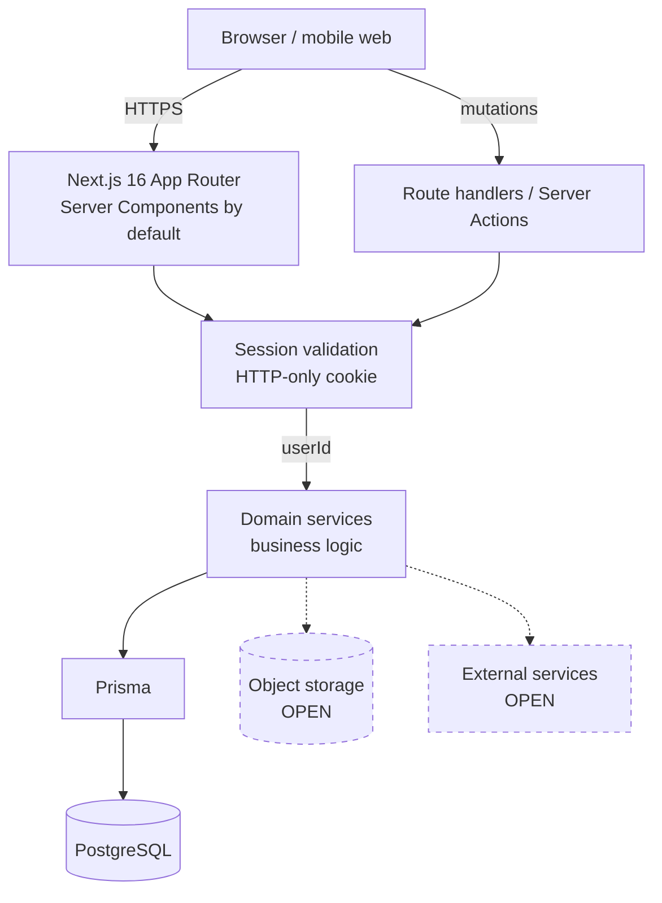

# Anera V2 — System Architecture

| Field | Value |
|---|---|
| **Purpose** | The V2 **target** system architecture: layers, boundaries, modules and external services. |
| **Status** | **SELECTED** — structure follows from locked decisions; module boundaries are not yet locked |
| **Owner** | Product owner |
| **Authority** | **Canonical for V2 target state.** [`00-MASTER-SPECIFICATION.md`](00-MASTER-SPECIFICATION.md) §12 remains canonical for **as-built** state. The two describe different things and both are valid. |
| **Dependencies** | D36 (stack) · D37 (auth) · D30 (architecture governance) · D41 (taxonomy — master spec not split) |
| **Related documents** | [`TECH-STACK.md`](TECH-STACK.md) · [`BACKEND-SCHEMA.md`](BACKEND-SCHEMA.md) · [`API-SPECIFICATION.md`](API-SPECIFICATION.md) · [`AUTHENTICATION.md`](AUTHENTICATION.md) · [`REALTIME-ARCHITECTURE.md`](REALTIME-ARCHITECTURE.md) · [`ARCHITECTURE-GOVERNANCE.md`](ARCHITECTURE-GOVERNANCE.md) |
| **Last updated** | 2026-09-02 |
| **Change history** | 2026-09-02 — created from Decisions 36, 37 and 30. |

---

## 1. Shape

`LOCKED (D30, D36)` — a **modular monolith**. One Next.js deployable, organised into domain modules with real boundaries.

Services are extracted **only when justified by evidence** (D30). Premature extraction is prohibited.

---

## 2. Request path

**Solid = Phase 1. Dashed = later phases, vendor `OPEN`.**

---

## 3. Layers

| Layer | Responsibility | Rule |
|---|---|---|
| **UI (Server Components)** | Render authenticated content on the server | Default. No auth state in the client |
| **UI (Client Components)** | Interactivity only | Justified case by case; `'use client'` is an exception |
| **Route handlers / Server Actions** | HTTP entry, validation, response shaping | Thin. No business logic |
| **Session validation** | Cookie → session lookup → `userId` | Every protected path. Server-side only |
| **Domain services** | Business logic, invariants, authorization | **New in V2.** Routes must not call Prisma directly |
| **Data access (Prisma)** | Queries, transactions | Only domain services call it |
| **PostgreSQL** | Persistence | Foreign keys enforced |

> **The single biggest structural change from the MVP:** a **domain service layer**. The as-built code has route handlers calling Prisma directly (`IG-09`), which is why business rules are duplicated across endpoints and untestable in isolation.

---

## 4. Server / client boundary

`LOCKED`:

| Concern | Side |
|---|---|
| Authentication | **Server only** |
| Authorization | **Server only** |
| Session state | **Server only** |
| Data fetching for authenticated views | **Server** (RSC) |
| Form validation | Both — client for UX, **server is authoritative** |
| UI state (tabs, modals, drafts) | Client (Zustand, minimal) |

**Zustand never holds authentication or authorization state** (D36, D37).

---

## 5. Domain modules

`SELECTED` — boundaries follow the product domains. **Names and exact boundaries are `OPEN` (`OQ-A08`)** and are confirmed at Phase 1 kickoff.

| Module | Owns | First phase |
|---|---|---|
| `identity` | Users, sessions, auth, password reset | 1 |
| `profile` | Profiles, photos, preferences | 1 |
| `discovery` | Candidate selection, filters, locality | 2 |
| `matching` | Swipes, mutual-like detection, matches | 2 |
| `ranking` | Ordering of the candidate set | 2 |
| `messaging` | Conversations, messages | 3 |
| `notifications` | Notification creation, delivery, preferences | 3 |
| `safety` | Reports, blocks, moderation, enforcement | 4 |
| `verification` | Verification levels and evidence | 4 |
| `ai` | AI Gateway — all model access | 5 |
| `commerce` | Entitlements, subscriptions, purchases, ledgers | 6 |
| `growth` | Referrals, rewards, campaigns | 7 |
| `social` | Posts, stories, feeds | 8 |
| `events` | Events, ticketing, attendance | 9 |
| `admin` | RBAC, audit, operations | 4+ |

`LOCKED (D30)` — **discovery, matching and ranking are separate responsibilities.** The MVP collapses all three into one endpoint with no ranking at all (`IG-54`).

---

## 6. Cross-cutting architecture

`LOCKED (D30)` — required as first-class concerns, not per-feature code:

| Concern | Requirement | Phase |
|---|---|---|
| **Central auth/authz governance** | One implementation, used everywhere | 1 |
| **Central Trust & Safety** | Safety is not scattered checks | 4 |
| **Central AI Gateway** | All model access routes through it | 5 |
| **Commerce & entitlements** | Explicit entitlement model | 6 |
| **Auditable ledgers** | All value movement; corrections are entries, not edits | 6 |
| **Observability** | Structured logging, error monitoring, tracing | 1 |
| **Background jobs / queues** | Async work off the request path | 2+ |
| **Feature flags** | Controlled rollout | 2+ |
| **Realtime** | See `REALTIME-ARCHITECTURE.md` | 3 |
| **Media** | Object storage + signed URLs | 2 |

---

## 7. External services

**No vendor is approved for any of these.** See `TECH-STACK.md` §3.

Object storage/CDN · email · SMS · push · payments · AI provider · analytics · error monitoring · verification provider.

---

## 8. What V2 removes

`DEPRECATED (D40)` — architecture being retired:

| MVP architecture | Replaced by |
|---|---|
| Route handlers calling Prisma directly | Domain service layer |
| Client-held auth state, dual transport | Server-validated cookie sessions |
| Client-side app shell holding everything (`page.tsx`, 3 tabs in React state) | Server Components + real routing |
| Separate Bun notification mini-service on :3003 | Consolidated (Phase 3 decides realtime transport) |
| Caddy `XTransformPort` routing | Standard deployment |
| SQLite + local-disk uploads | PostgreSQL + object storage |
| Hard-coded `http://localhost:3003` | Configuration |

---

## 9. Architectural constraints

1. **Modular monolith.** No microservices without evidence (D30).
2. **No route handler calls Prisma directly.** Domain services only.
3. **No business logic in components.**
4. **Server Components by default.**
5. **Discovery, matching and ranking stay separate.**
6. **All AI access via the Gateway.**
7. **Safety is central**, not per-feature.
8. **Every value movement is ledger-recorded.**

---

## 10. Open items

| Item | Tracked as |
|---|---|
| Domain module names and exact boundaries | `OQ-A08` |
| Realtime transport | `OQ-A02` |
| Media storage and CDN | `OQ-A03` |
| Queue / job system | `OQ-A01` |
| Observability tooling | `OQ-A04` |
| Feature flag system | `OQ-A05` |
| Hosting and environment topology | `OQ-B04`, `OQ-A14` |
| Whether any service is ever extracted | `OQ-A09` |

---

*Canonical V2 target architecture. As-built architecture is `00-MASTER-SPECIFICATION.md` §12.*
